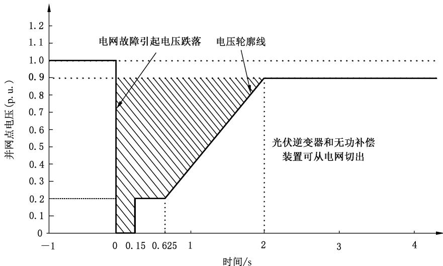
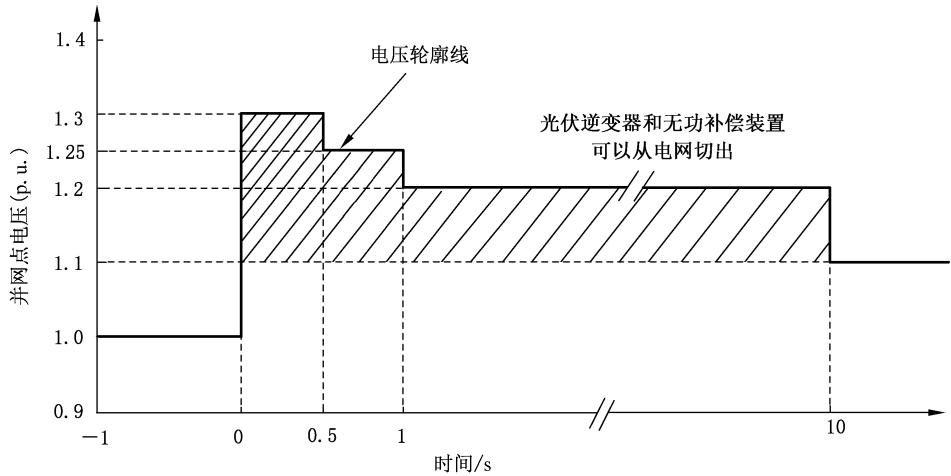
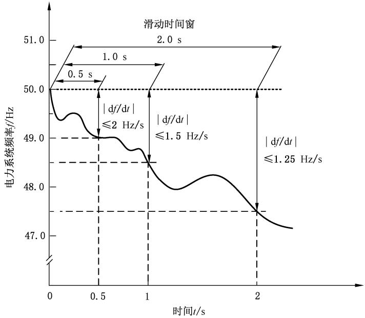

# GB/T 19964—2024 光伏发电站接入电力系统技术规定

- ICS：27.160
- CCS：F12
- 标准编号：GB/T 19964—2024
- 代替：GB/T 19964—2012
- 英文名称：Technical requirements for connecting photovoltaic power station to power system
- 发布日期：2024-03-15
- 实施日期：2024-03-15
- 发布机构：国家市场监督管理总局、国家标准化管理委员会

## 目录

- 前言
- 1 范围
- 2 规范性引用文件
- 3 术语和定义
- 4 有功功率
- 5 无功电压
- 6 故障穿越
- 7 运行适应性
- 8 功率预测
- 9 电能质量
- 10 仿真模型和参数
- 11 二次系统
- 12 测试和评价

## 前言

本文件按照 GB/T 1.1—2020《标准化工作导则 第 1 部分：标准化文件的结构和起草规则》的规定起草。

本文件代替 GB/T 19964—2012《光伏发电站接入电力系统技术规定》。与 GB/T 19964—2012 相比，除结构调整和编辑性改动外，主要技术变化如下：

- 更改了本文件的适用范围（见第 1 章，2012 年版的第 1 章）；
- 增加了光伏发电站功率预测、高电压穿越等技术相关的一些术语（见第 3 章）；
- 增加了光伏发电站一次调频的要求（见 4.3）；
- 增加了不对称故障时光伏发电站低电压穿越期间的动态无功支撑能力要求（见 6.1）；
- 增加了光伏发电站高电压穿越的要求（见 6.2）；
- 增加了光伏发电站连续故障穿越的要求，包括连续低电压穿越和连续低-高电压穿越（见 6.3）；
- 更改了光伏发电站运行适应性中的频率范围要求（见 7.3，2012 年版的 9.3）；
- 增加了光伏发电站低短路比运行适应性的要求和开展次/超同步振荡专题研究的要求（见 7.4 和 7.5）；
- 更改了光伏发电站功率预测结果上报和预测准确度的要求（见第 8 章，2012 年版的第 5 章）；
- 更改了光伏发电站仿真模型的要求（见 10.1，2012 年版的 11.1）；
- 增加了光伏发电站接入系统测试和评价的要求和内容（见 12.4）。

请注意，本文件的某些内容可能涉及专利。本文件的发布机构不承担识别专利的责任。

本文件由中国电力企业联合会提出并归口。

本文件起草单位：中国电力科学研究院有限公司、国家电网有限公司电力调度控制中心、中国科学院电工研究所。

本文件主要起草人：王伟胜、何国庆、刘纯、汪海蛟、吴福保、冯双磊、贺静波、李光辉、朱凌志、许洪华、迟永宁、车建峰、牟佳男、张军军、王勃、石文辉、张金平、李文峰、孙文文、李湃、刘美茵、王晖、孙艳霞、张兴、肖云涛、张健、刘可可、李洋、张悦。

本文件及其所代替文件的历次版本发布情况为：

- 2005 年首次发布为 GB/Z 19964—2005，2012 年第一次修订；
- 本次为第二次修订。

## 1 范围

本文件规定了光伏发电站接入电力系统的有功功率、无功电压、故障穿越、运行适应性、功率预测、电能质量、仿真模型和参数、二次系统的技术要求，以及测试和评价的内容。

本文件适用于通过 10 kV 以上电压等级并网的新建、改建和扩建光伏发电站的建设、生产和运行。配置储能的光伏发电站参照执行。

## 2 规范性引用文件

下列文件中的内容通过文中的规范性引用而构成本文件必不可少的条款。其中，注日期的引用文件，仅该日期对应的版本适用于本文件；不注日期的引用文件，其最新版本（包括所有的修改单）适用于本文件。

- GB/T 12325 电能质量 供电电压偏差
- GB/T 12326 电能质量 电压波动和闪变
- GB/T 14285 继电保护和安全自动装置技术规程
- GB/T 14549 电能质量 公用电网谐波
- GB/T 15543 电能质量 三相电压不平衡
- GB/T 19862 电能质量监测设备通用要求
- GB/T 22239 信息安全技术 网络安全等级保护基本要求
- GB/T 24337 电能质量 公用电网间谐波
- GB/T 29321 光伏发电站无功补偿技术规范
- GB/T 31464 电网运行准则
- GB/T 32900 光伏发电站继电保护技术规范
- GB/T 33982 分布式电源并网继电保护技术规范
- GB/T 36572 电力监控系统网络安全防护导则
- GB/T 37408 光伏发电并网逆变器技术要求
- GB/T 37409 光伏发电并网逆变器检测技术规范
- GB 38755 电力系统安全稳定导则
- GB/T 40289 光伏发电站功率控制系统技术要求
- GB/T 40581 电力系统安全稳定计算规范
- GB/T 40594 电力系统网源协调技术导则
- GB/T 40595 并网电源一次调频技术规定及试验导则
- GB/T 40604 新能源场站调度运行信息交换技术要求
- GB/T 40607 调度侧风电或光伏功率预测系统技术要求
- GB/T 50866 光伏发电站接入电力系统设计规范
- DL/T 448 电能计量装置技术管理规程
- DL/T 5003 电力系统调度自动化设计规程

## 3 术语和定义

GB/T 40581、GB/T 40594、GB/T 40595 界定的以及下列术语和定义适用于本文件。

### 3.1 光伏发电站 photovoltaic (PV) power station

利用光伏电池的光生伏特效应，将太阳辐射能直接转换为电能的发电系统。

注：一般包含变压器、逆变器和光伏方阵，以及相关辅助设施等。

### 3.2 逆变器 inverter

将直流电变换成交流电的设备。

### 3.3 并网点 point of connection

对有升压站的光伏发电站，是升压站高压侧母线或节点；对无升压站的光伏发电站，是光伏发电站的输出汇总点。

### 3.4 光伏功率预测 PV power forecasting

以光伏发电站的历史功率、历史气象数据、历史设备运行状态等数据建立光伏发电功率预测模型，以辐照度、功率或数值天气预报数据等信息作为模型的输入，结合光伏发电系统的设备状态及运行工况，预测光伏发电站未来一段时间内的有功功率。

注：根据预测时段分为中期、短期和超短期光伏功率预测。

### 3.5 中期光伏功率预测 medium-term PV power forecasting

光伏发电站次日零时起到未来 240 h 的有功功率预测，时间分辨率为 15 min。

### 3.6 短期光伏功率预测 short-term PV power forecasting

光伏发电站次日零时起到未来 72 h 的有功功率预测，时间分辨率为 15 min。

### 3.7 超短期光伏功率预测 ultra-short-term PV power forecasting

光伏发电站未来 15 min 到 4 h 的有功功率预测，时间分辨率为 15 min。

### 3.8 光伏发电站低电压穿越 low voltage ride through of PV power station

当电力系统事故或扰动引起光伏发电站并网点电压跌落时，在一定的电压跌落范围和时间间隔内，光伏发电站能够不脱网连续运行的能力。

### 3.9 光伏发电站高电压穿越 high voltage ride through of PV power station

当电力系统事故或扰动引起光伏发电站并网点电压升高时，在一定的电压升高范围和时间间隔内，光伏发电站能够不脱网连续运行的能力。

### 3.10 光伏发电站低-高电压穿越 low-high voltage ride through of PV power station

当电力系统事故或扰动引起光伏发电站并网点电压先跌落后升高时，在一定的电压跌落、升高范围和时间间隔内，光伏发电站能够不脱网连续运行的能力。

注：简称低-高电压穿越。

### 3.11 光伏发电站动态无功电流增量 dynamic reactive current increment of PV power station

光伏发电站在低电压或高电压穿越期间向电力系统注入或吸收的无功电流，相对于电压跌落或升高前向电力系统注入或吸收的无功电流的变化量。

注：无功电流指容性无功电流。

### 3.12 光伏发电站动态无功电流上升时间 rise time of dynamic reactive current of PV power station

自并网点电压跌落或升高达到触发设定值开始，到光伏发电站动态无功电流增量达到增量目标值的 90% 所需的时间。

### 3.13 孤岛 islanding

包含负荷和电源的部分电网，从主网脱离后继续孤立运行的状态。

注：孤岛分为非计划性孤岛和计划性孤岛。非计划性孤岛指非计划、不受控地发生孤岛；计划性孤岛指按预先配置的控制策略，有计划地发生孤岛。

### 3.14 防孤岛 anti-islanding

防止非计划性孤岛现象的发生。

## 4 有功功率

### 4.1 有功功率控制

#### 4.1.1

光伏发电站应具备参与电力系统调频、调峰的能力，并符合 GB 38755、GB/T 31464、GB/T 40594 和 GB/T 40595 的相关规定。

#### 4.1.2

光伏发电站应配置有功功率控制系统，具备有功功率连续平滑调节的能力，并能参与电力系统有功功率控制。

#### 4.1.3

光伏发电站有功功率控制系统的控制模式应至少包含有功功率限值控制、有功功率定值控制、有功功率差值控制和调频控制。控制模式应根据电力系统调度机构下发的自动化信号及调度指令投入或退出，有功功率控制的响应时间和控制精度应符合 GB/T 40289 的相关规定。

#### 4.1.4

在光伏发电站并网、正常停机以及太阳能辐照度增长过程中，光伏发电站的有功功率变化速率应满足电力系统安全稳定运行的要求，其限值应根据所接入电力系统的频率调节特性，由电力系统调度机构确定，宜为 10% 额定容量/min。当太阳能辐照度快速降低时，光伏发电站有功功率变化速率允许超出限值。

### 4.2 紧急控制

#### 4.2.1

在电力系统事故或紧急情况下，光伏发电站应按照电力系统调度机构的指令紧急降低有功功率或暂时从电网切出。

#### 4.2.2

当电力系统恢复正常运行状态后，光伏发电站应按电力系统调度机构的指令并网运行。

### 4.3 一次调频

#### 4.3.1

光伏发电站一次调频功能应符合 GB/T 40594、GB/T 40595 的规定。一次调频功能可按照电力系统调度机构的指令启动与停用。

#### 4.3.2

当电力系统频率偏差超出一次调频死区范围时，光伏发电站应按照公式（1）调整有功功率输出。

```text
ΔPt = -Kf × (ft - fN) / fN × PN    （1）
```

式中：

- ΔPt——光伏发电站有功功率变化量，单位为兆瓦（MW）；
- Kf——有功调频系数；
- ft——电力系统频率，单位为赫兹（Hz）；
- fN——电力系统额定频率，单位为赫兹（Hz）；
- PN——光伏发电站额定有功功率，单位为兆瓦（MW）。

#### 4.3.3

一次调频的有功调频系数、死区范围应根据所接入电力系统的频率调节特性，由电力系统调度机构确定。有功调频系数的取值范围宜为 10～50，死区范围宜为 ±（0.02 Hz～0.06 Hz）。

#### 4.3.4

当电力系统频率大于 50 Hz 时，光伏发电站有功功率减少的幅值限制宜不小于 10% 额定有功功率。

#### 4.3.5

当电力系统频率小于 50 Hz 时，光伏发电站有功功率增加的幅值限制宜不小于 6% 额定有功功率。

#### 4.3.6

一次调频有功功率响应的滞后时间应不大于 1 s，上升时间应不大于 5 s，调节时间应不大于 15 s，一次调频达到稳定时的有功功率调节偏差应不超过额定有功功率的 ±1%。

#### 4.3.7

光伏发电站应设置一次调频功能的启用状态信号、动作状态信号，并将信号上传至调度监控系统。启用与停用功能可通过本地或调度监控系统远程控制。

## 5 无功电压

### 5.1 无功电源

#### 5.1.1

光伏发电站安装的光伏逆变器，应满足额定有功出力下功率因数在超前 0.95～滞后 0.95 的范围内动态可调，并应在图 1 所示矩形框内动态可调。

标引符号说明：

- P——光伏逆变器有功功率标幺值；
- Q——光伏逆变器无功功率标幺值。

图 1：光伏逆变器无功出力范围。

#### 5.1.2

光伏发电站应利用光伏逆变器的无功容量及调节能力。当光伏逆变器的无功容量不能满足电力系统电压调节需求时，光伏发电站应加装无功补偿装置，包括并联电容器、并联电抗器、静止无功补偿器、静止无功发生器、同步调相机等。

### 5.2 无功容量配置

#### 5.2.1

光伏发电站的无功容量配置应满足电力系统分层和分区基本平衡的要求，并满足检修备用要求。

#### 5.2.2

对于接入公共电网的光伏发电站，其配置的容性无功容量应能够补偿光伏发电站满发时站内汇集线路、主变压器的感性无功功率及光伏发电站送出线路的一半感性无功功率之和；其配置的感性无功容量应能够补偿光伏发电站自身的容性充电无功功率及光伏发电站送出线路的一半充电无功功率之和。

#### 5.2.3

对于通过 220（330）kV 汇集系统升压至 500（750）kV 电压等级接入电网的光伏发电站，其配置的容性无功容量应能够补偿光伏发电站满发时站内汇集线路、主变压器的感性无功功率及光伏发电站送出线路的全部感性无功功率之和；其配置的感性无功容量应能够补偿光伏发电站自身的容性充电无功功率及光伏发电站送出线路的全部充电无功功率之和。

#### 5.2.4

光伏发电站配置的无功补偿装置类型及其容量可根据所接入电力系统的无功电压调节特性，通过研究确定。

### 5.3 电压控制

#### 5.3.1

光伏发电站应具备无功功率调节及电压控制能力，并应符合 GB/T 31464 和 GB/T 40594 的相关规定。

#### 5.3.2

光伏发电站应配置无功/电压控制系统，系统应具备定电压控制、定功率因数控制和定无功功率控制等控制模式以及在线切换控制模式的功能。

#### 5.3.3

光伏发电站的主变压器宜采用有载调压变压器。

#### 5.3.4

光伏发电站无功电压控制系统应能自动接收电力系统调度机构下发的并网点电压值、功率因数值或无功功率值，通过协调控制光伏逆变器和无功补偿装置的无功输出，以及主变压器分接头位置，实现对并网点电压的控制，其响应时间和控制精度应符合 GB/T 29321 的相关规定。

#### 5.3.5

当电网电压处于正常范围内时，通过 35 kV～110 kV 电压等级接入电网的光伏发电站应能够将并网点电压调节至标称电压的 97%～107% 范围内。

#### 5.3.6

当电网电压处于正常范围内时，通过 220 kV 及以上电压等级接入电网的光伏发电站应能够将并网点电压调节至标称电压的 100%～110% 范围内。

## 6 故障穿越

### 6.1 低电压穿越

#### 6.1.1

当电力系统发生故障导致光伏发电站并网点电压跌落时，光伏发电站应具备图 2 规定的低电压穿越能力，具体要求如下：

- a）光伏发电站并网点电压跌至 0 时，光伏发电站内的光伏逆变器和无功补偿装置应能够不脱网连续运行 150 ms；
- b）光伏发电站并网点电压跌至标称电压的 20% 时，光伏发电站内的光伏逆变器和无功补偿装置应能够不脱网连续运行 625 ms；
- c）光伏发电站并网点电压跌至标称电压的 20% 以上至 90% 时，光伏发电站内的光伏逆变器和无功补偿装置应能在图 2 所示的阴影区域内不脱网连续运行。



图 2：光伏发电站低电压穿越要求。

#### 6.1.2 故障类型及考核电压

不同类型电力系统故障时，光伏发电站低电压穿越的考核电压见表 1。

| 故障类型 | 考核电压 |
| --- | --- |
| 三相短路故障 | 并网点线电压 |
| 两相短路故障 | 并网点线电压 |
| 单相接地短路故障 | 并网点相电压 |

#### 6.1.3 对称故障时的动态无功支撑能力

当电力系统发生三相对称短路故障导致光伏发电站并网点电压跌落时，光伏发电站应具备动态无功电流支撑能力，具体要求如下。

- a）当光伏发电站并网点电压低于标称电压的 90% 时，光伏发电站向电网注入的无功电流应为电压跌落前正常运行时的无功电流输出值 I0 与动态无功电流增量 ΔIt 之和。动态无功电流增量应响应并网点电压变化，并应满足公式（2）。

```text
ΔIt = K1 × (0.9 - Ut) × IN，(0 ≤ Ut ≤ 0.9)    （2）
```

式中：

- ΔIt——光伏发电站注入的动态无功电流增量，单位为安（A）；
- K1——光伏发电站动态无功电流比例系数；
- Ut——光伏发电站并网点电压标幺值；
- IN——光伏发电站额定电流，单位为安（A）。

- b）光伏发电站动态无功电流比例系数 K1 可根据电力系统实际情况确定，取值范围宜为 1.5～3；
- c）光伏发电站动态无功电流上升时间应不大于 30 ms；
- d）并网点电压跌落期间，光伏发电站无功电流的最大输出能力应不低于光伏发电站额定电流 IN 的 1.05 倍；
- e）自并网点电压恢复至标称电压 90% 以上的时刻起，光伏发电站应在 30 ms 内退出动态无功电流增量。

#### 6.1.4 不对称故障时的动态无功支撑能力

当电力系统发生三相不对称短路故障导致光伏发电站并网点电压跌落时，光伏发电站应具备动态正、负序无功电流支撑能力，具体要求如下。

- a）当光伏发电站并网点电压正序分量在标称电压的 60%～90% 时，光伏发电站向电网注入的正序无功电流应为电压跌落前正常运行时的正序无功电流输出值 I0+ 与正序动态无功电流增量 ΔIt+ 之和；从电网吸收的负序无功电流应为电压跌落前正常运行时的负序无功电流输出值 I0- 与负序动态无功电流增量 ΔIt- 之差。动态正、负序无功电流增量应响应并网点电压变化，并满足公式（3）。

$$
\left\{ \begin{array}{l} \Delta I _ {\mathrm{t}} ^ {+} = K _ {2} ^ {+} \times (0. 9 - U _ {\mathrm{t}} ^ {+}) \times I _ {\mathrm{N}} \\ \Delta I _ {\mathrm{t}} ^ {-} = K _ {2} ^ {-} \times U _ {\mathrm{t}} ^ {-} \times I _ {\mathrm{N}} \end{array} , \quad (0. 6 \leqslant U _ {\mathrm{t}} ^ {+} \leqslant 0. 9) \right.\tag{……(3}
$$

式中：

- ΔIt+——光伏发电站注入的正序动态无功电流增量，单位为安（A）；
- ΔIt-——光伏发电站吸收的负序动态无功电流增量，单位为安（A）；
- K2+——光伏发电站动态正序无功电流比例系数；
- K2-——光伏发电站动态负序无功电流比例系数；
- Ut+——光伏发电站并网点电压正序分量标幺值；
- Ut-——光伏发电站并网点电压负序分量标幺值；
- IN——光伏发电站额定电流，单位为安（A）。

- b）动态正、负序无功电流比例系数 K2+、K2- 可根据电力系统实际情况确定，宜不小于 1.0；
- c）光伏发电站正、负序动态无功电流上升时间应不大于 30 ms；
- d）并网点电压跌落期间，光伏发电站无功电流的最大输出能力应不低于光伏发电站额定电流 IN 的 1.05 倍；
- e）当并网点电压正序分量小于标称电压的 60% 时，光伏发电站宜根据光伏逆变器和无功补偿装置的实际控制能力以及光伏发电站接入的电网条件，在不助增并网点电压不平衡度的前提下，向电网注入正序动态无功电流并从电网吸收负序动态无功电流。

#### 6.1.5 有功恢复能力

对电力系统故障期间没有切出的光伏发电站，其有功功率在故障清除后应快速恢复，有功功率恢复的变化速率宜不小于 30% 装机容量/s。

### 6.2 高电压穿越

#### 6.2.1

当电力系统发生故障导致光伏发电站并网点电压升高时，光伏发电站应具备图 3 所示的高电压穿越能力，具体要求如下：

- a）光伏发电站并网点电压升高至标称电压的 125% 以上至 130% 时，光伏发电站内的光伏逆变器和无功补偿装置应能够不脱网连续运行 500 ms；
- b）光伏发电站并网点电压升高至标称电压的 120% 以上至 125% 时，光伏发电站内的光伏逆变器和无功补偿装置应能够不脱网连续运行 1 s；
- c）光伏发电站并网点电压升高至标称电压的 110% 以上至 120% 时，光伏发电站内的光伏逆变器和其他无功补偿装置应能够不脱网连续运行 10 s。



图 3：光伏发电站高电压穿越要求。

#### 6.2.2 动态无功支撑能力

当光伏发电站并网点电压升高时，光伏发电站应具备动态无功电流支撑能力，具体要求如下。

- a）当光伏发电站并网点电压在标称电压的 110%～130% 时，光伏发电站向电网注入的无功电流应为电压升高前正常运行时的无功电流输出值 I0 与动态无功电流增量 ΔIt 之差。光伏发电站动态无功电流增量应响应并网点电压变化，并应满足公式（4）。

```text
ΔIt = K3 × (Ut - 1.1) × IN，(1.1 ≤ Ut ≤ 1.3)    （4）
```

式中：

- ΔIt——光伏发电站注入的动态无功电流增量，单位为安（A）；
- K3——光伏发电站动态无功电流比例系数；
- Ut——光伏发电站并网点电压标幺值；
- IN——光伏发电站额定电流，单位为安（A）。

- b）光伏发电站动态无功电流比例系数 K3 可根据电力系统实际情况确定，宜不小于 1.5；
- c）光伏发电站动态无功电流上升时间应不大于 30 ms；
- d）并网点电压升高期间，光伏发电站无功电流的最大输出能力应不低于光伏发电站额定电流 IN 的 1.05 倍；
- e）自并网点电压恢复至标称电压 110% 以下的时刻起，光伏发电站应在 30 ms 内退出动态无功电流增量。

#### 6.2.3 有功控制能力

并网点电压升高期间，在满足动态无功电流支撑的前提下，光伏发电站应具备有功功率控制能力，应综合利用光伏逆变器、储能系统实现整站有功功率控制，尽量保持故障前有功功率不变。光伏发电站内的光伏逆变器在高电压穿越期间的有功功率控制要求及验证方法应满足 GB/T 37408 和 GB/T 37409 的要求。

### 6.3 连续故障穿越

#### 6.3.1 连续低电压穿越

光伏发电站应具备连续低电压穿越的能力，具体要求如下：

- a）光伏发电站应具备至少连续两次低电压穿越的能力；
- b）相邻两次低电压穿越之间的时间间隔 Δt 可根据其送出线路及接入电力系统的故障重合闸动作时间确定，可选取 0.2 s～2 s；
- c）每次低电压穿越的特性和支撑能力应满足 6.1 的要求。

#### 6.3.2 连续低-高电压穿越

接入特高压直流送端近区的光伏发电站应具备连续低-高电压穿越能力，连续低-高电压穿越能力具体要求如下：

- a）光伏发电站应具备低电压穿越后立即高电压穿越的能力；
- b）光伏发电站应具备至少连续三次低-高电压穿越的能力。

## 7 运行适应性

### 7.1 电压适应性

#### 7.1.1

当并网点电压在标称电压的 90%～110% 时，光伏发电站内的光伏逆变器和无功补偿装置应能正常运行。

#### 7.1.2

当并网点电压低于标称电压的 90% 或超过标称电压的 110% 时，光伏发电站内的光伏逆变器和无功补偿装置应符合 6.1 和 6.2 的规定。

### 7.2 电能质量适应性

当光伏发电站并网点的闪变值满足 GB/T 12326、谐波值满足 GB/T 14549、三相电压不平衡度满足 GB/T 15543 的规定时，光伏发电站内的光伏逆变器和无功补偿装置应能够不脱网连续运行。

### 7.3 频率适应性

#### 7.3.1

光伏发电站的频率适应性应满足表 2 的要求。

| 电力系统频率（f）范围 | 要求 |
| --- | --- |
| f < 46.5 Hz | 根据光伏逆变器和无功补偿装置允许运行的最低频率而定 |
| 46.5 Hz ≤ f < 47 Hz | 频率每次低于 47 Hz、高于 46.5 Hz 时，光伏发电站应具有至少运行 5 s 的能力 |
| 47 Hz ≤ f < 47.5 Hz | 频率每次低于 47.5 Hz、高于 47 Hz 时，光伏发电站应具有至少运行 20 s 的能力 |
| 47.5 Hz ≤ f < 48 Hz | 频率每次低于 48 Hz、高于 47.5 Hz 时，光伏发电站应具有至少运行 60 s 的能力 |
| 48 Hz ≤ f < 48.5 Hz | 频率每次低于 48.5 Hz、高于 48 Hz 时，光伏发电站应具有至少运行 5 min 的能力 |
| 48.5 Hz ≤ f ≤ 50.5 Hz | 连续运行 |
| 50.5 Hz < f ≤ 51 Hz | 频率每次高于 50.5 Hz、低于 51 Hz 时，光伏发电站应具有至少运行 3 min 的能力，并执行电力系统调度机构下达的降低功率或高周切机策略，不允许停运状态的光伏发电站并网 |
| 51 Hz < f ≤ 51.5 Hz | 频率每次高于 51 Hz、低于 51.5 Hz 时，光伏发电站应具有至少运行 30 s 的能力，并执行电力系统调度机构下达的降低功率或高周切机策略，不允许停运状态的光伏发电站并网 |
| f > 51.5 Hz | 根据光伏发电站内光伏逆变器和无功补偿装置允许运行的最高频率而定 |

#### 7.3.2

光伏发电站内的光伏逆变器和无功补偿装置应在以下系统频率变化率范围内不脱网连续运行：

- a）在 0.5 s 的滑窗时间内，频率变化率的绝对值不大于 2 Hz/s；
- b）在 1 s 的滑窗时间内，频率变化率的绝对值不大于 1.5 Hz/s；
- c）在 2 s 的滑窗时间内，频率变化率的绝对值不大于 1.25 Hz/s。

滑窗时间及频率变化率的要求如图 4 所示。



### 7.4 低短路比适应性

#### 7.4.1

光伏发电站内的光伏逆变器和无功补偿装置应具备在低短路比条件下连续稳定运行的能力。

#### 7.4.2

接入弱交流、极弱交流系统的光伏发电站应加强同步支撑能力，可通过配置同步调相机、具备同步支撑能力的光伏逆变器或储能装置等电力电子装置方式实现。弱交流、极弱交流系统的评估以及同步支撑加强措施宜通过专题研究确定。

#### 7.4.3

接入弱交流、极弱交流系统的光伏发电站，在系统故障清除后由低电压穿越状态恢复至正常运行状态时，应快速控制动态电流以降低并网点过电压水平，宜开展过电压分析及抑制措施专题研究。

### 7.5 次/超同步振荡

光伏发电站接入弱交流、极弱交流系统，或近区存在串联补偿装置、直流换流站的情况下，应开展次/超同步振荡风险分析及防控措施专题研究，宜采用阻抗特性分析与时域仿真相结合的方法进行评估。

## 8 功率预测

### 8.1 预测功能和预测结果上报

#### 8.1.1

光伏发电站应配置光伏功率预测系统，并符合 GB/T 40607 的相关规定。

#### 8.1.2

光伏功率预测系统应至少具备中期、短期以及超短期光伏功率预测功能，预测时间分辨率应不低于 15 min，应支持在光伏发电站功率受限、光伏发电系统故障或检修等非正常停机情况下的功率预测。

#### 8.1.3

光伏发电站应按要求时间向电力调度机构每日上报两次中期、短期光伏功率预测结果，应每 15 min 向电力调度机构上报一次超短期功率预测结果。

#### 8.1.4

光伏发电站向电力调度机构上报光伏功率预测结果的同时，应上报与预测结果相同时段的光伏发电站预计开机容量数据。

#### 8.1.5

光伏发电站应每 15 min 自动向电力调度机构上报当前时刻的开机总容量，应每 5 min 自动向电力调度机构上报光伏发电站实测气象数据。

### 8.2 预测准确度

#### 8.2.1

中期光伏功率预测结果第 10 日（第 217 h～240 h）月平均准确率应不低于 75%。

#### 8.2.2

短期光伏功率预测结果日前预测月平均准确率应不低于 85%，日前预测月平均合格率应不低于 85%。

#### 8.2.3

超短期光伏功率预测结果第 4 h 预测月平均准确率应不低于 90%，第 4 h 预测月平均合格率应不低于 90%。

#### 8.2.4

当进行光伏发电站出力受限时刻的预测准确度计算时，应使用可用功率代替实际功率。

## 9 电能质量

### 9.1 电压偏差

光伏发电站接入后，引起公共连接点的电压偏差应满足 GB/T 12325 的要求。

### 9.2 电压波动和闪变

光伏发电站接入后，引起公共连接点的电压波动和闪变应满足 GB/T 12326 的要求。

### 9.3 谐波和间谐波

#### 9.3.1

光伏发电站向所接入公共连接点注入的谐波电流应满足 GB/T 14549 的要求。

#### 9.3.2

光伏发电站接入后，引起公共连接点的间谐波应满足 GB/T 24337 的要求。

### 9.4 电压不平衡度

光伏发电站接入后，引起公共连接点的电压不平衡度应满足 GB/T 15543 的要求。

### 9.5 监测与治理

光伏发电站应配置电能质量实时监测设备，设备应满足 GB/T 19862 的要求。当光伏发电站电能质量指标不满足要求时，应安装电能质量治理设备。

## 10 仿真模型和参数

### 10.1 仿真模型

#### 10.1.1

光伏发电站应建立光伏逆变器、无功补偿装置、汇集系统及场站控制系统的机电暂态和电磁暂态仿真计算模型和参数，并通过模型验证和准确性评价。

#### 10.1.2

光伏发电站应建立短路电流计算模型和参数，并通过模型验证和准确性评价。

### 10.2 模型与参数变化

光伏发电站应根据电力系统调度机构的要求开展性能和参数优化工作。当光伏发电站完成设备改造、软件升级、控制逻辑修改、控制参数或保护定值修改后，应跟踪其各个元件模型和参数的变化情况，并重新进行或补充模型验证和准确性评价。

## 11 二次系统

### 11.1 继电保护及安全自动装置

#### 11.1.1

光伏发电站继电保护及安全自动装置应按照 GB/T 14285、GB/T 32900、GB/T 33982 进行配置。继电保护应适应光伏发电站及电力系统安全稳定运行需要，满足可靠性、选择性、灵敏性和速动性的要求。

#### 11.1.2

光伏发电站集电系统故障应能快速切除，汇集线路保护快速段定值应对线路末端故障有灵敏度。专线接入公用电网的光伏发电站宜配置光纤电流差动保护，汇集系统母线应配置母线差动保护。

#### 11.1.3

光伏发电站宜配置独立的防孤岛保护装置，动作时间应不大于 2 s。防孤岛保护应与电网侧线路保护和安全自动装置相配合。

#### 11.1.4

光伏发电站升压站应配置故障录波设备，设备接入的模拟量及开关量应满足调度机构的要求，并应具有记录通道，能够记录故障前 10 s 到故障后 60 s 的数据；应具备继电保护及安全自动装置在线监视与分析功能，汇集光伏发电站保护及故障录波信息，并通过电力调度数据网与电力系统调度机构通信。

#### 11.1.5

光伏发电站的二次设备及系统应符合 GB/T 50866 的相关规定，并符合电力二次系统技术规范及电力二次系统安全防护要求。

#### 11.1.6

光伏发电站二次设备供电应配置不间断电源装置或采用站内直流电源系统供电，在外部交流供电电源消失后，不间断电源装置带负荷运行时间应大于 2 h。

#### 11.1.7

光伏发电站应根据接入方案的安全稳定计算结果，按需配置安全自动装置。

### 11.2 光伏发电站调度自动化

#### 11.2.1

光伏发电站应配置计算机监控系统、有功功率控制系统、无功电压控制系统、电能量采集系统、二次系统安全防护设备、调度数据网络接入设备等，并应满足 DL/T 5003 要求及电力二次系统调度管理规范要求。

#### 11.2.2

光伏发电站调度自动化系统远动信息采集范围应满足电力系统调度自动化能量管理系统（EMS）远动信息接入规定的要求。

#### 11.2.3

光伏发电站与电力系统调度机构之间的通信方式、传输通道和信息传输内容应符合 GB/T 40604 的规定，包括提供遥测信号、遥信信号、遥调信号和其他安全自动装置的信号，以及提供信号的方式和实时性要求等。

#### 11.2.4

光伏发电站关口计量点应设在光伏发电站与电网、不同光伏发电站企业的产权分界处，计量装置配置应符合 DL/T 448 的规定。

#### 11.2.5

对于接入 220 kV 及以上电压等级的光伏发电站应配置同步相量测量装置，对于接入 110（66）kV 电压等级的光伏发电站可根据实际需求配置同步相量测量装置。

#### 11.2.6

经评估存在振荡风险的光伏发电站，应配置宽频测量装置。

#### 11.2.7

光伏发电站应配置全站统一的时钟同步系统，对站内各二次系统和设备的时钟进行统一授时。

#### 11.2.8

光伏发电站网络安全防护应满足 GB/T 22239、GB/T 36572 以及电力监控系统安全防护规定的要求，防护方案应通过网络安全等级测评和安全评估。

### 11.3 光伏发电站通信

#### 11.3.1

通过 220 kV 及以上电压等级并网的光伏发电站应具备两条独立的光缆通信通道；通过 110（66）kV 电压等级并网的光伏发电站应至少具备一条独立的光缆通信通道。

#### 11.3.2

光伏发电站与电力系统直接连接的通信设备应具有与系统接入端设备一致的接口与协议。

注：通信设备包括光纤传输设备、脉码调制终端设备、综合接入设备、调度程控交换机、数据通信网、通信监测等。

#### 11.3.3

光伏发电站内的通信设备配置应按相关的设计规程执行。

## 12 测试和评价

### 12.1

光伏发电站在接入电力系统前应完成测试和评价；当光伏发电站改（扩）建后，应重新进行测试与评价。

### 12.2

光伏发电站在接入电力系统测试前 30 日，应完成光伏逆变器、无功补偿装置以及光伏发电站的模型验证和准确性评价，并提交测试方案至电力系统调度机构备案。

### 12.3

光伏发电站应在全部发电单元并网调试运行后 6 个月内，提交光伏发电站运行特性测试和评价报告至电力系统调度机构。

### 12.4

光伏发电站的测试和评价内容包括但不限于以下内容：

- a）光伏发电站电能质量测试；
- b）光伏发电站有功功率控制和频率响应能力测试；
- c）光伏发电站无功/电压控制能力测试和评价；
- d）光伏发电站无功补偿装置并网性能测试；
- e）光伏发电站电气仿真模型及参数验证和评价；
- f）光伏发电站故障穿越能力评价；
- g）光伏发电站运行适应性评价。

### 12.5

当光伏发电站完成设备改造、软件升级、控制逻辑修改、控制参数或保护定值修改后，应根据电力系统要求，重新进行或补充测试与评价。
