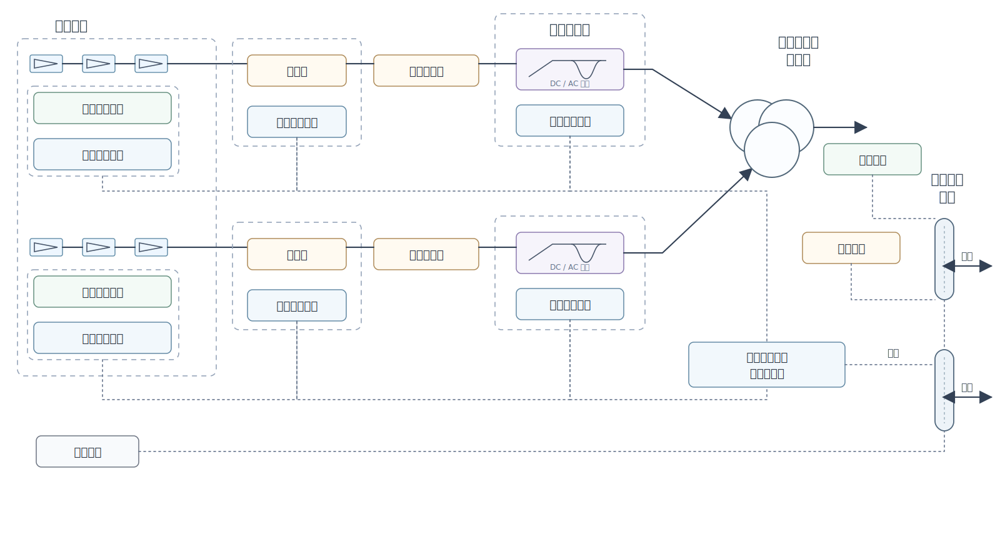

**GB/T 31366—2015**

# 光伏发电站监控系统技术要求

**Technical requirements for monitoring and control system of photovoltaic power station**

2015-02-04 发布
2015-09-01 实施

## 目录

前言……Ⅰ
1 范围……1
2 规范性引用文件……1
3 术语和定义……1
4 总则……2
5 系统结构及配置……2
6 系统功能……3
7 性能指标……6
8 工作环境条件……7
附录 A（资料性附录）光伏发电站监控系统典型通信结构图……9
附录 B（资料性附录）光伏发电单元典型通信结构图……10
附录 C（资料性附录）间隔层基本采集信息表……11

## 前言

本标准按照 GB/T 1.1—2009 给出的规则起草。

本标准由中国电力企业联合会提出。

本标准由中国电力企业联合会归口。

本标准起草单位：中国电力科学研究院、国网电力科学研究院、招商新能源控股有限公司、内蒙古神舟光伏电力有限公司。

本标准主要起草人：吴福保、张祥文、吕宏水、周邺飞、陈梅、赫卫国、冯炜、张小白、孔爱良、汪春、华光辉、徐永邦、马新平、司德亮、杨波、陶以彬。

# 光伏发电站监控系统技术要求

## 1 范围

本标准规定了并网光伏发电站监控系统的结构及配置、系统功能、性能指标、工作环境条件等技术要求。

本标准适用于通过 35 kV 及以上电压等级并网，以及通过 10 kV 电压等级与公共电网连接的新建、改建和扩建光伏发电站。

## 2 规范性引用文件

下列文件对于本文件的应用是必不可少的。凡是注日期的引用文件，仅注日期的版本适用于本文件。凡是不注日期的引用文件，其最新版本（包括所有的修改单）适用于本文件。

- GB/T 13729 远动终端设备
- DL/T 634.5104 远动设备及系统 第 5-104 部分：传输规约 采用标准传输协议子集的 IEC 60870-5-101 网络访问
- DL/T 860（所有部分）变电站通信网络和系统
- DL/T 5149—2001 220~500 kV 变电所计算机监控系统设计技术规程
- 《电力二次系统安全防护规定》（国家电力监管委员会 5 号令，2005）

## 3 术语和定义

下列术语和定义适用于本文件。

### 3.1 光伏发电站 photovoltaic(PV) power station

以光伏发电系统为主，包含各类建（构）筑物及检修、维护、生活等辅助设施在内的发电站。

### 3.2 光伏发电单元 PV power unit

光伏发电站中，以一定数量的光伏组件串，通过直流汇流箱汇集，经逆变器逆变与隔离升压变压器升压成符合电网频率和电压要求的电源。又称单元发电模块。

### 3.3 并网点 point of interconnection of PV power station

对于有升压站的光伏发电站，指升压站高压侧母线或节点。对于无升压站的光伏发电站，指光伏发电站的输出汇总点。

### 3.4 监控系统 monitoring and control systems

利用计算机对生产过程进行实时监视和控制的系统。

### 3.5 间隔层 bay level

由（智能）I/O 单元、控制单元、控制网络和保护接口机等构成，面向单元设备的就地测量控制层。

### 3.6 站控层 station level

面向整个光伏发电站进行运行管理的中心控制层，由各类服务器、操作员站、远动接口设备等构成。

### 3.7 辅助系统 auxiliary system

辅助系统包括图像监视及安全警卫、火灾自动报警、门禁、环境监视等子系统。

**注：**实现图像监视及防盗报警、火灾自动报警、环境量采集、灯光与通风控制等报警联动控制功能，实时接收各辅助系统终端装置上传的各种模拟量、开关量、报警信号及视频图像数据，分类存储各类信息并进行分析、计算、判断、统计和其他相关处理的软件和硬件设备。

### 3.8 光伏发电功率预测 PV power forecasting

对光伏发电站未来一段时间内的输出功率进行预测的技术或功能的统称。

## 4 总则

### 4.1
监控系统应采用开放式体系结构、具备标准软件接口和良好的可扩展性，并要求稳定性强、抗干扰能力强。

### 4.2
监控系统应满足《电力二次系统安全防护规定》的要求。

### 4.3
监控系统应包含有功控制、无功控制和数据监视功能。

### 4.4
监控系统应具有与电网调度机构通信及信息交换的能力。

### 4.5
光伏发电站监控系统可与继电保护故障信息管理系统、功率预测系统和辅助系统一体化设计和集成。

## 5 系统结构及配置

### 5.1 总体要求

#### 5.1.1
监控系统应具有较高的可靠性，监控服务器、远动通信装置、网络交换机及通信通道宜冗余配置。

#### 5.1.2
监控系统应具备完善的数据录入工具和简便、易用的维护诊断工具。

### 5.2 系统结构

#### 5.2.1
光伏发电站监控系统由间隔层和站控层两部分组成，站控层与间隔层宜直接连接，并用分布式、分层式和开放式网络系统实现连接。系统典型通信结构图参见附录 A。

#### 5.2.2
站控层与间隔层不具备直接连接条件的情况下，可通过规约转换设备连接。光伏发电单元典型通信结构图参见附录 B。

#### 5.2.3
独立配置的功率预测系统相关信息应能在监控系统中展示。独立配置的辅助系统相关信息宜能在监控系统中展示。

### 5.3 系统配置

#### 5.3.1 硬件配置

##### 5.3.1.1
光伏发电站监控系统的硬件设备宜由以下几部分组成：

- a）站控层设备：包括各类面向全站管理的服务器、操作员站、远动通信装置及其他接口设备等；
- b）网络及通信安全设备：包括网络交换机/路由器、硬件防火墙、正/反向电力专用横向单向安全隔离装置、纵向认证加密设备等设备；
- c）间隔层设备：包括光伏逆变器、汇流箱、太阳跟踪系统、气象监测系统及辅助系统的通信控制单元，光伏发电单元规约转换器，测控装置和继电保护装置等设备；
- d）其他设备：对时设备、网络打印机等。

##### 5.3.1.2
并网电压等级为 220 kV 及以上的光伏发电站，应采用双机冗余的方式配置服务器和远动通信装置等设备。

#### 5.3.2 软件配置

##### 5.3.2.1
软件配置应包含数据采集、数据处理、控制操作、防误闭锁、告警、事故顺序记录和事故追忆、画面生成及显示、计算及制表、系统时钟对时、系统自诊断、有功功率控制、无功电压控制和其他专业应用等功能，并具备与继电保护故障信息管理系统和功率预测系统信息交互的功能。

##### 5.3.2.2
在满足性能要求的情况下，其功能应便于集成和扩展。

##### 5.3.2.3
软件宜支持跨平台运行。

## 6 系统功能

### 6.1 监控功能

#### 6.1.1 数据采集

##### 6.1.1.1
系统应通过光伏发电站间隔层设备实时采集模拟量、开关量及其他相关数据。间隔层基本采集信息表见附录 C。

##### 6.1.1.2
间隔层测控装置采集的模拟量、开关量电气特性应符合 GB/T 13729 的要求。

##### 6.1.1.3
间隔层测控装置应对所采集的实时信息进行数字滤波、有效性检查、工程值转换、信号接点抖动消除、刻度计算等加工。

##### 6.1.1.4
重要的保护动作、装置故障信号等应通过无源接点输入，其余保护信号可通过通信方式进行采集。

#### 6.1.2 数据处理

##### 6.1.2.1
监控系统应实现数据合理性检查、异常数据分析、事件分类等处理，并支持常用的计算功能。

##### 6.1.2.2
监控系统应支持灵活设定历史数据存储周期，具有不少于一年的历史数据的存储能力。

##### 6.1.2.3
监控系统应具有灵活的统计计算能力并提供方便灵活的查询功能。

#### 6.1.3 控制操作

##### 6.1.3.1
控制对象范围：断路器、隔离开关、接地刀闸、光伏逆变器、主变压器分接头、无功补偿设备和其他重要设备。

##### 6.1.3.2
应具有自动控制和人工控制两种控制方式。控制操作级别由高到低为就地、站内监控、远方调度/集控，三种控制级别间应相互闭锁。

##### 6.1.3.3
自动控制应包括顺序控制和调节控制，应具有有功无功功率控制、变压器分接头联调控制以及操作顺序控制等功能，这些功能应各自独立，互不影响。

##### 6.1.3.4
在自动控制过程中，程序遇到任何软、硬件故障均应输出报警信息，并不影响系统的正常运行。

##### 6.1.3.5
人工控制时，监控系统应具有操作监护功能，监护人员可在本机或者另外的操作员站实施监护。

##### 6.1.3.6
在监控系统中对开断、并网设备应采用选择、返校、执行三个步骤，实施分步操作。

##### 6.1.3.7
系统应支持在站内和远方两种控制的方式，各类控制应通过防误闭锁校验。

#### 6.1.4 防误闭锁

##### 6.1.4.1
设备操作应同时满足站控层防误、间隔层防误和现场电气防误的闭锁要求。任意一层出现故障，应不影响其他层的正常闭锁。

##### 6.1.4.2
站内所有操作指令应经过防误验证，并有出错告警功能。

#### 6.1.5 告警

##### 6.1.5.1
告警内容应包括：设备状态异常、故障，测量值越限，监控系统的软硬件、通信接口及网络故障等。

##### 6.1.5.2
应具备事故告警和预告告警功能。事故告警应包括非正常操作引起的断路器跳闸和保护动作信号，预告告警应包括设备变位、状态异常信息、模拟量越限、工况投退等。

##### 6.1.5.3
告警发生时应能推出告警条文和画面，可打印输出。对事故告警应伴以声、光等提示。

##### 6.1.5.4
应提供历史告警信息检索查询功能。

#### 6.1.6 事故顺序记录和事故追忆

##### 6.1.6.1
光伏发电站内重要设备的状态变化应列为事件顺序记录（SOE），主要包括：

- a）断路器、隔离开关、光伏逆变器及其操作机构的动作信号和故障信号；
- b）继电保护装置、光伏逆变器、汇流箱、公共接口设备等的动作信号、故障信号。

##### 6.1.6.2
事件顺序记录的时标为事件发生时刻各装置本身的时标，分辨率应不大于 2 ms。

##### 6.1.6.3
事故追忆的时间跨度和记录点的时间间隔应能方便设定，应至少记录事故前 1 min 至事故后 5 min 的相关模拟量和事件动作信息，并能反演事故过程。

#### 6.1.7 画面生成及显示

##### 6.1.7.1
系统应具有图元编辑、图形制作和显示功能，并与实时数据库相关联，可动态显示系统采集的开关量和模拟量、系统计算量和设备技术参数、光伏发电站电气接线图等。

##### 6.1.7.2
画面应支持多窗口、分层、漫游、画面缩放、打印输出等功能。

##### 6.1.7.3
画面应能通过键盘或鼠标选择显示。画面主要包括：

- a）各类菜单（或索引表）显示；
- b）光伏发电站电气接线图，具备顺序控制功能的间隔需显示间隔顺序控制图；
- c）光伏方阵、汇流箱、光伏逆变器、主变压器等主要设备状态图；
- d）直流系统、UPS 电源、气象系统等公用接口设备状态图；
- e）系统结构及通信状态图。

##### 6.1.7.4
可具备显示火灾报警、视频监视等公用接口设备状态图。

##### 6.1.7.5
画面应能显示设备检修状态。

##### 6.1.7.6
应具有电网拓扑识别功能，实现带电设备的颜色标识。

#### 6.1.8 计算及制表

##### 6.1.8.1
应可使用各种历史数据，生成不同格式和类型的报表。

##### 6.1.8.2
应支持对光伏发电站各类历史数据进行统计计算，至少应包括功率、电压、电流、电量等日、月、年中最大或最小值及其出现的时间，电压合格率、功率预测合格率、电能量不平衡率、辐照度等。

##### 6.1.8.3
应具有用户自定义特殊公式功能，并可按要求设定周期进行计算。

##### 6.1.8.4
报表应支持文件、打印等方式输出。

#### 6.1.9 系统时钟对时

应支持接收卫星定位系统或者基于调度部门的对时系统的信号并进行对时，并以此同步站内相关设备的时钟。

#### 6.1.10 系统自诊断

##### 6.1.10.1
系统应在线诊断各软件和硬件的运行工况，当发现异常和故障时能及时告警并存储。

##### 6.1.10.2
各类有冗余配置的设备发生软硬件故障应能自动切换至备用设备，切换过程不影响整个系统的正常运行。

### 6.2 有功功率控制

#### 6.2.1
光伏发电站监控系统应具备有功功率控制功能。

#### 6.2.2
光伏发电站监控系统应能接收并执行电网调度部门远方发送的有功出力控制指令。

#### 6.2.3
调节光伏逆变器包括发出启停控制指令或分配有功功率控制指令。

#### 6.2.4
光伏发电站监控系统应能实时上送全站有功出力的输出范围、有功出力变化率、有功功率等信息。

#### 6.2.5
光伏发电站监控系统应在有功功率控制出现异常时，提供告警信息。

### 6.3 无功电压控制

#### 6.3.1
光伏发电站监控系统应具备无功电压控制功能。

#### 6.3.2
光伏发电站监控系统应能接收并执行电网调度部门发送的电压无功控制指令。

#### 6.3.3
调节光伏逆变器包括发出启停控制指令或分配无功功率或功率因数控制指令。

#### 6.3.4
调节手段应包括调节升压变压器变比、调节光伏逆变器无功输出和控制无功补偿装置等。

#### 6.3.5
光伏发电站监控系统应能实时上送全站无功出力的输出范围、无功功率等信息。

#### 6.3.6
光伏发电站监控系统应在无功功率控制出现异常时，提供告警信息。

### 6.4 功率预测系统信息交互

#### 6.4.1
功率预测系统独立配置时，光伏发电站监控系统应能向功率预测系统提供实时有功数据、实时气象监测数据等信息，并能接收功率预测系统提供的短期和超短期功率预测结果、短期数值天气预报。

#### 6.4.2
功率预测系统独立配置时，光伏发电站监控系统和功率预测系统通信应通过安全隔离设备。

### 6.5 继电保护故障信息管理系统信息交互

#### 6.5.1
独立配置的继电保护故障信息管理系统应单独组网，与监控系统物理隔离，继电保护故障信息管理系统与监控系统通信应满足《电力二次系统安全防护规定》的要求。继电保护装置应单独提供通讯接口与继电保护故障信息管理系统通讯。

#### 6.5.2
一体化配置的继电保护故障信息管理系统，继电保护信息子站可与监控系统远动通讯设备一体化。

### 6.6 辅助系统信息交互

#### 6.6.1
辅助系统独立配置时，光伏发电站监控系统应能接收辅助系统提供的防盗报警、火灾报警、门禁报警和环境量超限等报警信号。

#### 6.6.2
对于一体化配置的辅助系统应具备以下功能：

- a）应能实现图像显示、前端摄像机控制、画面切换、照片抓拍、手动和自动录像、回放等功能；
- b）应能根据防盗报警、火灾报警、门禁和环境量等报警信号自动切换到指定摄像机同时进行录像，显示报警位置信息，并联动相关辅助设备；
- c）应能够显示、记录防盗报警、火灾报警、门禁报警和环境量采集数据等信息。

### 6.7 通信

#### 6.7.1
监控系统站控层应采用以太网通信，对于独立配置的辅助系统宜采用网络通信，通信协议宜采用 DL/T 860 通信协议；对于独立配置的功率预测系统宜采用网络通信，通信协议宜采用 DL/T 634.5104 通信协议。

#### 6.7.2
站控层和间隔层应采用以太网通信，通信协议宜采用 DL/T 860 通信协议。不能提供网络接口的间隔层设备，应通过规约转换器和站控层通信。

#### 6.7.3
监控系统应能与站内电源系统等智能设备通信。

#### 6.7.4 远动通信要求

- a）应满足通过电力调度数据网通道与调度主站系统通信的要求，远动通信设备的接口应满足电力调度数据网接入要求，宜采用 DL/T 634.5104 或采用调度自动化系统要求的通信协议；
- b）远动通信设备宜直接从间隔层获取调度所需的数据，实现远动信息的直采直送；
- c）并网电压等级为 220 kV 及以上的光伏发电站远动通信设备应采用无机械磨损件独立设备；
- d）远动通信设备应能够同时和多级调度中心进行数据通信，且能对通道状态进行监视。

## 7 性能指标

### 7.1 系统可用性

- a）双机系统年可用率：≥99.98%；
- b）系统内主要设备运行寿命：≥10 年；
- c）站控层设备平均无故障间隔时间（MTBF）：≥20000 h；
- d）间隔层装置平均无故障间隔时间：≥30000 h；
- e）控制操作正确率：≥99.99%。

### 7.2 测控装置模拟量测量误差

- a）有功、无功的测量相对误差：≤0.5%；
- b）电流、电压的测量相对误差：≤0.2%；
- c）电网频率测量误差：≤0.01 Hz。

### 7.3 系统实时性

- a）测控装置模拟量越死区传送时间（至站控层）：≤2 s；
- b）测控装置状态量变位传送时间（至站控层）：≤1 s；
- c）测控装置模拟量信息响应时间（从 I/O 输入端至站控层）：≤3 s；
- d）测控装置状态量信息响应时间（从 I/O 输入端至站控层）：≤2 s；
- e）人工控制命令从生成到输出的时间：≤1 s；
- f）画面整幅调用响应时间：
  - 1）实时画面：≤1 s；
  - 2）其他画面：≤2 s。
- g）画面实时数据刷新周期：≤3 s；
- h）站内事件顺序记录分辨率（SOE）：光伏发电间隔层测控装置 ≤2 ms。

### 7.4 系统资源

#### 7.4.1 各工作站 CPU 平均负荷率

- a）正常时（任意 30 min 内）：≤30%；
- b）电力系统故障时（10 s 内）：≤70%。

#### 7.4.2 网络负荷率

- a）正常时（任意 30 min 内）：≤20%；
- b）电力系统故障时（10 s 内）：≤30%。

#### 7.4.3 容量

- a）模拟量：≥8000 点；
- b）状态量：≥10000 点；
- c）遥控：≥500 点；
- d）计算量：≥2000 点。

### 7.5 气象监测数据采集器性能指标

- a）连续无日照正常工作时间：≥15 天；
- b）数据畅通率：≥95%；
- c）采集数据量存储时间：≥3 个月；
- d）数据刷新周期：≤5 min。

### 7.6 系统对时精度

- a）站控层设备对时精度：≤1 s；
- b）间隔层测控保护设备对时精度：≤1 ms。

## 8 工作环境条件

### 8.1 场地和环境

#### 8.1.1 最大相对湿度

- a）日平均：95%；
- b）月平均：90%。

#### 8.1.2 工作环境温度

- a）室外最低工作温度不高于 -25 ℃，最高工作温度不低于 55 ℃；
- b）室内最低工作温度不高于 -5 ℃，最高工作温度不低于 45 ℃。

#### 8.1.3 耐振能力

- a）水平加速度：0.3 g；
- b）垂直加速度：0.15 g。

#### 8.1.4 其他

安装方式：垂直安装屏倾斜度：≤5°。

### 8.2 防雷与接地

应符合 DL/T 5149—2001 中第 11 章防雷与接地的要求。

### 8.3 电源系统

#### 8.3.1 电源使用范围

应采用 DC 110/220 V 直流系统或 AC 220 V 不间断电源供电。

#### 8.3.2 电源要求

应符合 GB/T 13729 的要求，不间断电源（UPS）在交流电源失电或电源不符合要求时，维持系统正常工作时间不低于 2 h。

## 附录 A（资料性附录）光伏发电站监控系统典型通信结构图

光伏发电站监控系统典型通信结构图见图 A.1。

## 附录 B（资料性附录）光伏发电单元典型通信结构图

光伏发电单元典型通信结构图见图 B.1。

## 附录 C（资料性附录）间隔层基本采集信息表

## C.1 间隔层基本遥测信息

间隔层基本遥测信息见表 C.1。

表 C.1 间隔层基本遥测信息

<table><tr><td>序号</td><td>对象</td><td>内容</td></tr><tr><td>1</td><td rowspan="5">太阳跟踪系统</td><td>高度角</td></tr><tr><td>2</td><td>方位角</td></tr><tr><td>3</td><td>运行状态</td></tr><tr><td>4</td><td>自动/手动状态</td></tr><tr><td>5</td><td>抗风雪状态</td></tr><tr><td>6</td><td rowspan="22">逆变器</td><td>直流侧电压</td></tr><tr><td>7</td><td>直流侧电流</td></tr><tr><td>8</td><td>直流侧功率</td></tr><tr><td>9</td><td>交流侧电压 $U_a$ </td></tr><tr><td>10</td><td>交流侧电压 $U_b$ </td></tr><tr><td>11</td><td>交流侧电压 $U_c$ </td></tr><tr><td>12</td><td>交流侧电压 $U_{ab}$ </td></tr><tr><td>13</td><td>交流侧电压 $U_{bc}$ </td></tr><tr><td>14</td><td>交流侧电压 $U_{ca}$ </td></tr><tr><td>15</td><td>交流侧电流 $I_a$ </td></tr><tr><td>16</td><td>交流侧电流 $I_b$ </td></tr><tr><td>17</td><td>交流侧电流 $I_c$ </td></tr><tr><td>18</td><td>交流侧有功功率</td></tr><tr><td>19</td><td>交流侧无功功率</td></tr><tr><td>20</td><td>交流侧功率因数</td></tr><tr><td>21</td><td>逆变器温度</td></tr><tr><td>22</td><td>日发电量</td></tr><tr><td>23</td><td>月发电量</td></tr><tr><td>24</td><td>年发电量</td></tr><tr><td>25</td><td>累计发电量</td></tr><tr><td>26</td><td>光伏逆变器最大可发有功</td></tr><tr><td>27</td><td>光伏逆变器无功输出范围</td></tr><tr><td>28</td><td rowspan="25">并网点</td><td>并网点电压 $U_{\text{a}}$ </td></tr><tr><td>29</td><td>并网点电压 $U_{\text{b}}$ </td></tr><tr><td>30</td><td>并网点电压 $U_{\text{c}}$ </td></tr><tr><td>31</td><td>并网点电压 $U_{\text{ab}}$ </td></tr><tr><td>32</td><td>并网点电压 $U_{\text{bc}}$ </td></tr><tr><td>33</td><td>并网点电压 $U_{\text{ca}}$ </td></tr><tr><td>34</td><td>并网点电流 $I_{\text{a}}$ </td></tr><tr><td>35</td><td>并网点电流 $I_{\text{b}}$ </td></tr><tr><td>36</td><td>并网点电流 $I_{\text{c}}$ </td></tr><tr><td>37</td><td>并网点有功功率</td></tr><tr><td>38</td><td>并网点无功功率</td></tr><tr><td>39</td><td>并网点功率因数</td></tr><tr><td>40</td><td>并网点上网电量</td></tr><tr><td>41</td><td>并网点A相电压闪变</td></tr><tr><td>42</td><td>并网点B相电压闪变</td></tr><tr><td>43</td><td>并网点C相电压闪变</td></tr><tr><td>44</td><td>并网点A相电压偏差</td></tr><tr><td>45</td><td>并网点B相电压偏差</td></tr><tr><td>46</td><td>并网点C相电压偏差</td></tr><tr><td>47</td><td>并网点A相频率偏差</td></tr><tr><td>48</td><td>并网点B相频率偏差</td></tr><tr><td>49</td><td>并网点C相频率偏差</td></tr><tr><td>50</td><td>并网点A相谐波THD</td></tr><tr><td>51</td><td>并网点B相谐波THD</td></tr><tr><td>52</td><td>并网点C相谐波THD</td></tr><tr><td>53</td><td rowspan="9">主升压变压器</td><td>低压侧电压 $U_{\text{a}}$ </td></tr><tr><td>54</td><td>低压侧电压 $U_{\text{b}}$ </td></tr><tr><td>55</td><td>低压侧电压 $U_{\text{c}}$ </td></tr><tr><td>56</td><td>低压侧电压 $U_{\text{ab}}$ </td></tr><tr><td>57</td><td>低压侧电压 $U_{\text{bc}}$ </td></tr><tr><td>58</td><td>低压侧电压 $U_{\text{ca}}$ </td></tr><tr><td>59</td><td>低压侧电流 $I_{\text{a}}$ </td></tr><tr><td>60</td><td>低压侧电流 $I_{\text{b}}$ </td></tr><tr><td>61</td><td>低压侧电流 $I_{\text{c}}$ </td></tr><tr><td>62</td><td rowspan="13">主升压变压器</td><td>低压侧有功功率</td></tr><tr><td>63</td><td>低压侧无功功率</td></tr><tr><td>64</td><td>高压侧电压 $U_{\mathrm{a}}$ </td></tr><tr><td>65</td><td>高压侧电压 $U_{\mathrm{b}}$ </td></tr><tr><td>66</td><td>高压侧电压 $U_{\mathrm{c}}$ </td></tr><tr><td>67</td><td>高压侧电压 $U_{\mathrm{ab}}$ </td></tr><tr><td>68</td><td>高压侧电压 $U_{\mathrm{bc}}$ </td></tr><tr><td>69</td><td>高压侧电压 $U_{\mathrm{ca}}$ </td></tr><tr><td>70</td><td>高压侧电流 $I_{\mathrm{a}}$ </td></tr><tr><td>71</td><td>高压侧电流 $I_{\mathrm{b}}$ </td></tr><tr><td>72</td><td>高压侧电流 $I_{\mathrm{c}}$ </td></tr><tr><td>73</td><td>高压侧有功功率</td></tr><tr><td>74</td><td>高压侧无功功率</td></tr><tr><td>75</td><td rowspan="3">汇流箱</td><td>各组串直流输入电流</td></tr><tr><td>76</td><td>直流输出电流</td></tr><tr><td>77</td><td>直流母线电压</td></tr><tr><td>78</td><td rowspan="12">升压变电站母线数据</td><td>母线电压 $U_{\mathrm{a}}$ </td></tr><tr><td>79</td><td>母线电压 $U_{\mathrm{b}}$ </td></tr><tr><td>80</td><td>母线电压 $U_{\mathrm{c}}$ </td></tr><tr><td>81</td><td>母线电压 $U_{\mathrm{ab}}$ </td></tr><tr><td>82</td><td>母线电压 $U_{\mathrm{bc}}$ </td></tr><tr><td>83</td><td>母线电压 $U_{\mathrm{ca}}$ </td></tr><tr><td>84</td><td>线电压 $U_{\mathrm{ab}}$ </td></tr><tr><td>85</td><td>线电压 $U_{\mathrm{bc}}$ </td></tr><tr><td>86</td><td>线电压 $U_{\mathrm{ca}}$ </td></tr><tr><td>87</td><td>A相电流</td></tr><tr><td>88</td><td>B相电流</td></tr><tr><td>89</td><td>C相电流</td></tr></table>

## C.2 间隔层基本遥信信息

间隔层基本遥信信息见表 C.2。

表 C.2 间隔层基本遥信信息

<table><tr><td>序号</td><td>对象</td><td>内容</td></tr><tr><td>1</td><td rowspan="8">光伏逆变器</td><td>直流过压</td></tr><tr><td>2</td><td>交流过压</td></tr><tr><td>3</td><td>交流欠压</td></tr><tr><td>4</td><td>初始停机</td></tr><tr><td>5</td><td>按键关机</td></tr><tr><td>6</td><td>保护动作总信号</td></tr><tr><td>7</td><td>××装置故障(异常、闭锁)</td></tr><tr><td>8</td><td>××保护动作信号</td></tr><tr><td>9</td><td rowspan="11">并网点</td><td>断路器位置状态</td></tr><tr><td>10</td><td>隔离刀闸</td></tr><tr><td>11</td><td>接地刀闸</td></tr><tr><td>12</td><td>远方/就地切换</td></tr><tr><td>13</td><td>保护动作总信号</td></tr><tr><td>14</td><td>控制回路断线</td></tr><tr><td>15</td><td>重合闸动作</td></tr><tr><td>16</td><td>××装置故障(异常、闭锁)</td></tr><tr><td>17</td><td>开关本体及操作机构故障</td></tr><tr><td>18</td><td>××保护动作信号</td></tr><tr><td>19</td><td>××保护动作信号</td></tr><tr><td>20</td><td rowspan="10">隔离升压变压器</td><td>高压侧断路器位置状态</td></tr><tr><td>21</td><td>低压侧断路器位置状态</td></tr><tr><td>22</td><td>高压侧隔离刀闸</td></tr><tr><td>23</td><td>低压侧隔离刀闸</td></tr><tr><td>24</td><td>高压侧开关远方/就地</td></tr><tr><td>25</td><td>低压侧开关远方/就地</td></tr><tr><td>26</td><td>保护动作总信号</td></tr><tr><td>27</td><td>××装置故障(异常、闭锁)</td></tr><tr><td>28</td><td>××保护动作信号</td></tr><tr><td>29</td><td>××保护动作信号</td></tr><tr><td>30</td><td rowspan="3">汇流箱</td><td>保护动作总信号</td></tr><tr><td>31</td><td>××装置故障(异常、闭锁)</td></tr><tr><td>32</td><td>××保护动作信号</td></tr><tr><td>33</td><td rowspan="3">汇流柜</td><td>保护动作总信号</td></tr><tr><td>34</td><td>××装置故障(异常、闭锁)</td></tr><tr><td>35</td><td>××保护动作信号</td></tr></table>

## C.3 气象环境基本采集信息

气象环境基本采集信息见表 C.3。

表 C.3 气象环境基本采集信息

<table><tr><td>序号</td><td>对象</td><td>内容</td></tr><tr><td>1</td><td rowspan="9">气象环境监测数据</td><td>环境温度</td></tr><tr><td>2</td><td>环境湿度</td></tr><tr><td>3</td><td>电池板温度</td></tr><tr><td>4</td><td>风速</td></tr><tr><td>5</td><td>风向</td></tr><tr><td>6</td><td>气压</td></tr><tr><td>7</td><td>太阳总辐射</td></tr><tr><td>8</td><td>直接辐射</td></tr><tr><td>9</td><td>散射辐射</td></tr></table>