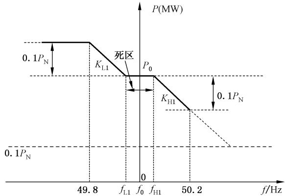
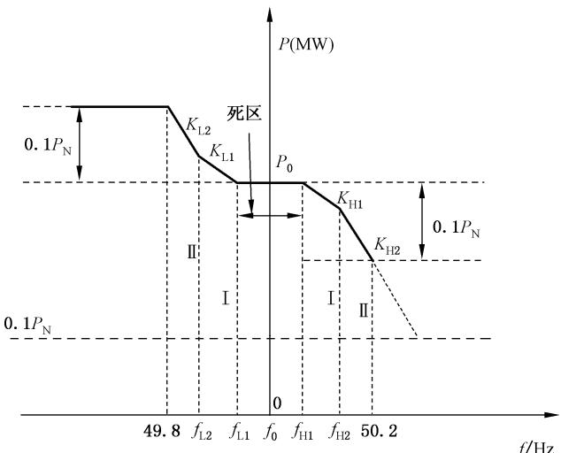
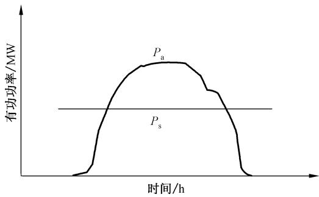
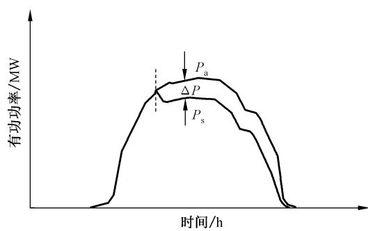
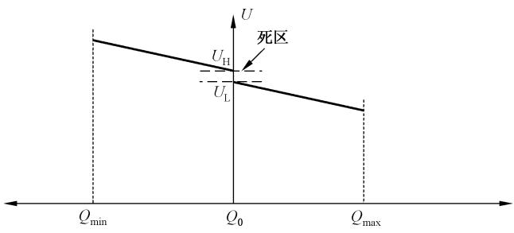
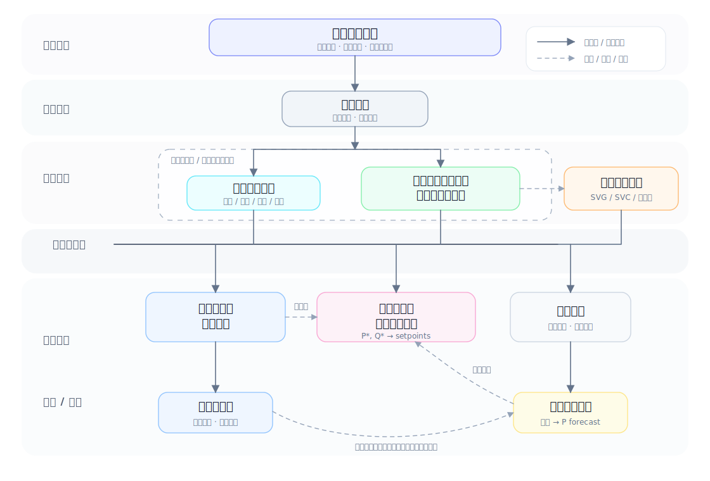

# 光伏发电站功率控制系统技术要求

> 中华人民共和国国家标准
> GB/T 40289—2021

Technical requirement of power control system for photovoltaic power station

ICS 27.160
CCS F12

2021-05-21 发布
2021-12-01 实施

国家市场监督管理总局
国家标准化管理委员会 发布

## 目次

前言 …… III
1 范围 …… 1
2 规范性引用文件 …… 1
3 术语和定义 …… 1
4 总体要求 …… 3
5 控制系统功能和结构 …… 3
6 数据采集与通信 …… 3
7 启停控制 …… 4
8 有功功率控制 …… 4
9 无功电压控制 …… 7
10 闭锁 …… 8
11 控制过程记录 …… 9
12 系统性能指标 …… 9
13 系统检测 …… 9
附录 A（资料性） 光伏发电站功率控制模式 …… 10
附录 B（资料性） 光伏发电站功率控制系统结构 …… 12
附录 C（资料性） 光伏发电站理论发电功率计算方法 …… 13

## 前言

本文件按照 GB/T 1.1—2020《标准化工作导则 第1部分:标准化文件的结构和起草规则》的规定起草。

请注意本文件的某些内容可能涉及专利。本文件的发布机构不承担识别专利的责任。

本文件由中国电力企业联合会提出并归口。

本文件起草单位:中国电力科学研究院有限公司、国家电网有限公司西北分部、国网青海省电力公司、国网山西省电力公司。

本文件主要起草人:朱凌志、钱敏慧、陈宁、吴福保、金一丁、范高锋、王茂春、张怡、周才期、姜达军、褚云龙、汪春、陈志磊、姚虹春、赵大伟、王智伟、赵俊屹、张舒捷、刘美茵、周昶。

## 1 范围

本文件规定了光伏发电站功率控制系统的功能和结构、数据采集与通信、启停控制、有功功率控制、无功电压控制、闭锁、控制过程记录、性能指标和系统检测等技术要求。

本文件适用于通过 35 kV 及以上电压等级并网，以及通过 10 kV 电压等级与公共电网连接的光伏发电站。

## 2 规范性引用文件

下列文件中的内容通过文中的规范性引用而构成本文件必不可少的条款。其中，注日期的引用文件，仅该日期对应的版本适用于本文件；不注日期的引用文件，其最新版本（包括所有的修改单）适用于本文件。

GB/T 19964 光伏发电站接入电力系统技术规定

GB/T 29321 光伏发电站无功补偿技术规范

GB/T 31366 光伏发电站监控系统技术要求

## 3 术语和定义

下列术语和定义适用于本文件。

### 3.1 光伏发电站功率控制系统 power control system for PV station

通过调节电站内并网逆变器、储能设备(若电站配置储能设备)、无功补偿装置的功率输出，使光伏发电站有功功率、无功功率，并网点电压、功率因数满足电网调度机构下达的指令值或预先设定值要求。

### 3.2 光伏发电站额定功率 rated power of PV station

光伏发电站内所有逆变器的额定功率之和。

### 3.3 有功功率限值控制 limited active power control

光伏发电站将有功功率控制在调度机构下达的指令值或预先设定值以下。

注：见附录 A 中图 A.1。

### 3.4 有功功率定值控制 constant active power control

光伏发电站将有功功率控制在调度机构下达的指令值或预先设定值。

### 3.5 有功功率差值控制 delta active power control

光伏发电站低于可用发电功率运行,实际有功功率与理论发电功率的差值由调度机构下达或预先设定。

注：见图A.2。

### 3.6 调频响应 frequency modulation response

光伏发电站根据并网点频率的变化,在一定范围内实时调节电站有功功率,参与电力系统频率调节。

### 3.7 过频响应 frequency modulation response for over-frequency

并网点频率高于额定频率并超过设定的调节死区时,光伏发电站减少电站有功功率输出,参与电力系统频率调节。

### 3.8 欠频响应 frequency modulation response for under-frequency

并网点频率低于额定频率并超过设定的调节死区时,光伏发电站增加电站有功功率输出,参与电力系统频率调节。

### 3.9 定无功功率控制 constant reactive power control

光伏发电站将无功功率控制在调度机构下达的指令值或预先设定值。

### 3.10 定功率因数控制 constant power factor control

光伏发电站根据有功功率调整无功功率,将并网点功率因数控制在调度机构下达的指令值或预先设定值。

### 3.11 定电压控制 constant voltage control

光伏发电站通过调整光伏逆变器和无功补偿装置的无功输出,将并网点电压控制在调度机构下达的指令值或预先设定值。

### 3.12 无功电压下垂控制 reactive power-voltage droop control

光伏发电站根据并网点电压测量值与参考值的偏差，按给定的比例系数调整电站无功功率。

注：见图A.3。

### 3.13 响应时间 response time

控制过程中,自接收到控制指令或检测到触发控制操作的状态量变化起,直到被观测变量实际输出变化量第一次达到控制终值与初值之差的90%所需的时间。

### 3.14 有功调频系数 $K_{\mathrm{f}}$ active power-frequency regulating coefficient

在系统频率波动时,光伏发电站有功功率变化量标幺值与系统频率变化量标幺值(以系统额定频率为基准值)的比值,按公式(1)计算。

$$
K_{\mathrm{f}}=-\frac{\Delta P/P_{\mathrm{N}}}{\Delta f/f_{\mathrm{N}}}\tag{1}
$$

式中：

$\Delta P$ ——光伏发电站有功功率的变化量,单位为兆瓦(MW);

$P_{N}$ ——光伏发电站的额定有功功率,单位为兆瓦(MW);

$\Delta f$ ——系统频率的变化量,单位为赫兹(Hz);

$f_{\mathrm{N}}$ ——系统额定频率，单位为赫兹 $(\mathrm{Hz})$ 。

### 3.15 理论发电功率 theoretical power

当前光资源情况下,光伏发电站内所有光伏逆变器均可正常运行时发出的功率总和。

### 3.16 可用发电功率 available power

考虑光伏发电站内设备故障、缺陷或检修等原因引起受阻后能够发出的有功功率。

## 4 总体要求

4.1 光伏发电站功率控制系统应满足功率控制的实时性和可靠性要求，满足电站运行稳定性和抗干扰要求。

4.2 光伏发电站功率控制系统应具有与接收电网调度自动化系统通信的能力，接收电网调度下发的控制指令并按要求上传光伏发电站实时运行信息。

4.3 光伏发电站功率控制系统应采用标准的软硬件接口，具有良好的可扩展性，满足 GB/T 31366 的要求。

4.4 光伏发电站功率控制系统应包含调度远方控制和本地控制两种方式，本地控制应包含自动控制方式和手动控制方式。

4.5 功率控制系统应符合电力监控系统安全防护相关规定。

## 5 控制系统功能和结构

### 5.1 系统结构

光伏发电站功率控制系统宜集成于光伏发电站监控系统，也可由独立系统实现。采用独立装置实现时，光伏发电站功率控制系统所需设备信息可通过光伏发电站监控系统获取，系统架构的信息如附录B中图B.1所示；功率控制系统集成于光伏发电站监控系统时，系统架构的信息如图B.2所示。

### 5.2 系统功能

5.2.1 功率控制系统至少应具备数据采集与通信、有功功率控制、无功电压控制、闭锁、控制过程记录等功能。

5.2.2 功率控制系统应提供方便的人机交互界面，对功率控制系统各类控制参数及基础信息进行设置。

5.2.3 功率控制系统应具备时间同步功能。

5.2.4 功率控制系统应具备与功率预测系统、变电站综合自动化系统等其他相关系统的数据接口功能。

## 6 数据采集与通信

### 6.1 数据采集类型

数据采集类型应包括但不限于：

a）光伏发电站有功功率、无功功率、并网点电压、电流、频率；

b) 储能设备的有功功率、无功功率(若电站配置储能设备);

c）各光伏逆变器有功功率、无功功率、电压及运行状态；

d) 光伏发电站配置的静态/动态无功补偿装置的无功功率、电压。

### 6.2 数据采集精度与周期

6.2.1 并网点频率测量分辨率应不低于 0.005 Hz，电压、电流采集精度应不低于 0.5 级。

6.2.2 光伏发电站有功功率、无功功率、并网点电压、电流、频率的采样周期应不大于 100 ms。

6.2.3 光伏逆变器、储能设备、无功补偿设备信号量的采样周期宜不大于 5 s。

## 7 启停控制

7.1 光伏发电站正常或故障恢复后的启动过程，功率控制系统应具备有功功率变化率限制功能，功率变化率应在 $10\% \sim 50\%$ 额定功率每分钟范围内可调。

7.2 光伏发电站正常停机时，功率控制系统应对有功功率变化率进行限制，满足 GB/T 19964 要求。

## 8 有功功率控制

### 8.1 控制原则

8.1.1 功率控制系统的控制对象应为电站内光伏逆变器和储能设备(若电站配置储能设备)。

8.1.2 功率控制系统的控制模式至少应包含有功功率限值控制、有功功率定值控制、有功功率差值控制和调频响应，控制模式应根据电网调度机构下发的自动化信号及调度指令投入或退出。

8.1.3 功率控制系统应具备计算光伏发电站的理论发电功率、可用发电功率能力，并将数据上报至调度机构，理论发电功率、可用发电功率可按附录 C 计算得到。

### 8.2 有功功率限值控制

8.2.1 有功功率限值控制模式下，功率控制系统应控制光伏发电站有功功率不超过指令值，实际值与指令值之差应不大于电站额定功率的 $1\%$ 。

8.2.2 当限值功率指令值降低时,功率控制系统应在 120 s 内将光伏发电站有功功率平滑控制至新的设定值以下。

### 8.3 有功功率定值控制

8.3.1 有功功率定值控制模式下，功率控制系统应控制光伏发电站有功功率与指令值之差不超过电站额定功率的±1%。

8.3.2 当设定值变化时,功率控制系统应在 $15 \, s \sim 120 \, s$ 范围内将光伏发电站有功功率平滑调节至新的设定值。

### 8.4 有功功率差值控制

8.4.1 当光伏发电站可用发电功率大于电站额定功率的 20% 时，功率控制系统按公式(2)计算差值控制模式的有功功率目标值，且计算调整时间间隔应不大于 1 min。

$$
P_{\mathrm{obj}}=P_{\mathrm{a}}-\Delta P\tag{2}
$$

式中：

$P_{obj}$ ——光伏发电站有功功率目标值,单位为兆瓦(MW);

$P_{a}$ ——光伏发电站可用发电功率,单位为兆瓦(MW);

$\Delta P$ ——功率差值,单位为兆瓦(MW)。

8.4.2 功率控制系统应具备在线调整功率差值的功能,功率差值应在光伏发电站额定功率的 5%\~15% 范围内连续可调。

### 8.5 调频响应

8.5.1 功率控制系统应具备过频响应和欠频响应两种调频响应功能,可独立投入或同时投入,具体投入方式根据当地电网运行情况由调度机构确定。

8.5.2 调频响应应包含基本调频响应模式，宜包含分段调频响应模式。

8.5.3 基本调频响应模式下,光伏发电站功率控制系统应根据并网点频率测量值,按照公式(3)和图1调整电站有功功率。

$$
\Delta P=\begin{cases}
K_{\mathrm{L1}}\times P_{\mathrm{N}}\times\dfrac{f_{\mathrm{L1}}-f}{f_{\mathrm{N}}}, & f<f_{\mathrm{L1}} \\
K_{\mathrm{H1}}\times P_{\mathrm{N}}\times\dfrac{f_{\mathrm{H1}}-f}{f_{\mathrm{N}}}, & f>f_{\mathrm{H1}}
\end{cases}\tag{3}
$$

式中：

$\Delta P$ ——光伏发电站输出有功功率的变化量,单位为兆瓦(MW);

$K_{L1}$ ——有功调频系数(欠频响应);

$K_{H1}$ ——有功调频系数(过频响应);

$P_{N}$ ——光伏发电站额定功率,单位为兆瓦(MW);

$f_{L1}$ ——欠频响应动作死区阈值,单位为赫兹(Hz);

$f_{H1}$ ——过频响应动作死区阈值,单位为赫兹(Hz);

f ——当前频率测量值,单位为赫兹(Hz);

$f_{N}$ ——系统额定频率,单位为赫兹(Hz)。

标引序号说明：

$P_{0}$ ——有功功率稳态初始值,单位为兆瓦(MW);

$P_{N}$ ——光伏发电站额定功率,单位为兆瓦(MW);

$f_{0}$ ——基准频率,单位为赫兹(Hz);

$f_{L1}$ ——欠频响应动作死区阈值,单位为赫兹(Hz);

$f_{H1}$ ——过频响应动作死区阈值,单位为赫兹(Hz);

$K_{L1}$ ——有功调频系数(欠频响应);

$K_{H1}$ ——有功调频系数(过频响应)。

图 1 基本调频响应模式

8.5.4 分段调频响应模式下，光伏发电站在有功功率可调节范围内应根据频率偏差值，在不同频率偏差范围采用不同调频系数调整有功功率，按公式(4)计算，分段调频响应模式见图2。

$$
\Delta P=\begin{cases}
K_{\mathrm{L2}}\times P_{\mathrm{N}}\times\dfrac{f_{\mathrm{L2}}-f}{f_{\mathrm{N}}}, & f<f_{\mathrm{L2}} \\
K_{\mathrm{L1}}\times P_{\mathrm{N}}\times\dfrac{f_{\mathrm{L1}}-f}{f_{\mathrm{N}}}, & f_{\mathrm{L2}}\leqslant f<f_{\mathrm{L1}} \\
K_{\mathrm{H1}}\times P_{\mathrm{N}}\times\dfrac{f_{\mathrm{H1}}-f}{f_{\mathrm{N}}}, & f_{\mathrm{H1}}<f\leqslant f_{\mathrm{H2}} \\
K_{\mathrm{H2}}\times P_{\mathrm{N}}\times\dfrac{f_{\mathrm{H2}}-f}{f_{\mathrm{N}}}, & f>f_{\mathrm{H2}}
\end{cases}\tag{4}
$$

式中：

$\Delta P$ ——光伏发电站输出有功功率的变化量,单位:兆瓦(MW);

$K_{L1}$ ——有功调频系数(欠频响应Ⅰ段);

$K_{H1}$ ——有功调频系数(过频响应Ⅰ段);

$K_{L2}$ ——有功调频系数(欠频响应Ⅱ段);

$K_{H2}$ ——有功调频系数(过频响应Ⅱ段);

$P_{N}$ ——光伏发电站额定功率,单位为兆瓦(MW);

$f_{L1}$ ——欠频响应Ⅰ段动作死区阈值，单位为赫兹(Hz)；

$f_{H1}$ ——过频响应Ⅰ段动作死区阈值，单位为赫兹(Hz)；

$f_{L2}$ ——欠频响应Ⅱ段动作死区阈值，单位为赫兹(Hz)；

$f_{H2}$ ——过频响应Ⅱ段动作死区阈值，单位为赫兹(Hz)；

f ——当前频率测量值,单位为赫兹(Hz);

$f_{N}$ ——系统额定频率,单位为赫兹(Hz)。

标引序号说明：

$P_{0}$ ——有功功率稳态初始值,单位为兆瓦(MW);

$f_{H2}$ ——过频响应Ⅱ段动作死区阈值,单位为赫兹(Hz);

$P_{N}$ ——光伏发电站额定功率,单位为兆瓦(MW);

$K_{L1}$ ——有功调频系数(欠频响应Ⅰ段);

$f_{0}$ ——基准频率,单位为赫兹(Hz);

$K_{H1}$ ——有功调频系数(过频响应Ⅰ段);

$f_{L1}$ ——欠频响应I段动作死区阈值,单位为赫兹(Hz);

$K_{L2}$ ——有功调频系数(欠频响应Ⅱ段);

$f_{L2}$ ——欠频响应Ⅱ段动作死区阈值,单位为赫兹(Hz);

$K_{H2}$ ——有功调频系数(过频响应Ⅱ段)。

$f_{H1}$ ——过频响应I段动作死区阈值,单位为赫兹(Hz);

图 2 分段调频响应模式

8.5.5 基本调频响应模式的各参数建议取值范围和典型值见表 1 设置, 分段调频响应的各参数建议取值范围和典型值见表 2 设置。

表 1 基本调频响应模式参数调节范围和典型值

<table><tr><td>参数</td><td>建议取值范围</td><td>典型值</td></tr><tr><td> $f_{\text{L1}}/\text{Hz}$ </td><td>49.9~49.98</td><td>49.95</td></tr><tr><td> $f_{\text{H1}}/\text{Hz}$ </td><td>50.02~50.1</td><td>50.05</td></tr><tr><td> $K_{L1}$ </td><td>5~50</td><td>33</td></tr><tr><td> $K_{H1}$ </td><td>5~50</td><td>33</td></tr></table>

表 2 分段调频响应模式参数调节范围和典型值

<table><tr><td>参数</td><td>建议取值范围</td><td>典型值</td></tr><tr><td> $f_{L1}/Hz$ </td><td>49.9~49.98</td><td>49.95</td></tr><tr><td> $f_{L2}/Hz$ </td><td>—</td><td>49.90</td></tr><tr><td> $f_{H1}/Hz$ </td><td>50.02~50.05</td><td>50.05</td></tr><tr><td> $f_{H2}/Hz$ </td><td>—</td><td>50.10</td></tr><tr><td> $K_{L1}$ </td><td>5~50</td><td>20</td></tr><tr><td> $K_{H1}$ </td><td>5~50</td><td>20</td></tr><tr><td> $K_2$ </td><td>10~70</td><td>40</td></tr><tr><td> $K_{H2}$ </td><td>10~70</td><td>40</td></tr></table>

8.5.6 功率控制系统应控制光伏发电站调频响应启动时间不大于 3 s，响应时间不大于 5 s，调频响应偏差不大于电站额定功率的 $\pm1\%$。

## 9 无功电压控制

### 9.1 控制原则

9.1.1 无功电压控制的控制对象应为光伏逆变器、光伏发电站配置的无功补偿装置。

9.1.2 功率控制系统的控制模式至少应包含定无功功率控制、定功率因数控制、定电压控制和无功电压下垂控制等，控制模式应根据电网调度机构下发的自动化信号及调度指令投入退出。

9.1.3 若光伏发电站内光伏逆变器在夜间零有功功率输出时仍具备无功功率调节功能,则功率控制系统在夜间应具备正常参与电网无功电压调节的能力。

9.1.4 功率控制系统应具备光伏发电站(不影响电站有功发电能力的)无功裕度计算功能,并将结果上传给电网调度机构。

### 9.2 定无功功率控制

9.2.1 定无功功率控制模式下，功率控制系统应控制光伏发电站无功功率与指令值之差不超过电站额定功率的±1%。

9.2.2 无功功率指令值变化时，功率控制系统应将电站无功功率平滑调节至新的指令值，响应时间满足 GB/T 29321 要求。

### 9.3 定功率因数控制

9.3.1 定功率因数控制模式下，功率控制系统应以光伏发电站无功功率为控制目标，目标值应根据光伏发电站有功功率测量值和功率因数设定值计算获取，按公式(5)计算。

$$
Q_{\mathrm{obj}}=\begin{cases}
\dfrac{\sqrt{1-PF_{\mathrm{ref}}^{2}}}{PF_{\mathrm{ref}}}P_{\mathrm{meas}}, & \text{功率因数参考值为超前} \\
-\dfrac{\sqrt{1-PF_{\mathrm{ref}}^{2}}}{PF_{\mathrm{ref}}}P_{\mathrm{meas}}, & \text{功率因数参考值为滞后}
\end{cases}\tag{5}
$$

式中：

$Q_{obj}$ ——光伏发电站无功功率目标值,单位为兆乏(Mvar);

$PF_{ref}$ ——并网点电压功率因数参考值；

$P_{meas}$ ——光伏发电站有功功率测量值,单位为兆瓦(MW)。

9.3.2 功率控制系统应控制光伏发电站无功功率与目标值之差不超过电站额定功率的±1%。

9.3.3 功率因数值变化时,功率控制系统应重新计算无功功率目标值,并将电站无功功率平滑调节至新的目标值,响应时间满足 GB/T 29321 要求。

### 9.4 定电压控制

9.4.1 定电压控制模式下，无功功率控制系统应能控制并网点电压达到调度下达的设定值，控制精度满足 GB/T 29321 要求。

9.4.2 无功控制系统应根据当地电网要求设置定电压控制的死区，死区范围一般设定在额定电压的 $\pm 0.3\% \sim \pm 1\%$ 之间。

### 9.5 无功电压下垂控制

9.5.1 无功电压下垂控制模式下，光伏发电站无功功率目标值按照公式(6)计算。

$$
Q_{\mathrm{obj}}=Q_{0}+K_{\mathrm{qv}}\times(U_{\mathrm{ref}}-U_{\mathrm{meas}})\quad U_{\mathrm{meas}}<U_{\mathrm{L}}\ \text{或}\ U_{\mathrm{meas}}>U_{\mathrm{H}}\tag{6}
$$

式中：

$Q_{obj}$ ——光伏发电站无功功率目标值,单位为标幺值(pu);

$Q_{0}$ ——光伏发电站并网点电压为 $U_{meas}$ 时对应的无功功率, 单位为标幺值(pu);

$K_{qv}$ ——无功电压下垂控制系数；

$U_{ref}$ ——并网点电压参考值,单位为标幺值(pu);

$U_{meas}$ ——并网点电压测量值,单位为标幺值(pu);

$U_{L}$ ——无功电压下垂控制动作低电压阈值,单位为标幺值(pu);

$U_{H}$ ——无功电压下垂控制动作高电压阈值,单位为标幺值(pu)。

9.5.2 无功电压下垂系数 $K_{qv}$ 应根据光伏发电站电站无功补偿装置容量和当地电网实际情况合理设置，一般取值范围为 2～15，典型取值为 6。

9.5.3 无功电压控制系统应根据当地电网要求设置无功电压下垂控制的电压死区，死区范围一般设定在额定电压的 $\pm 0.5\% \sim \pm 2\%$ 之间。

## 10 闭锁

10.1 功率控制系统应具备完备的闭锁功能,可根据光伏逆变器、升压站、无功补偿装置运行状态对控制过程进行闭锁。

10.2 功率控制系统应提供配置界面对闭锁条件进行配置,具备根据运行状态自动解锁或人工解锁功能,解锁方式可设置。

10.3 功率控制系统应具备低电压闭锁功能,当并网点电压低于设定的低电压闭锁阈值,功率控制系统应立即停止发送功率控制指令。

10.4 当并网点电压恢复至低电压闭锁阈值以上，且持续时间超过预先设定的延时，功率控制系统方可恢复正常的有功功率控制和无功电压控制功能，闭锁恢复延时时间应在 $0.2\mathrm{s}\sim 10\mathrm{s}$ 内可设置。

10.5 功率控制系统应具备设置闭锁功能投入/退出的功能。

## 11 控制过程记录

11.1 功率控制系统应具备控制过程记录功能,控制过程记录信息包括但不限于:调度机构下发的调控指令信息,检测启动控制的目标指令信息,分解下发的设备控制指令信息,设备闭锁信息。

11.2 调度机构下发的调控指令信息包括但不限于:接收时间,控制对象,控制模式,控制目标。

11.3 检测启动控制的目标指令信息包括但不限于:时间、启动控制原因、控制模式、控制目标。

11.4 分解下发的设备控制指令信息包括但不限于: 控制时间、控制对象、控制模式、控制目标。

11.5 设备闭锁信息包括但不限于:闭锁开始时间、闭锁对象、闭锁原因、解锁时间。

11.6 功率控制系统应具备控制过程记录查询过程，查询方式包括按时间查询、按对象查询等方式。

11.7 控制过程记录保存时间不少于 3 个月。

## 12 系统性能指标

### 12.1 系统可用性

12.1.1 站控层设备平均无故障间隔时间:≥20 000 h。

12.1.2 间隔层设备平均无故障间隔时间:≥30 000 h。

12.1.3 控制系统动作正确率:99.99%。

### 12.2 数据接入量

功率控制系统应支持遥测量接入点数不少于5000点，遥信量接入点数不少于10000点，遥控接入点数不少于500点，遥调接入点数不少于1000点。

## 13 系统检测

功率控制系统应在检测后投入使用,应包括但不限于以下内容:

a）启停控制功能；

b）有功功率控制功能，包括限值控制、定值控制、差值控制以及调频响应等模式；

c) 无功电压控制功能，包括定无功功率控制、定功率因数控制、定电压控制、无功电压下垂控制等模式；

d) 系统闭锁功能。

## 附录 A（资料性） 光伏发电站功率控制模式

光伏发电站有功功率限值控制模式见图 A.1 所示，有功功率差值控制模式见图 A.2 所示。

标引序号说明：

$P_{a}$ ——可用发电功率,单位为兆瓦(MW);

$P_{s}$ ——功率设定值,单位为兆瓦(MW)。

图 A.1 限值控制模式

标引序号说明：

$P_{a}$ ——可用发电功率,单位为兆瓦(MW);

$P_{s}$ ——功率设定值,单位为兆瓦(MW);

$\Delta P$ ——功率差值,单位为兆瓦(MW)。

图 A.2 光伏发电站差值控制模式

光伏发电站无功电压下垂控制模式见图 A.3 所示。

标引序号说明：

$Q_{min}$ ——额定有功功率时,功率因数 0.95(超前)条件下的无功功率容量,单位为标幺值(pu);

$Q_{max}$ ——额定有功功率时,功率因数0.95(滞后)条件下的无功功率容量,单位为标幺值(pu);

$Q_{0}$ ——光伏发电站并网点电压为 $U_{meas}$ 时对应的无功功率, 单位为标幺值(pu);

$U_{L}$ ——无功电压下垂控制动作低电压阈值,单位为标幺值(pu);

$U_{H}$ ——无功电压下垂控制动作高电压阈值,单位为标幺值(pu)。

图 A.3 无功电压下垂控制模式

## 附录 B（资料性） 光伏发电站功率控制系统结构

光伏发电站功率控制系统宜集成于光伏发电站监控系统，也可由独立系统实现。集成于监控系统时，可理解为图 B 中“光伏发电站功率控制系统”与“光伏发电站监控系统”合并为同一系统；采用独立系统实现功率控制功能的系统结构示意如图 B 所示。

图 B 光伏发电站功率控制系统为独立系统的结构示意图

## 附录 C（资料性） 光伏发电站理论发电功率计算方法

光伏发电站可根据样板逆变器法计算电站理论发电功率,具体计算方法见公式(C.1)和公式(C.2)。
a) 光伏发电站理论发电功率：

$$
P_{j}=\sum_{k=1}^{K}\frac{N_{k}}{M_{k}}\cdot\sum_{m=1}^{M_{k}}P_{j,k,m}\tag{C.1}
$$

b) 光伏发电站可用发电功率：

$$
P_{j}^{\prime}=\sum_{k=1}^{K}\frac{N_{k}^{\prime}}{M_{k}}\cdot\sum_{m=1}^{M_{k}}P_{j,k,m}\tag{C.2}
$$

式中：

$P_{j}$ ——光伏发电站 j 理论发电功率；

$P'_{j}$ ——光伏发电站 j 可用发电功率；

k ——逆变器型号编号；

K ——逆变器型号数量；

$M_{k}$ ——型号 $k$ 逆变器的样板逆变器数量；

$N_{k}$ ——型号 k 逆变器的全站总数量；

$N'_{k}$ ——型号 k 逆变器的开机运行总数量；

$P_{j,k,m}$ ——光伏发电站 j 型号 k 逆变器第 m 台样板机的实际功率。