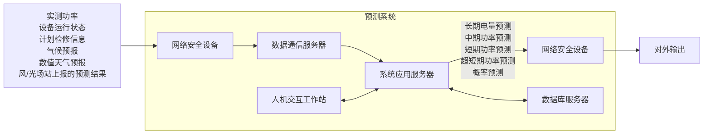

# 中华人民共和国国家标准

GB/T 40607—2021

# 调度侧风电或光伏功率预测系统 技术要求

# Technical requirements for dispatching side forecasting system of wind or photovoltaic power

2021-10-11 发布

2022-05-01 实施

国家市场监督管理总局发布
国家标准化管理委员会

## 目次

前言 …… I
1 范围 …… 1
2 规范性引用文件 …… 1
3 术语和定义 …… 1
4 数据要求 …… 2
4.1 基本要求 …… 2
4.2 数据采集 …… 2
4.3 数据处理 …… 3
4.4 数据存储 …… 3
5 软件要求 …… 3
5.1 基本要求 …… 3
5.2 预测的空间尺度 …… 3
5.3 预测的时间尺度及执行周期 …… 3
5.4 人机界面 …… 4
5.5 数据统计 …… 4
5.6 数据接收 …… 4
5.7 软件配置 …… 4
6 硬件要求 …… 5
7 性能指标要求 …… 5
附录 A（资料性） 风电场静态信息 …… 7
附录 B（资料性） 光伏电站静态信息 …… 9
附录 C（资料性） 气象数据订正方法 …… 11
附录 D（资料性） 误差统计指标计算方法 …… 12
附录 E（资料性） 系统的硬件拓扑 …… 15

## 前言

本文件按照 GB/T 1.1—2020《标准化工作导则 第 1 部分: 标准化文件的结构和起草规则》的规定起草。

请注意本文件的某些内容可能涉及专利。本文件的发布机构不承担识别专利的责任。

本文件由中国电力企业联合会提出。

本文件由全国电网运行与控制标准化技术委员会(SAC/TC 446)归口。

本文件起草单位：中国电力科学研究院有限公司、国家电网有限公司国家电力调度控制中心、中国南方电网电力调度控制中心、国网北京市电力公司、国网山东省电力公司、国网山西省电力公司、国网湖南省电力有限公司、国网江苏省电力有限公司、国网青海省电力公司、国网甘肃省电力公司。

本文件主要起草人:裴哲义、冯双磊、车建峰、王勃、迟永宁、董存、范高锋、陈国平、冷喜武、何锡祺、袁帅、赵俊屹、徐民、雷震、李延和、孙勇、杨健、韩自奋、孙荣富、王铮、裴岩、张菲、赵艳青、姜文玲、王钊、汪步惟、靳双龙、宋宗朋、滑申冰、胡菊、刘晓琳、马振强、韩振永、孙晨蕾、郭于阳、张艾虎、兰玥、赵丽君。

# 调度侧风电或光伏功率预测系统 技术要求

## 1 范围

本文件规定了调度侧风电或光伏功率预测系统(以下简称“预测系统”)在数据、软件、硬件和性能指标方面的技术要求。

本文件适用于预测系统的研发、建设、验收和运行。

## 2 规范性引用文件

下列文件中的内容通过文中的规范性引用而构成本文件必不可少的条款。其中，注日期的引用文件，仅该日期的版本适用于本文件；不注日期的引用文件，其最新版本（包括所有的修改单）适用于本文件。

GB/T 18709 风电场风能资源测量方法

GB/T 19963 风电场接入电力系统技术规定

GB/T 19964 光伏发电站接入电力系统技术规定

GB/T 30153 光伏发电站太阳能资源实时监测技术要求

GB/T 40604—2021 新能源场站调度运行信息交换技术要求

## 3 术语和定义

下列术语和定义适用于本文件。

### 3.1 数值天气预报 numerical weather prediction

根据大气实际情况,在一定的初值和边值条件下,通过大型计算机进行数值计算,求解描写天气演变过程的流体力学和热力学方程组,预报未来一定时段的大气运动状态和天气现象,通过数值的形式给出不同气象要素的预报值。

### 3.2 长期电量预测 long term electricity production prediction

预测风电场或光伏电站未来 12 个月的逐月电量及总电量。

### 3.3 中期功率预测 medium term power forecasting

预测风电场或光伏电站次日零时起到未来 240 h 的有功功率。

注：时间分辨率为 15 min。

### 3.4 短期功率预测 short term power forecasting

预测风电场或光伏电站次日零时起到未来 72 h 的有功功率。

注：时间分辨率为 15 min。

### 3.5 超短期功率预测 ultra short term power forecasting

预测风电场或光伏电站未来 $15 \, min \sim 4 \, h$ 的有功功率。

注：时间分辨率为 15 min。

### 3.6 概率预测 probabilistic power forecasting

预测风电场或光伏电站未来时刻的有功功率在一定置信度下的预测区间。

## 4 数据要求

### 4.1 基本要求

风电或光伏功率预测的基础数据应包括场站的静态信息、气候预报、数值天气预报、实测气象、实测功率、设备运行状态、计划检修信息等。

### 4.2 数据采集

4.2.1 场站的静态信息数据应符合下列要求：

a）风电场的静态信息至少包括名称、并网装机容量、中心位置的经纬度坐标、风机功率曲线等，具体信息见附录A；

b) 光伏电站的静态信息至少包括名称、并网装机容量、中心位置的经纬度坐标、光伏电池板特性参数等，具体信息见附录 B。

4.2.2 气候预报数据应符合下列要求：

a）至少包括次月起到未来12个月的气候预报数据，时间分辨率为月；

b) 至少包括月平均风速、月平均总辐照度、月平均温度等参数；

c) 每月至少提供一次气候预报数据。

4.2.3 数值天气预报数据应符合下列要求：

a）至少包括次日零时起到未来 240 h 的数值天气预报数据，时间分辨率为 15 min；

b) 至少包括不同层高的风速、风向，总辐照度，云量，气温，湿度，气压等参数；

c) 每日至少提供两次数值天气预报数据。

4.2.4 实测气象数据应符合下列要求：

a）风电场安装气象信息采集设备的技术指标符合GB/T18709的规定；

b）光伏电站安装气象信息采集设备的技术指标符合GB/T30153的规定；

c) 风电场采集的实测气象数据至少包括 10 m、30 m、50 m、70 m 和风电机组轮毂高度处（当轮毂高度不等于 70 m）的风速、风向，10 m 高程的气温、气压、相对湿度以及风电机组机舱测风仪器的采集数据；

d) 光伏电站采集的实测气象数据至少包括总辐照度、法向直射辐照度、水平面散射辐照度、气温、相对湿度、气压；

e) 实测气象数据采集的时间间隔不大于 5 min。

4.2.5 场站静态信息应离线收集，并保证相关数据的准确性。

4.2.6 实测功率数据、设备运行状态的采集时间间隔应不大于 5 min。

4.2.7 气候预报、数值天气预报、实测气象、实测功率、设备运行状态数据的采集应自动完成，并可通过手动方式补充录入。

4.2.8 自动采集数据的传输时间延迟应不大于 1 min。

### 4.3 数据处理

4.3.1 系统应具备数据完整性及合理性自动校验功能，并可对缺测和异常数据进行自动插补和修正。

4.3.2 数据完整性检验应符合下列要求：

a）数据的数量等于预期记录的数据数量；

b) 数据的时间顺序符合预期的开始、结束时间，中间应连续。

4.3.3 数据合理性检验应符合下列要求：

a）对实测功率、数值天气预报、实测气象数据进行越限检验，可手动设置限值范围；

b) 根据实测气象数据与实测功率数据的关系对数据进行相关性检验。

4.3.4 缺测和异常数据的处理应符合下列要求：

a）以前一时刻的功率数据补全缺测或异常的实际功率数据；

b) 以零代替小于零的功率数据；

c) 缺测或异常的气象数据应采用线性内插或根据相关性原理进行订正,订正方法可采用附录 C 的方法;

d) 经过插补和修正的数据应以特殊标识记录并可查询；

e）缺测和异常数据均可由人工补录或修正。

### 4.4 数据存储

数据存储应符合下列要求：

a）实时采集的数据应作为原始资料正本保存并备份，不应对正本数据进行任何改动；

b）存储系统运行期间所有时刻的数值天气预报数据；

c）存储系统运行期间所有时刻的实测功率数据、实测气象数据；

d) 存储每次执行的长期电量预测的结果及时标；

e）存储每次执行的短期、中期功率预测和概率预测的结果及时标；

f) 存储每 15 min 滚动执行的超短期功率预测和概率预测的结果及时标；

g）经过修正的数据，应存储修正前后的数据；

h）所有数据至少保存10年。

## 5 软件要求

### 5.1 基本要求

预测系统的功能应至少包括长期电量预测、中期功率预测、短期功率预测、超短期功率预测、概率预测和数据统计。

### 5.2 预测的空间尺度

预测的空间尺度应至少包括单个风电场/光伏电站、整个调度管辖区域的全网风电/光伏。

### 5.3 预测的时间尺度及执行周期

5.3.1 长期电量预测要求：

应逐月滚动更新电量预测结果,每次预测未来12个月,宜每月上旬发布。

5.3.2 中期功率预测要求：

a) 根据数值天气预报的发布次数进行中期功率预测,单次计算时间应小于 5 min;

b) 应每日至少执行两次预测。

5.3.3 短期功率预测要求：

a）单次预测时长和时间分辨率符合GB/T19963和GB/T19964的规定；

b) 根据数值天气预报的发布次数进行短期功率预测, 单次计算时间应小于 5 min;

c) 应每日至少执行两次预测。

5.3.4 超短期功率预测要求：

应每 15 min 执行一次,动态更新预测结果,单次计算时间应小于 5 min。

5.3.5 概率预测要求：

a）预测时长和时间分辨率应与中期、短期、超短期功率预测保持一致；

b）应至少提供置信度为 $95\%$ 、 $90\%$ 、 $85\%$ 的预测区间上下限，并可手动设置其他置信度。

### 5.4 人机界面

5.4.1 应具备风电场或光伏电站输出功率监视页面，至少显示实测功率、预测功率及实测气象要素，数据应动态更新。

5.4.2 应具备历史数据的曲线查询和比较页面,至少提供日、周等时间区间的曲线展示,页面查询响应时间应小于 1 min。

5.4.3 应提供数据统计分析页面,提供饼图、柱形图、表格等多种可视化展示手段。

### 5.5 数据统计

5.5.1 应能对风电场或光伏电站的运行参数、实测气象数据及预测误差进行统计。

5.5.2 运行参数统计应包括有效发电时间、最大出力及其发生时间和利用小时数等。

5.5.3 实测气象数据的统计应包括完整率和可用率等。

5.5.4 预测误差统计指标应包括均方根误差、平均绝对误差、平均误差、相关性系数、准确率、95%分位数偏差率、合格率、平均带宽、可靠度和分位数损失等，具体的计算方法见附录 D。

5.5.5 参与统计数据的时间范围应能任意选定,光伏电站可根据所处地理位置的日出日落时间自动剔除凌晨和夜间不发电时段。

5.5.6 各指标的统计计算时间应小于 1 min。

### 5.6 数据接收

预测系统应具备接收调度管辖范围内风电场或光伏电站上报的长期电量预测、中期功率预测、短期功率预测和超短期功率预测数据的能力(风电场或光伏电站上报预测数据的要求应符合 GB/T 40604—2021 的规定)。

### 5.7 软件配置

5.7.1 预测系统应配置通用、成熟的数据库，用于数据、模型及参数的存储。

5.7.2 预测系统软件应采用模块化划分,单个功能模块故障不应影响整个系统的运行。

5.7.3 预测系统应具有可扩展性,支持用户和第三方应用程序的开发。

5.7.4 预测系统应采用权限管理机制，应确保系统操作安全性。

## 6 硬件要求

6.1 预测系统硬件应至少包括数据通信服务器、系统应用服务器、数据库服务器、网络安全设备、人机交互工作站，系统的硬件拓扑见附录 E。

6.2 数据通信服务器、系统应用服务器和数据库服务器宜采用冗余配置。

6.3 人机交互工作站宜采用图形工作站，应具有良好的可靠性和可扩展性。

6.4 风电或光伏功率预测系统应运行于电力二次系统Ⅱ区或Ⅲ区，跨区数据传输应采用物理隔离装置。

6.5 风电或光伏功率预测系统应满足电力二次系统安全防护规定的要求。

## 7 性能指标要求

7.1 若衡量预测系统性能指标的统计数据中包含了功率受限时刻，则应使用该时刻风电或光伏的可用功率替代实际功率。

7.2 风电场、光伏电站功率预测结果的性能指标应符合表1、表2的规定，调度管辖区域的全网风电、全网光伏功率预测结果的性能指标应符合表3、表4的规定。

7.3 风电场、光伏电站的性能指标统计以系统接收场站上报的数据计算，全网风电、全网光伏以系统执行的数据计算。

7.4 预测系统月可用率应大于 99%。

表 1 风电场的功率预测性能指标要求

<table><tr><td>预测时间尺度</td><td>月平均准确率</td><td>月平均合格率</td></tr><tr><td>中期功率预测</td><td>以1日(24h)为步长统计,预测准确率按顺序依次递减,第10日(第217~240小时)≥70%</td><td>—</td></tr><tr><td>短期功率预测</td><td>日前≥83%</td><td>日前≥83%</td></tr><tr><td>超短期功率预测</td><td>第4小时≥87%</td><td>第4小时≥87%</td></tr></table>

表 2 光伏电站的功率预测性能指标要求

<table><tr><td>预测时间尺度</td><td>月平均准确率</td><td>月平均合格率</td></tr><tr><td>中期功率预测</td><td>以1日(24h)为步长统计,预测准确率按顺序依次递减,第10日(第217~240小时)≥75%</td><td>—</td></tr><tr><td>短期功率预测</td><td>日前≥85%</td><td>日前≥85%</td></tr><tr><td>超短期功率预测</td><td>第4小时≥90%</td><td>第4小时≥90%</td></tr></table>

表 3 全网风电的功率预测性能指标要求

<table><tr><td>预测时间尺度</td><td>月平均准确率</td><td>月平均合格率</td></tr><tr><td>中期功率预测</td><td>以1日(24h)为步长统计,预测准确率按顺序依次递减,第10日(第217~240小时)≥75%</td><td>—</td></tr><tr><td>短期功率预测</td><td>日前≥85%</td><td>日前≥85%</td></tr><tr><td>超短期功率预测</td><td>第4小时≥90%</td><td>第4小时≥90%</td></tr></table>

表 4 全网光伏的功率预测性能指标要求

<table><tr><td>预测时间尺度</td><td>月平均准确率</td><td>月平均合格率</td></tr><tr><td>中期功率预测</td><td>以1日(24h)为步长统计,预测准确率按顺序依次递减,第10日(第217~240小时)≥80%</td><td>—</td></tr><tr><td>短期功率预测</td><td>日前≥90%</td><td>日前≥90%</td></tr><tr><td>超短期功率预测</td><td>第4小时≥95%</td><td>第4小时≥95%</td></tr></table>

# 附录 A（资料性）

## 风电场静态信息

### A.1 风电场基本参数

风电场基本参数见表 A.1。

表 A.1 风电场基本参数

<table><tr><td>序号</td><td>名称</td><td>单位</td><td>数值或内容</td></tr><tr><td>1</td><td>风电场名称</td><td>—</td><td></td></tr><tr><td>2</td><td>建设地点</td><td>—</td><td></td></tr><tr><td>3</td><td>风电场中心位置经纬度</td><td>(°)</td><td></td></tr><tr><td>4</td><td>投运时间</td><td>—</td><td>年 月 日</td></tr><tr><td>5</td><td>占地面积</td><td>km2</td><td></td></tr><tr><td>6</td><td>并网装机容量</td><td>MW</td><td></td></tr><tr><td>7</td><td>测风塔位置经纬度</td><td>(°)</td><td></td></tr><tr><td>8</td><td>并网线路及电压等级</td><td>—</td><td></td></tr><tr><td>9</td><td>上网变电站名称</td><td>—</td><td></td></tr></table>

### A.2 风机功率曲线

风机功率曲线见表 A.2。

表 A.2 风机功率曲线

<table><tr><td>名称</td><td colspan="3">风机类型1</td><td colspan="3">风机类型2</td></tr><tr><td>风机型号</td><td colspan="3"></td><td colspan="3"></td></tr><tr><td>风机台数</td><td colspan="3"></td><td colspan="3"></td></tr><tr><td>生产厂商</td><td colspan="3"></td><td colspan="3"></td></tr><tr><td>轮毂高度/m</td><td colspan="3"></td><td colspan="3"></td></tr><tr><td>叶轮直径/m</td><td colspan="3"></td><td colspan="3"></td></tr><tr><td>发电机类型</td><td colspan="3"></td><td colspan="3"></td></tr><tr><td>桨距调节</td><td colspan="3"></td><td colspan="3"></td></tr><tr><td>功率曲线</td><td colspan="3"></td><td colspan="3"></td></tr><tr><td>编号</td><td>风速/(m/s)</td><td>功率/W</td><td>推力系数</td><td>风速/(m/s)</td><td>功率/W</td><td>推力系数</td></tr><tr><td></td><td></td><td></td><td></td><td></td><td></td><td></td></tr><tr><td></td><td></td><td></td><td></td><td></td><td></td><td></td></tr><tr><td></td><td></td><td></td><td></td><td></td><td></td><td></td></tr><tr><td></td><td></td><td></td><td></td><td></td><td></td><td></td></tr><tr><td></td><td></td><td></td><td></td><td></td><td></td><td></td></tr></table>

### A.3 风机详细信息

风机详细信息见表 A.3。

表 A.3 风机详细信息

<table><tr><td>序号</td><td>机组编号</td><td>风机型号</td><td>轮毂高度/m</td><td>并网时间</td><td>北纬/(°)</td><td>东经/(°)</td><td>海拔/m</td></tr><tr><td></td><td></td><td></td><td></td><td></td><td></td><td></td><td></td></tr><tr><td></td><td></td><td></td><td></td><td></td><td></td><td></td><td></td></tr><tr><td></td><td></td><td></td><td></td><td></td><td></td><td></td><td></td></tr><tr><td></td><td></td><td></td><td></td><td></td><td></td><td></td><td></td></tr><tr><td></td><td></td><td></td><td></td><td></td><td></td><td></td><td></td></tr><tr><td></td><td></td><td></td><td></td><td></td><td></td><td></td><td></td></tr><tr><td></td><td></td><td></td><td></td><td></td><td></td><td></td><td></td></tr></table>

# 附录 B（资料性）

## 光伏电站静态信息

### B.1 光伏电站基本参数

光伏电站基本参数见表 B.1。

表 B.1 光伏电站基本参数

<table><tr><td>序号</td><td>名称</td><td>单位</td><td>数值或内容</td></tr><tr><td>1</td><td>光伏电站名称</td><td>—</td><td></td></tr><tr><td>2</td><td>建设地点</td><td>—</td><td></td></tr><tr><td>3</td><td>光伏电站中心位置经纬度</td><td>(°)</td><td></td></tr><tr><td>4</td><td>投运时间</td><td>—</td><td>年 月 日</td></tr><tr><td>5</td><td>占地面积</td><td>km2</td><td></td></tr><tr><td>6</td><td>并网装机容量</td><td>MW</td><td></td></tr><tr><td>7</td><td>测光设备位置经纬度</td><td>(°)</td><td></td></tr><tr><td>8</td><td>并网线路及电压等级</td><td>—</td><td></td></tr><tr><td>9</td><td>上网变电站名称</td><td>—</td><td></td></tr></table>

### B.2 光伏阵列信息

光伏阵列信息见表 B.2。

表 B.2 光伏阵列信息

<table><tr><td>序号</td><td>电池型号</td><td>电池片数</td><td>逆变器型号</td><td>逆变器效率</td><td>光伏阵列的倾斜角/(°)</td><td>光伏阵列的方位角/(°)</td><td>串并联方式</td><td>总功率/W</td></tr><tr><td></td><td></td><td></td><td></td><td></td><td></td><td></td><td></td><td></td></tr><tr><td></td><td></td><td></td><td></td><td></td><td></td><td></td><td></td><td></td></tr><tr><td colspan="9">倾斜角:光伏电池板与地面的夹角。方位角:如果电池板水平放置方位角为零,此外正南为0°,正西为90°,正北180°,正东270°。</td></tr></table>

### B.3 光伏组件参数

光伏组件参数见表 B.3。

表 B.3 光伏组件参数

<table><tr><td>电池型号</td><td>最佳工作电压 $V_{mp}$ /V</td><td>最佳工作电流 $I_{mp}$ /A</td><td>开路电压 $V_{oc}$ /V</td><td>短路电流 $I_{sc}$ /A</td><td>峰值功率 $P_m$ /W</td></tr><tr><td></td><td></td><td></td><td></td><td></td><td></td></tr><tr><td></td><td></td><td></td><td></td><td></td><td></td></tr></table>

# 附录 C（资料性）

## 气象数据订正方法

### C.1 线性内插订正法

线性内插订正由公式(C.1)计算得出。

有 $x_{t}, \cdots, x_{t+i}, \cdots, x_{t+n}$ 共 n 个连续的时间序列 $(i=1,2,\cdots,n-1)$ ，其中 $x_{t+i}$ 为未知值（有 n-2 个未知值）， $x_{t}$ 和 $x_{t+n}$ 为已知值，利用 $x_{t}$ 和 $x_{t+n}$ 对数据进行内插补充。

$$
x_{t+i} = \frac{x_{t+n} - x_t}{n - 1} i + x_t \tag{C.1}
$$

式中：

x——实测风速、实测辐照度、实测温度等气象数据。

### C.2 相关性原理订正法

相关性原理订正由公式(C.2)计算得出。

x、y 为时间序列数据，其中 x 为参照数据，共有 N 个数据；y 为需订正数据，共有 n 个数据；n < N，并且 n 包含在 N 时间序列内，可将需订正数据订正至 N 个时间序列。

$$
y_N = \overline{y}_n + r \frac{e_x}{e_y} (x_N - \overline{x}_n) \tag{C.2}
$$

式中：

x、y ——风电场的实测功率、实测风速或光伏电站的实测功率、实测辐照度；

$y_{N}$ ——需订正数据的第 N 个时间序列要素值；

$\overline{y}_n$ ——需订正数据的 $n$ 个时间序列要素的平均值；

r ——参照数据和需订正数据的 n 个时间序列的相关性系数；

$e_{x}$ ——参照数据的 n 个时间序列要素的标准差；

$e_{y}$ ——需订正数据的 n 个时间序列要素的标准差；

$x_{N}$ ——参照数据的第 N 个时间序列要素值；

$\overline{x}_{n}$ ——参照数据的 n 个时间序列要素的平均值。

# 附录 D（资料性）

## 误差统计指标计算方法

### D.1 均方根误差（$E_{\mathrm{rmse}}$）

均方根误差 $(E_{\mathrm{rmse}})$ 由公式(D.1)计算得出。

$$
E_{\mathrm{rmse}} = \sqrt{\frac{1}{n} \sum_{i = 1}^{n} \left( \frac{P_{Pi} - P_{Mi}}{C_i} \right)^2} \tag{D.1}
$$

式中：

n ——所有样本个数；

$P_{Pi}$ ——i 时刻的实际功率；

$P_{Mi}$ ——i 时刻的预测功率；

$C_{i}$ ——i 时刻的开机容量。

### D.2 平均绝对误差（$E_{\mathrm{mae}}$）

平均绝对误差 $(E_{\mathrm{mae}})$ 由公式(D.2)计算得出。

$$
E_{\mathrm{mae}} = \frac{1}{n} \sum_{i = 1}^{n} \left| \frac{P_{Pi} - P_{Mi}}{C_i} \right| \tag{D.2}
$$

### D.3 平均误差（$E_{\mathrm{me}}$）

平均误差 $(E_{\mathrm{me}})$ 由公式(D.3)计算得出。

$$
E_{\mathrm{me}} = \frac{1}{n} \sum_{i = 1}^{n} \left( \frac{P_{Pi} - P_{Mi}}{C_i} \right) \tag{D.3}
$$

### D.4 相关系数（$r$）

相关系数(r)由公式(D.4)计算得出。

$$
r = \frac{\sum_{i = 1}^{n} \left[ \left( P_{Mi} - \overline{P}_M \right) \left( P_{Pi} - \overline{P}_P \right) \right]}{\sqrt{\sum_{i = 1}^{n} \left( P_{Mi} - \overline{P}_M \right)^2 \sum_{i = 1}^{n} \left( P_{Pi} - \overline{P}_P \right)^2}} \tag{D.4}
$$

式中：

$\overline{P}_{M}$ ——误差统计时段预测功率的平均值；

$\overline{P}_{P}$ ——误差统计时段实际功率的平均值。

### D.5 准确率（$C_{R}$）

准确率 $(C_{\mathrm{R}})$ 由公式(D.5)计算得出。

$$
C_R = 1 - E_{\mathrm{rmse}} \tag{D.5}
$$

### D.6 合格率（$Q_{R}$）

合格率 $(Q_{\mathrm{R}})$ 由公式(D.6)、公式(D.7)计算得出。

$$
Q_R = \frac{1}{n} \sum_{i = 1}^{n} B_i \times 100\% \tag{D.6}
$$

$$
B_i =
\begin{cases}
1, & \dfrac{\left| P_{Pi} - P_{Mi} \right|}{C_i} < 0.25 \\
0, & \dfrac{\left| P_{Pi} - P_{Mi} \right|}{C_i} \geq 0.25
\end{cases}
\tag{D.7}
$$

式中：

$B_{i}$ ——i 时刻的预测合格率判定结果。

### D.7 $95\%$ 分位数偏差率（$P_{\mathrm{er}_{95}}$）

$95\%$ 分位数偏差率 $(P_{\mathrm{er}_{95}})$ 由公式(D.8)、公式(D.9)计算得出。

$95\%$ 分位数偏差率包括 $95\%$ 分位数正偏差率和 $95\%$ 分位数负偏差率。$95\%$ 分位数正偏差率指将评价时段内单点预测正偏差率由小到大排列，选取位于 $95\%$ 位置处的单点预测正偏差率，按公式(D.8)计算：

$$
\begin{cases}
E_i = \dfrac{P_{Pi} - P_{Mi}}{C_i} \geq 0, & i = 1, 2, \dots, n \\
E_j = \operatorname{sortp}(E_i), & j = 1, 2, \dots, n \\
p_{\mathrm{er}_{95\mathrm{pos}}} = E_j, & j = \mathrm{INT}(0.95 \cdot n)
\end{cases}
\tag{D.8}
$$

式中：

$E_{i}$ ——i 时刻预测偏差率；

$E_{j}$ ——排序后的单点预测偏差率；

sortp(·)——由小到大排序函数；

$p_{\mathrm{er}_{95\mathrm{pos}}}$ ——95%分位数正偏差率；

INT(·)——取整函数；

$n$ ——评价时段内的正偏差样本数。

$95\%$ 分位数负偏差率指将评价时段内单点预测负偏差率由大到小排列，选取位于 $95\%$ 位置处的单点预测负偏差率，按公式(D.9)计算：

$$
\begin{cases}
E_i = \dfrac{P_{Pi} - P_{Mi}}{C_i} \leq 0, & i = 1, 2, \dots, n' \\
E_j = \operatorname{sortn}(E_i), & j = 1, 2, \dots, n' \\
p_{\mathrm{er}_{95\mathrm{neg}}} = E_j, & j = \mathrm{INT}(0.95 \cdot n')
\end{cases}
\tag{D.9}
$$

式中：

$p_{\mathrm{er}_{95\mathrm{neg}}}$ ——95%分位数负偏差率；

sortn(·)——由大到小排序函数；

$n'$ ——评价时段内的负偏差样本数。

### D.8 可靠度（$R^{\alpha}$）

可靠度 $(R^{\alpha})$ 由公式(D.10)计算得出。

$$
R^{\alpha} = \frac{N_{\mathrm{hit}}^{\alpha}}{N} \tag{D.10}
$$

式中：

$N_{hit}^{\alpha}$ ——置信度为 $1-\alpha$ 时实际功率落在预测区间上界与下界之间的点的个数；

N ——所有样本个数。

### D.9 平均带宽（$S^{\alpha}$）

平均带宽 $(S^{\alpha})$ 由公式(D.11)计算得出。

$$
S^{\alpha} = \frac{1}{N} \sum_{i = 1}^{N} \left( U_i^{\alpha} - L_i^{\alpha} \right) \tag{D.11}
$$

式中：

$U_{i}^{\alpha}$ ——置信度为 $1-\alpha$ 时预测上限；

$L_{i}^{\alpha}$ ——置信度为 $1-\alpha$ 时预测下限；

$N$ ——所有样本个数。

### D.10 分位数损失（$L_{\mathrm{pinball}}^{q}$）

分位数损失 $(L_{\mathrm{pinball}}^{q})$ 由公式(D.12)和公式(D.13)计算得出。

$$
L_{\mathrm{pinball}}^{q} = \frac{1}{N} \sum_{i = 1}^{N} p_{\mathrm{pinball}}(y_{t,q}, y_t^{*}, q) \tag{D.12}
$$

$$
p_{\mathrm{pinball}}(y_{t,q}, y_t^{*}, q) =
\begin{cases}
(1 - q)(y_{t,q} - y_t^{*}), & y_t^{*} < y_{t,q} \\
q(y_t^{*} - y_{t,q}), & y_t^{*} \geq y_{t,q}
\end{cases}
\tag{D.13}
$$

式中：

$q$ ——预测分位数；

$p_{\text{pinball}}(y_{t,q}, y_{t}^{*}, q)$ ——i 时刻 q 分位数下的 pinball 值；

$N$ ——所有样本个数；

$y_{t,q}$ —— t 时刻预测值的 q 分位数；

$y_{t}^{*}$ —— t 时刻实际值。

# 附录 E（资料性）

## 系统的硬件拓扑

预测系统的硬件拓扑见图 E.1。

图 E.1 预测系统的硬件拓扑
