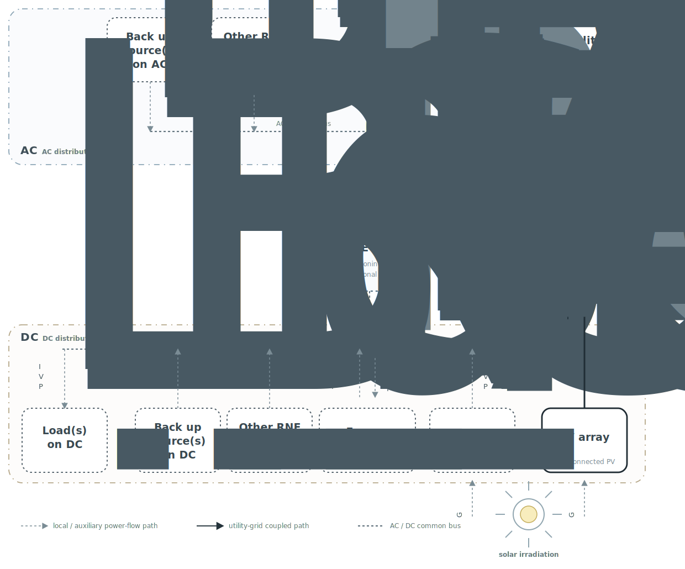
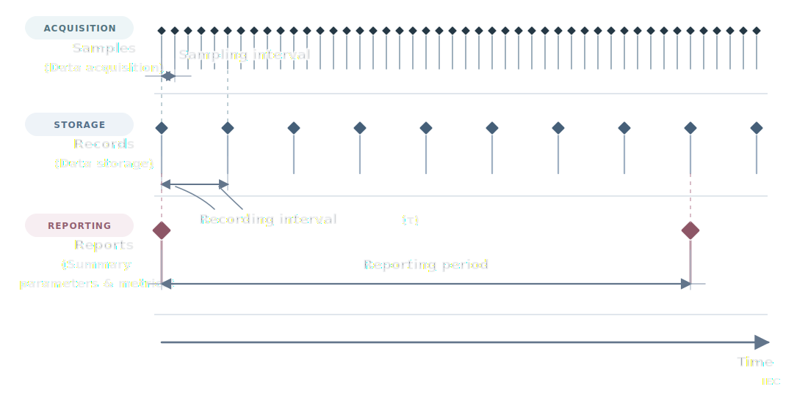

<!--
中文翻译说明：
- 本译文依据 IEC 61724-1:2021 英文 Markdown 原文逐条翻译。
- 公式、变量、图像引用、IEC/ISO 标准号以及常用英文缩写保持不变。
- 生僻或易歧义的专业术语在首次出现或有助于理解时保留英文表达。
- 本译文供技术参考；正式引用时应以 IEC 发布的英文原文为准。
-->

# IEC 61724-1:2021 光伏系统性能 – 第 1 部分：监测

## 目录

前言....6
简介....8
1 范围....10
2 规范性引用文件....10
3 术语和定义 11
4 监测系统分类....15
5 一般....16
5.1 测量精度和不确定度....16
5.2 校准 16
5.3 重复元素 16
6 数据采集时序和报告 16
6.1 样本、记录和报告....16
6.2 时间戳 18
6.3 参数名称....18
7 必需测量....18
8 辐照度....23
8.1 传感器类型....23
8.2 一般要求....23
8.2.1 概述 23
8.2.2 传感器要求....23
8.2.3 传感器位置 24
8.2.4 重新校准....25
8.2.5 污损缓解 25
8.2.6 缓解露水和霜冻....25
8.2.7 检查和维护 26
8.2.8 传感器对准 26

8.3 测量 26

8.3.1 全球水平辐照度....26
8.3.2 阵列面内辐照度 26
8.3.3 阵列面内背面辐照度....27
8.3.4 阵列面内背面辐照度比 27
8.3.5 水平反照率 27
8.3.6 直接法向辐照度 27
8.3.7 散射水平辐照度 27
8.3.8 光谱匹配辐照度 27
8.3.9 阵列面内辐照度用于集中器系统....28
8.3.10 聚光系统的光谱辐照度 29
8.3.11 日周集中器系统测量....29
8.3.12 辐照度卫星遥感....30

9 环境因素..31

9.1 PV 组件温度....31
9.2 环境空气温度....31

9.3 风速和风向 32
9.4 污损比....32
9.5 降雨量 33
9.6 雪 33
9.7 湿度 33

10 跟踪支架系统....33

10.1 单轴跟踪支架....33
10.2 双轴跟踪支架 33

10.2.1 监测..33
10.2.2 指向误差传感器对准....33

11 电气测量....34

11.1 逆变器级测量 34
11.2 电站级测量....34

12 数据处理和质量检查....35

12.1 夜..35
12.2 质量检查....35

12.2.1 删除无效读数....35
12.2.2 缺失数据的处理....35

13 计算参数....36

13.1 概述......36
13.2 总结....36
13.3 辐照量 36
13.4 电能..37

13.4.1 概述 37
13.4.2 DC 输出能量....37
13.4.3 AC 输出能量 37

13.5 阵列额定功率....37

13.5.1 DC 额定功率....37
13.5.2 AC 额定功率 38

13.6 产量..38

13.6.1 概述 38
13.6.2 PV 阵列发电量折算值....38
13.6.3 最终系统发电量折算值 38
13.6.4 参考发电量折算值....39
13.6.5 双面参考发电量折算值....39

13.7 发电量折算损失 39

13.7.1 概述 39
13.7.2 阵列捕获损失....39
13.7.3 系统平衡（BOS）损失....40

13.8 效率 40

13.8.1 阵列（DC）效率 40
13.8.2 系统（AC）效率....40
13.8.3 BOS 效率 40

14 绩效指标....41

14.3.1 性能比 41

14.3.2 温度校正性能比s 42

14.3.3 双面性能比s....44

14.4 性能指标....44

15 数据过滤....45

15.1 可用数据的使用....45

15.2 根据特定条件过滤数据....45

15.3 逆变器、电网或负载可用性降低 45

附录A（资料性附录） 采样间隔 46

A.1 一般考虑因素....46

A.2 时间常数....46

A.3 别名错误 46

A.4 示例....47

附件B（资料性附录）组件温度传感器选型及附件....48

B.1 目标 48

B.2 传感器和材料选择....48

B.2.1 最佳传感器类型 48

B.2.2 最佳磁带 48

B.2.3 氰基丙烯酸酯粘合剂和背板完整性 49

B.3 传感器附件 49

B.3.1 永久与临时......49

B.3.2 附件位置 49

B.3.3 双面模块....49

B.3.4 方法 49

附录 C（规范性） 污损使用清洁和污染的 PV 参考设备对进行测量 52

C.1 概述......52

C.2 设备 52

C.3 标准化....52

C.4 测量方法 1 – 污损导致的最大功率降低 .....53

C.5 测量方法 2 – 由于污损引起的短路电流减少 .....53

C.6 非均匀污损 53

C.7 日平均值....54

C.8 重整化....54

附录 D（资料性） 降额因素....55

附件 E（规范） 具有本地负载、存储或辅助电源的系统....57

E.1 系统类型 57

E.2 参数和公式 59

参考书目 66

图 1 – PV 系统的可能元件..8

图 2 – 样本、记录和报告....17

图 B.1 - 传感器附件，永久....50

图 B.2 - 传感器附件，临时 50

图 B.3 – 传感器元件导线应力消除....51

图 E.1 – 不同 PV 系统类型的可能元件之间的能量流....57

表 1 – 采样和记录间隔要求....18

表 2 – 测量参数和要求......20

表 3 – 表 2 中引用的乘数....23

表 4 – 辐照度传感器要求....24

表 5 – 逆变器级电气测量要求....34

表 6 – 电站级 AC 电力输出测量要求....34

表 7 – 计算出的参数....36

表 8 – 性能指标....41

表 E.1 – 不同 PV 系统类型的元件....58

表 E.2 – 不同系统类型的参数和公式 ......59

## 前言

1) 国际电工委员会（IEC）是一个世界范围内的标准化组织，由所有国家电工委员会（IEC国家委员会）组成。 IEC 的目标是促进有关电气和电子领域标准化的所有问题的国际合作。为此，除了其他活动外，IEC 还出版了国际标准、技术规范、技术报告、公开规范 (PAS) 和指南（以下简称“IEC 出版物”）。它们的准备工作委托给技术委员会；任何对可主题感兴趣的 IEC 国家委员会都可以参与这项准备工作。与 IEC 联络的国际组织、政府组织和非政府组织也参与了此项准备工作。 IEC 根据两个组织之间协议确定的条件与国际标准化组织 (ISO) 密切合作。
2) IEC 关于技术问题的正式决定或协议尽可能表达了有关相关主题的国际共识，因为每个技术委员会都有来自所有感兴趣的 IEC 国家委员会的代表。
3) IEC 出版物具有供国际使用的建议形式，并在这个意义上被 IEC 国家委员会接受。尽管我们已尽一切合理努力确保 IEC 出版物的技术内容准确无误，但 IEC 不对这些出版物的使用方式或任何最终用户的任何误解承担责任。
4) 为了促进国际统一，IEC国家委员会承诺在其国家和地区出版物中尽可能透明地应用IEC出版物。任何 IEC 出版物与相应国家或地区出版物应之间的任何差异均应在后者中明确指出。
5) IEC本身不提供任何合格证明。独立认证机构提供合格评定服务，并在某些领域获得 IEC 合格标志。 IEC 不对独立认证机构提供的任何服务负责。
6) 所有宜用户确保他们拥有本出版物的最新版本。
7) 对于任何性质的直接或间接的人身伤害、财产损失或其他损害，或者因出版、使用或依赖本 IEC 出版物或任何其他 IEC 出版物而产生的费用（包括法律费用）和开支，不应承担 IEC 或其董事、雇员、雇员或代理人（包括个人专家及其技术委员会和 IEC 国家委员会成员）的责任。
8) 请注意本出版物中引用的规范性引用文件。使用引用的出版物对于正确应用本出版物是必不可少的。
9) 请注意本 IEC 出版物可的某些要素可能受专利权保护。 IEC 不应负责识别任何或所有此类专利权。

国际标准IEC 61724-1由IEC第82技术委员会制定：太阳能光伏能源系统。

第二版取消并取代了 2017 年发布的第一版。该版本构成了技术修订版。

相对于先前版本，此版本包括以下重大技术更改：

• 引入了双面系统的监测。
- 辐照度传感器要求已更新。
- 污损测量基于新技术进行更新。
• C 类监测系统已被淘汰。
- 更新了各种要求、建议和解释性说明。

本标准的正文依据下列文件：

|外国直接投资计划 |投票报告 |
| --- | --- |
| 82/1904/FDIS | 82/1925/RVD |

有关投票批准的完整信息可在上表所示的投票报告中找到。

用于制定本国际标准的语言是英语。

本文件根据 ISO/IEC 指令第 2 部分起草，并根据 ISO/IEC 指令第 1 部分和 ISO/IEC 指令 IEC 补充（可在 www.iec.ch/members\_experts/refdocs 获取）制定。 IEC 开发的主要文件类型在 www.iec.ch/standardsdev/publications 中有更详细的描述。

IEC 61724 系列所有部件的列表（以光伏系统性能总标题发布）可在 IEC 网站上找到。

委员会决定，本文件的内容将保持不变，直到 IEC 网站 webstore.iec.ch 下与特定文件相关的数据显示的稳定日期为止。届时，该文件将

- 再次确认，
- 撤回，
• 由修订版取代，或
- 修正。

## 引言

本文档定义了光伏 (PV) 性能监测系统的类别，并作为监测系统选择的指南。

图 1 说明了构成不同 PV 系统类型的主要元素。本文件的主要条款是针对没有本地负载、储能或辅助电源的并网系统编写的，如图 1 中的粗线所示。附件 E 包括带有附加组件的系统的一些详细信息。

PV 阵列可包括固定轴和跟踪支架系统以及平板和集中器系统。

**图例**

粗线表示没有本地负载、储能或辅助电源的简单并网系统。

PCE 表示功率转换设备，也可根据系统功能称为逆变器或变流器。

性能监测系统的用途多种多样，可能包括将性能与设计预期和保证进行比较，以及检测和定位故障。

为了将性能与设计预期和保证进行比较，宜的重点是系统级数据以及预测和测试方法之间的一致性。

为了检测和定位故障，宜在系统的子级别上需要更高的分辨率，并强调测量重复性和相关指标。

监测系统宜可适应 PV 系统的尺寸和用户要求。一般来说，较大的 PV 系统宜比较小且成本较低的 PV 系统具有更多的监测点和更高精度的传感器。

## 1 范围

IEC 61724 的这一部分概述了光伏 (PV) 系统性能监测和分析的术语、设备和方法。它还可以作为依赖所收集数据的其他标准的基础。

## 2 规范性引用文件

正文中引用下列文件时，其部分或全部内容构成本文件的要求。对于注明日期的参考文献，仅引用的版本适用。对于未注明日期的参考文献，适用参考文件的最新版本（包括任何修订）。

IEC 60050-131，国际电工词汇 (IEV) – 第 131 部分：电路理论

IEC 60904-2、光伏器件 – 第 2 部分：光伏参考器件的要求

IEC 60904-5、光伏器件 – 第 5 部分：通过开路电压方法确定光伏 (PV) 器件的等效电池温度 (ECT)

IEC 60904-7、光伏器件 – 第 7 部分：光伏器件测量的光谱失配校正的计算

IEC 61215（所有部件）、地面光伏 (PV) 模块 – 设计资格和型式批准

IEC 61557-12，1 000 V 以下低压配电系统的电气安全 AC 和 1 500 V DC – 用于测试、测量或监测保护措施的设备 – 第 12 部分：电力计量和监测装置 (PMD)

IEC TS 61724-2、光伏系统性能-第2部分：容量评估方法

IEC TS 61724-3、光伏系统性能-第3部分：能量评估方法

IEC TS 61836，太阳能光伏能源系统 – 术语、定义和符号

IEC 62053-22，电力计量设备 – 特殊要求 – 第 22 部分：AC 有功电能静态电表（0,1S、0,2S 和 0,5S 级）

IEC 62670-3、光伏集中器 (CPV) – 性能测试 – 第 3 部分：性能测量和额定功率

IEC 62817:2014、光伏系统 – 太阳能跟踪器的设计鉴定

ISO/IEC Guide 98-1，测量不确定度 - 第 1 部分：测量不确定度表达介绍

ISO/IEC Guide 98-3，测量不确定度 - 第 3 部分：测量不确定度表达指南 (GUM:1995)

ISO 9060:2018，太阳能——测量半球太阳和直接太阳辐射的仪器的规格和分类

ISO 9488，太阳能 – 词汇

## 3 术语和定义

就本文件而言，IEC 60050-131、IEC TS 61836、ISO 9488 中给出的术语和定义以及以下内容适用。

ISO 和 IEC 在以下地址维护用于标准化的术语数据库：

• IEC 百科全书：可在 http://www.electropedia.org/ 获取
• ISO在线浏览平台：可在http://www.iso.org/obp获取

### 3.1 样本

从传感器或测量设备获取的数据

### 3.2 采样间隔

样本之间的时间

### 3.3 记录

记录和存储的数据

### 3.4 记录间隔

τ

记录之间的时间

### 3.5 报告

基于一系列记录的聚合值

### 3.6 报告周期

报告之间的时间

### 3.7 正面

通常面向天空的表面的一侧

### 3.8 背面

通常面向地面的表面的一侧

### 3.9 单面 PV 器件

PV 器件，其中仅使用正面进行发电

### 3.10 双面 PV 器件

PV装置，其中正面和背面均用于发电

### 3.11 双面率系数

φ

除非另有说明，背面和双面器件的正面的 I-V 特性之间的比率，通常为标准测试条件 (STC)

注 1：双面率系数包括短路电流双面率系数 $\varphi_{\mathrm{Isc}}$ 、 开路电压双面率系数 $\varphi_{\mathrm{Voc}}$ 和最大功率双面率系数 $\varphi_{\mathrm{Pmax}}$ 。

注 2：双面率系数在 IEC TS 60904-1-2 中定义。

### 3.12 辐照度

G

每单位面积的辐射功率的入射通量

注 1：以 W·m $^{-2}$ 为单位表示。

### 3.13 阵列面内辐照度

$G_{i}$ 或 POA

入射到平行于 PV 阵列中模块平面的倾斜表面正面上的直接、漫射和地面反射辐照度的总和，也称为阵列平面 (POA) 辐照度

注 1：以 W·m $^{-2}$ 为单位表示。

### 3.14 水平反照率

$\rho_{H}$

在水平面上测量的被地面反射的入射光比例

注 1：它是地面的一个属性，是一个范围从 0 到 1 的无量纲量。

### 3.15 阵列面内背面辐照度比

$\rho_{i}$

PV阵列中模块的背面上入射的辐照度与正面上入射的辐照度的比率

注 1：它是一个无量纲量，但可以超过 1，因为除了反射光之外，太阳能资源可的漫射和直接分量也可以在阵列平面的背面进行测量。

### 3.16 光谱匹配的阵列面内背面辐照度比

$\rho_{i}^{SP}$

当使用光谱匹配参考器件或应用 IEC 60904-7 的光谱校正因子测量两个辐照度量时，按 3.15 的阵列面内背面辐照度比

### 3.17 光谱匹配参考器件

参考器件，例如 PV 电池或模块，其光谱响应特性与 PV 阵列中的 PV 模块的光谱响应特性足够接近，因此在典型的入射光谱范围内，光谱失配误差很小

### 3.18 阵列面内背面辐照度

$G_{i}^{rear}$ 或 POA $^{rear}$

入射到 PV 阵列中模块的背面上的直接、漫射和地面反射辐照度的总和，也称为后侧阵列平面辐照度

注 1：以 W·m $^{-2}$ 为单位表示。

注 2：（如果通过阵列面内背面辐照度比测量）：$G_{i}^{rear} = \rho_{i} \times G_{i}$ 或 $G_{i,SP}^{rear} = \rho_{i}^{SP} \times G_{i}$ 。

### 3.19 双面参考器件

双面 PV设备，例如电池或模块，对于前侧和后侧辐照度的响应，与要监测的双面模块具有基本相同的属性

### 3.20 双面辐照度因子

BIF

无量纲因子，可直接乘以前端阵列面内辐照度 ( $G_{i}$ )，以计算从前端和背面共同到达双面器件的“有效”辐照度

注 1：$BIF = (1 + \varphi_{Pmax} \times \rho_t)$ 或 $BIF^{sp} = (1 + \varphi_{Pmax} \times \rho_t^{sp})$ 。见 3.11、3.15、3.16。

注 2：使用双面参考器件可以同时测量背面 POA 辐照度和正面 POA 辐照度。在这种情况下，$BIF = G_{i}^{BIFI Ref Device} \div G_{i}$ 。为了保持一致性，正面 POA 辐照度宜使用与双面参考器件相同或相似类型的设备进行测量。

注 3：“有效”辐照度可包括后侧辐照度中不均匀性的影响。

### 3.21 全球水平辐照度

GHI

直接加漫射辐照度入射在水平表面的正面上

注 1：以 W·m $^{-2}$ 为单位表示。

注 2：$GHI = DNI \cdot \cos Z + DHI$，其中 $Z$ 是太阳天顶角。

### 3.22 日周

紧邻太阳圆盘

### 3.23 直接法向辐照度

DNI

辐照度从太阳盘和天空的日周区域发出，在 $5^{\circ}$ 的对向全角内落在垂直于太阳光线的平面上

注 1：以 W·m $^{-2}$ 为单位表示。

注 2：$GHI = DNI \cdot \cos Z + DHI$，其中 $Z$ 是太阳天顶角。

### 3.24 日周贡献

日周正常辐照度的特定部分对直接法向辐照度的贡献。 日周贡献是指由距太阳中心的内角距离和外角距离描述的特定环形角区域（参见 ISO 9488）

注 1：如果描述该角度区域的内角是太阳盘的半角，则日周贡献也称为日周比率。

注 2：根据日周辐照度测量仪器或所涉及的太阳能技术，包括不同的波长范围。为了正确描述日周辐照度，必须指定仪器或所涉及技术的波长范围或光谱响应。

### 3.25 日周比率

从日周天空区域发出的测量直接法向辐照度 (DNI) 的分数，即在 DNI 传感器的角度接受范围内但在太阳盘之外

### 3.26 太阳形状

方位角平均辐射率剖面作为距太阳中心角距离的函数，在太阳中心归一化为 1，并考虑短波辐射的波长范围（参见 ISO 9488）

### 3.27 散射水平辐照度

$G_{d}$ 或 DHI

水平表面的正面上的全局辐照度，不包括从日盘和 $5^{\circ}$ 所对全角内的天空日周区域发出的部分

注 1：以 W·m $^{-2}$ 为单位表示。

注 2：$GHI = DNI \cdot \cos Z + DHI$，其中 $Z$ 是太阳天顶角。

### 3.28 阵列面内直射束辐照度

$G_{i,b}$

阵列面内辐照度入射到与 PV 阵列中的模块平面平行的倾斜表面的正面上，从太阳盘和天空的日周区域发出，在 $5^{\circ}$ 的对向全角范围内

注 1：阵列面内直射束辐照度 $G_{i,b} = \cos(\theta) \times DNI$ ，其中 $\theta$ 是太阳与平面法线之间的角度。当阵列平面垂直于太阳时，$G_{i,b} = DNI$ 。

注 2：以 W·m $^{-2}$ 为单位表示。

### 3.29 辐照量

11

辐照度在指定时间间隔内积分

注1：单位为kW·h·m $^{-2}$ 。

### 3.30 标准测试条件

STC

阵列面内辐照度 1000 W·m $^{-2}$，正入射，PV 电池结温 25 °C，以及 IEC 60904-3 中定义的参考光谱辐照度

### 3.31 污损比

SR

给定污损条件下 PV 阵列的实际功率输出与 PV 阵列干净且不含污损时的预期功率之比

### 3.32 污损水平

SL

 污损造成的部分功率损耗，由 1 - SR 给出

### 3.33 污损速率

 污损比的变化率，通常以每天的百分比表示

### 3.34 有功功率

P

 周期性条件下，一个周期内电流和电压瞬时乘积的平均值

 条目注 1：在正弦条件下，有功功率是复数功率的实部。

 条目注 2：以 W 为单位表示。

### 3.35 视在功率

S

 二端元件或二端电路端子之间的均方根电压与元件或电路中均方根电流的乘积

 条目注 1：在正弦条件下，视在功率是复数幂的模数。

 条目注 2：以 VA 为单位表示。

### 3.36 功率因数

λ

在周期性条件下，有功功率 P与视在功率 S的绝对值之比：

$$
\lambda = \frac {| P|}{S}
$$

## 4 监测系统分类

本文件定义了监测系统的两个分类，A类和B类。

A 类适用于大型 PV 系统，例如公用事业规模或大型商业设施。

 B 类适用于小型系统，例如屋顶或中小型商业安装。

 文档可的用户指定最适合其应用的分类，无论 PV 系统大小如何。

监测系统分类应应在本文件的任何符合性声明中注明。

 在本文件中，一些要求被指定为适用于特定的分类。如果未指定，则要求适用于两个类别。

## 5 总则

### 5.1 测量精度和不确定度

测量精度是指重复性和分辨率，其含义在IEC电百科中定义。

测量不确定度指的是精度，否则具有 IEC 电子百科中定义的含义。

 测量不确定度可按照 ISO/IEC Guide 98-1 和 ISO/IEC Guide 98-3 中的概述进行计算。

### 5.2 校准

传感器和信号调节电子设备的重新校准应按照制造商的建议进行，或者按照标准中规定的更频繁的间隔进行。

 建议定期对照姊妹传感器或参考设备对每个传感器进行交叉检查，以识别未校准的传感器。

### 5.3 重复元素

 根据系统规模和用户要求，监测系统可包括传感器冗余和/或整个 PV 系统的不同组件或分段的传感器元件的重复。因此，本文档可中定义的测量和计算的参数具有多个实例，每个实例对应于PV系统的一个子部分或子组件。

### 5.4 功耗

PV 电站不应运行所需的任何系统所消耗的寄生功率均被视为由电站提供的负载。

### 5.5 文档

 监测系统应的所有组件的详细信息均已记录。所有系统检查和维护，包括清洁，应均应记录在案。

### 5.6 检查

、监测系统、应至少每年检查一次，最好间隔更频繁。检查宜查找传感器和电气外壳是否损坏、劣化或断开，污损或光学传感器移位、接线松动、温度传感器脱落、附件脆化以及其他潜在问题。

## 6 数据采集时序和报告

### 6.1 样本、记录和报告

图2说明了样本、记录和报告之间的关系。

A 样本是从传感器或测量设备获取的数据。 采样间隔是样本之间的时间。样本不需要永久保存。

A 记录是基于采集的样本输入到数据存储中的数据。 记录间隔（在本文档中表示为 $\tau$）是记录之间的时间。 记录间隔宜是采样间隔的整数倍，并且记录间隔的整数个宜适合 $1\mathrm{h}$ 。

 每条记录的记录参数值是记录间隔期间采集的样本的平均值、最大值、最小值、总和或其他函数（视测量数量而定）。该记录还可以包括补充数据，例如样本的附加统计数据、丢失数据点的数量、错误代码、瞬态和/或特别感兴趣的其他数据。 （风数据记录见9.3中的说明。）

A 报告是涵盖多个记录间隔的聚合值。 报告周期是报告之间的时间。通常，报告周期将选择为天、周、月或年。

 表 1 列出了采样间隔和记录间隔的最大值。

 与采样间隔相关的进一步考虑因素在附录 A 中阐述。A 类的最大采样间隔比辐照度、风和电输出的典型信号和仪器时间常数长，但是，选择该值是为了考虑常见数据采集系统的实用性。

 所示采样和记录间隔建议适用于现场地面测量。对于辐照度的卫星测量，可使用长达 1 小时的更长间隔可。地面仪器需要频繁采样才能构建记录间隔上的有效时间平均值，例如在部分多云的情况下，而基于卫星的估计使用单个图像中许多像素的空间平均值来代替时间平均值。）

表 1 – 采样和记录间隔要求

|  | A级高精度 | B 级中等精度 |
| --- | --- | --- |
| 采样间隔对于辐照度的最大温度、风力和电力输出| 5 秒 | 1 分钟 |
|最大记录间隔 | 5 分钟（建议 1 分钟）| 15 分钟 |

### 6.2 时间戳

 每个记录和每个报告应都包含一个时间戳。

时间戳数据应包括对应于记录间隔或报告周期的开始或结束的日期和时间以及指定的选择应。

时间宜参考当地标准时间（不是夏令时）或世界时间，以避免冬/夏时间变化，并指定时间应的选择。

午夜应被视为新一天的开始，表示为 00:00:00。

当涉及多个数据采集单元且每个数据采集单元独立地应用时间戳时，单元宜的时钟优选地通过诸如全球定位系统(GPS)或网络时间协议(NTP)的自动化机制来同步。

### 6.3 参数名称

为了跨平台数据提取的一致性，建议使用标准化的参数名称。橙色按钮分类数据定义中列出了本文档中参数的标准化名称。

## 7 必需测量

表2列出了本文件定义的测量参数以及测量要求的摘要。

各监测参数的用途列于表2中，以指导用户。后续引用的子条款中提供了更多细节和附加要求。
表2中的

A复选标记（√）表示需要现场测量的参数，如果有具体注释，则表示合格。

 表2中的符号“R”表示可是根据远程气象数据或卫星数据而不是现场测量确定的参数。

 表 2 列出了所需的现场传感器的最小数量。在许多情况下，这显示为表 3 中的一个因子乘以一个乘数。如果没有给出数字，则仅需要一个传感器，但通常建议使用冗余传感器。

当需要多个传感器时，它们应分布在整个PV工厂的代表性位置或放置在表中指定的监测点处。如果工厂包括具有不同技术类型或显着不同的当地地理或其他操作特性的多个部分，则在每个此类部分中至少放置一个传感器应，并在必要时添加额外的传感器应以满足这一要求。

E 表 2 中的空单元格表示为满足特定系统要求或满足项目规范而选择可的可选参数。

表 2 – 测量参数和要求

<table><tr><td rowspan="2">参数</td><td rowspan="2">符号</td><td rowspan="2">单位</td><td rowspan="2">监测用途</td><td colspan="2">A类系统</td><td colspan="2">B类系统</td></tr><tr><td>必填？</td><td>最少数量传感器</td><td>必需吗？</td><td>传感器最少数量</td></tr></table>

#### 辐照度（参见第 8 条）

<table><tr><td rowspan="2">参数</td><td rowspan="2">符号</td><td rowspan="2">单位</td><td rowspan="2">监测用途</td><td colspan="2">A类系统</td><td colspan="2">B类系统</td></tr><tr><td>阵列面内辐照度 (POA)</td><td>$G_i$</td><td>W·m-2</td><td>太阳能资源</td><td>√</td><td>1 × 表3</td><td>√</td><td></td></tr><tr><td> 全球水平辐照度</td><td>GHI</td><td>W·m-2</td><td>太阳能资源、与历史和卫星数据的连接</td><td>√</td><td>1 × 表 3</td><td>√ 或R</td><td></td></tr><tr><td>水平反照率</td><td>$ρ_H$</td><td>无量纲</td><td rowspan="3">太阳能资源，背面</td><td>√ 对于双面，选项 1 根据 8.3.3</td><td>1 × 表3</td><td></td><td></td></tr><tr><td rowspan="2">阵列面内背面辐照度 (POA) 或光谱匹配阵列面内背面辐照度</td><td>$G_i^{rear}$</td><td>W·m-2</td><td rowspan="2">√ 适用于双面，每个选项 2 8.3.3</td><td rowspan="2">3 × 表3</td><td></td><td></td></tr><tr><td>$G_{i,sp}^{rear}$</td> <td>W·m-2</td><td></td><td></td></tr><tr><td>漫反射辐照度</td><td>$G_d$</td><td>W·m-2</td><td rowspan="3">太阳能资源</td><td>√ 双面，选项 1，按照 8.3.3（可选）√ 对于 CPV，浓度 < 20×</td><td>1 × 表3</td><td></td><td></td></tr><tr><td>直接法向辐照度</td><td>DNI</td><td>W·m-2</td><td>√适用于 CPV</td><td>1 × 表 3</td><td></td><td></td></tr><tr><td>日周贡献，日周比率， 太阳形状</td><td></td><td></td><td></td> <td></td><td></td><td></td></tr></table>

#### 环境因素（见第9条）

<table><tr><td rowspan="2">参数</td><td rowspan="2">符号</td><td rowspan="2">单位</td><td rowspan="2">监测用途</td><td colspan="2">A类系统</td><td colspan="2">B类系统</td></tr><tr><td>PV 组件温度</td><td>$T_{mod}$</td><td>°C</td><td>确定温度相关损失</td><td>√</td><td>3 × 表3</td><td>√</td><td></td></tr><tr><td>环境空气温度</td><td>$T_{amb}$</td><td>°C</td><td rowspan="3">估算PV 温度，与预测模型的连接</td><td>√</td><td>1 × 表 3</td><td>√ 或R</td><td></td></tr><tr><td>风速度</td><td></td><td>m·s-1</td><td>√</td><td>1 × 表3</td><td>√ 或R</td><td></td></tr><tr><td>风方向</td><td></td><td>度</td><td>√</td><td>1 × 表3</td><td></td><td></td></tr><tr><td>污损比</td><td>SR</td><td></td><td>确定污损相关损失</td><td>√如果不进行清洗的典型年度污损损失预计 >2 %</td><td>1 × 表3</td><td></td><td></td></tr><tr><td>降雨</td><td></td><td>cm</td><td>估算污损损失</td><td>√</td><td>1 × 表3</td><td>√ 或R</td><td></td></tr><tr><td>积雪</td><td></td><td>cm</td><td>估算与雪相关的损失 </td><td>√如果未经清理的典型年雪损失预计 >2 %，且污损测量未测量雪损失 </td><td>1 × 表3</td><td></td><td></td></tr><tr><td>湿度</td><td></td><td>%</td><td>估算光谱变化</td><td></td><td></td><td></td><td></td></tr></table>

#### 跟踪支架系统（参见第 10 条）

<table><tr><td rowspan="2">参数</td><td rowspan="2">符号</td><td rowspan="2">单位</td><td rowspan="2">监测用途</td><td colspan="2">A类系统</td><td colspan="2">B类系统</td></tr><tr><td>单轴跟踪支架倾斜角度</td><td>$\phi_T$</td><td>度</td><td>跟踪支架系统故障检测，单轴</td><td>√适用于单轴跟踪支架</td><td>1 × 表3</td><td></td><td></td></tr><tr><td>双轴跟踪支架主错误角度</td><td>$\Delta \phi_1$</td><td>度</td><td rowspan="2">跟踪支架系统故障检测，双轴</td><td rowspan="2">√适用于双轴跟踪支架</td><td rowspan="2">1 × 表3</td><td></td><td></td></tr><tr><td>双轴跟踪支架次级错误角度</td><td>$\Delta \phi_2$</td><td>度</td><td></td><td></td></tr></table>

#### 电气输出（参见第 11 条）

<table><tr><td rowspan="2">参数</td><td rowspan="2">符号</td><td rowspan="2">单位</td><td rowspan="2">监测用途</td><td colspan="2">A类系统</td><td colspan="2">B类系统</td></tr><tr><td>阵列电压(DC)</td><td>$V_A$</td><td>V</td><td rowspan="7">能量输出、诊断和故障本地化</td><td>√</td><td rowspan="3">在每个逆变器 - 如果适用（请参阅11.1)</td><td></td><td rowspan="3"></td></tr><tr><td>阵列电流(DC)</td><td>$I_A$</td><td>A</td><td>√</td><td></td></tr><tr><td>阵列功率(DC)</td><td>$P_A$</td><td>kW</td><td>√</td><td></td></tr><tr><td>输出电压 (AC)</td><td>$V_{out}$</td><td>V</td><td>√</td><td rowspan="5"> 在每个逆变器和系统级</td><td>√</td><td rowspan="5">各逆变器级及系统级</td></tr><tr><td>输出电流(AC)</td><td>$I_{out}$</td><td>A</td><td>√</td><td>√</td></tr><tr><td>输出电源(AC)</td><td>$P_{out}$</td><td>kW</td><td>√</td><td>√</td></tr><tr><td>输出能源</td><td>$E_{out}$</td><td>kWh</td><td>√</td><td>√</td></tr><tr><td>输出功率因数</td><td>λ</td><td></td><td>实用程序请求合规</td><td>√</td><td>√</td></tr><tr><td>减少负载需求</td><td></td><td></td><td rowspan="2">确定公用事业或负载请求合规性以及对PV系统的影响性能</td><td>√</td><td>系统级</td><td></td><td></td></tr><tr><td>系统输出功率因数请求</td><td>$λ_{req}$</td><td></td><td>√</td><td>系统级</td><td></td><td></td></tr></table>

表 3 – 表 2 中引用的乘数

|系统尺寸(AC)MW |乘数|
| --- | --- |
| < 40 | 2 |
| ≥ 40 至 < 100 | 3 |
| ≥ 100 至 < 300 | 4 |
| ≥ 300 至 < 500 | 5 |
| ≥ 500 至 < 700 | 6 |
| ≥ 700 | 7，每增加 200 MW 加 1。 |

## 8 辐照度

### 8.1 传感器类型

 地面现场辐照度测量方法包括：

- 测量总宽带半球太阳能辐照度，与光谱或角度分布无关。无论技术类型如何，具有此目的的仪器都被归类为日射强度计。
- 测量与入射光谱和角度分布的 PV 可用部分相对应的匹配辐照度。 PV 参考器件（参考单元和模块）用于此目的。
- 测量光谱辐照度，从中可以确定光谱匹配的辐照度。光谱辐射计或多光谱仪器可用于此目的。

 测量结果可以在使用适当模型的方法之间进行转换，但存在一定的不确定性。如果使用，则记录基于模型的转置和校正应。

辐照度可也可以通过使用卫星仪器的远程测量来确定，作为地面现场测量的补充或替代（当表 2 允许时）。见 8.3.12。

 所选传感器和传感器类型应记录在案。

### 8.2 通用要求

#### 8.2.1 概述

 本条款 8.2 提供了适用于大多数现场辐照度测量的一般要求。关于特定辐照度测量类型可的后续子条款包括不同和/或附加要求。

#### 8.2.2 传感器要求

传感器应根据传感器类型满足表4的要求。

表 4 – 辐照度传感器要求

|传感器类型 | A级系统| B级系统|
| --- | --- | --- |
|总辐射表| 正面（POA 和 GHI）：A 级，符合 ISO 9060:2018，光谱平坦校准不确定度 ≤ 2 %（1 000 W·m-2 范围可达 1 500 W·m-2）分辨率 ≤ 1 W·m-2背面：C 级或更高根据 ISO 9060:2018 1 000 W·m-2 时校准不确定度 ≤ 3 % 范围高达 1 500 W·m-2 分辨率 ≤ 1 W·m-2 | C 级或更高，符合 ISO 9060:2018 校准不确定度 ≤ 3 % (1 000 W·m-2) 范围高达 1 500 W·m-2 分辨率 ≤ 1 W·m-2 |
| PV 参考器件 |工作参考设备符合 IEC 60904-2 校准不确定度 ≤ 2 % (1 000 W·m-2) 范围高达 1 500 W·m-2 分辨率 ≤ 1 W·m-2 |工作参考设备符合 IEC 60904-2 校准不确定度 ≤ 3 % (1 000 W·m-2) 范围高达 1 500 W·m-2 分辨率 ≤ 1 W·m-2 |

日射强度计包含多种仪器技术，包括但不限于热电堆日射强度计和基于单或多光电二极管的仪器。对于表 4 中的正面太阳能辐照度测量，光谱平坦意味着日射强度计的宽带辐照度测量受入射太阳光光谱分布的影响可以忽略不计。

#### 8.2.3 传感器位置

##### 8.2.3.1 正面

 前端辐照度测量传感器（包括 GHI 和阵列平面传感器应）的位置应选择具有代表性，并尽可能避免从日出到日落的遮蔽条件。阴影宜仅发生在日出或日落的半小时内，并且记录任何阴影应。

 对于前端阵列平面辐照度测量，对于固定倾斜或跟踪系统，传感器应保持与模块相同的倾斜和方位角。此可以通过将传感器直接放置在模块架上或单独的杆或带跟踪的延伸臂（如果适用）上来实现。

注可选地，额外的前端辐照度传感器可以放置在被相邻模块行临时遮挡的位置，例如在跟踪系统回溯期间，为了监测这种遮蔽效应，但这些传感器不满足表2和表3的要求，并且性能指标始终使用未遮蔽的传感器，除非明确说明。

##### 8.2.3.2 背面

 选择后侧辐照度和/或阵列面内背面辐照度比传感器应的位置，使其具有代表大多数阵列中背面上存在的条件的视野，同时最大限度地减少模块上的阴影。如果整个场地的预期地面有所不同，请使用适当数量的传感器和采样方法来捕获变化。传感器宜还可用于捕获后侧辐照度，除了 PV 阵列附近部分的代表性阴影外，不受当地环境的影响。

 传感器宜通过使用梁或导轨支撑结构，以与模块相同的倾斜角度直接放置在模块支架上，并远离行端、安装桥墩和其他局部阴影或增强照明现象（例如模块支架的反射）的来源。

A 关于阵列面内背面辐照度传感器和阵列面内背面辐照度比传感器的问题是辐照度从边缘到边缘到达模块表面背面的不均匀性。建议沿货架结构的背面放置多个传感器，以跟踪和测量全天的不均匀照明轮廓。这样既可以量化后侧辐照度的不均匀性，又可以计算后侧辐照度的有效平均值，以引入选定的性能公式。

注意测量的辐照度可根据传感器的位置而有所不同，特别是在背面 POA 传感器测量的情况下。例如，如果传感器放置在一排模块下方，则可显示的读数与放置在该行模块上方时的读数不同，因为倾斜平面中对辐照度的贡献来自地面或附近的特征。

##### 8.2.3.3 水平反照率

水平反照率传感器应的位置被选择为代表现场的反照率。传感器宜的安装高度至少为 1.0 m，以便为辐照度从地面反射提供足够的视野，并且不宜可以在 ±80 度视角内被植被或任何附近结构（包括模块和模块支撑结构）遮挡。遮光可以通过反照率测量装置及其支撑结构宜得到最小化。如果整个场地的预期地面有所不同，请使用适当数量的传感器和采样方法来捕获变化。

#### 8.2.4 重新校准

 传感器应的重新校准应尽量减少停机时间和传感器停机，以防止监测中断。有效的方法可包括：

- 用新的或重新校准的装置更换已安装的传感器
• 尽可能对传感器进行现场重新校准
• 提供冗余传感器和交替实验室重新校准计划。

 对于 A 类系统，传感器应每 2 年重新校准一次，或者根据制造商的建议更频繁地校准。

对于 B 类系统，根据制造商的建议重新校准传感器。

#### 8.2.5 污损缓解

 对于 A 类系统，可以减轻污损累积对辐照度传感器应的影响。对于典型的传感器和安装，需要每周清洁一次。当当地条件允许或采用技术减轻或纠正传感器污损时，清洁可的频率应降低，相当于每周清洁或检测到污损，以便在需要时安排清洁。

#### 8.2.6 缓解露水和霜冻

对于 A 类系统，对于预计在年度 GHI 小时的 2% 以上期间出现露水或霜冻的位置，可以减轻露水和霜冻积累对辐照度传感器应的影响。

 通过检查该地点的典型气象年份数据，关注环境温度和露点来确定安装地点是否需要缓解可。出于本次评估的目的，当环境温度与露点相差 1.5 °C 以内时，预计会出现露水或霜冻。

各种缓解手段，包括加热和外部通风，都是有效的。 辐照度传感器应在减少露水和霜冻的同时保持其准确性和分类。加热不应会干扰传感器的精度和分类。对于日射强度计，在传感器加热可时确保准确性能的有效方法包括但不限于内部和外部通风。

#### 8.2.7 检查与维护

 对传感器应进行例行检查，以检查污损、未对准和其他故障情况。对于 A 类系统，每周检查一次前端传感器应。

传感器应根据制造商的要求进行维护。维护要求可包括，例如，干燥剂检查和/或更换（如果适用）。

#### 8.2.8 传感器对准

用于测量全球水平辐照度（GHI）的辐照度传感器应调平至 0.5° 以内。

辐照度阵列平面传感器 (POA) 辐照度应在 $0,5^{\circ}$ 倾斜角和 $1^{\circ}$ 方位角（A 类）或 $1^{\circ}$ 倾斜角和$2^{\circ}$的方位角（B级），具有以下规定：

- 当传感器直接放置在模块机架上时，如果可以证明传感器与机架对齐在规定的公差范围内，则满足对齐要求。
- 当传感器放置在独立于模块的另一个安装结构上时，请注意应以实现并验证对齐是否在规定的公差范围内。如果无法实现对准，则测量并记录对准误差应。

注：传感器倾斜度可以使用倾斜仪测量。阵列平面传感器的方位对准可以通过查看并建模晴空条件下的辐照度时间序列进行验证。

### 8.3 测量

#### 8.3.1 全球水平辐照度

全球水平辐照度 (GHI) 使用水平方向朝上的辐照度传感器进行测量，或者根据 3.21 中的公式通过直接法向辐照度和散射水平辐照度的组合来确定。

#### 8.3.2 阵列面内辐照度

 对于平板系统，阵列面内辐照度使用辐照度传感器进行测量，该传感器的孔径平行于阵列平面 (POA)，安装在模块支撑结构或与模块平行对齐的另一个结构上。

在跟踪系统的情况下，辐照度传感器应与模块的实际阵列平面持续对齐，包括回溯（如果使用）。

对于集中器系统，见8.3.9。

如果任何跟踪器被编程为相对于阵列的其余部分以非标准方式操作，则出于表 2 和表 3 的目的，这些跟踪器宜被排除在传感器位置之外，但可以选择接收额外的互补传感器。

注 1 如果支撑传感器的跟踪器未正确跟踪，则辐照度在跟踪表面上的测量可能会出错。验证的方法是分别使用测量的直接法向辐照度和水平漫反射辐照度、DNI和$G_{d}$，以及换位模型来计算预期的阵列面内辐照度，然后将其与测量值进行比较。

注 2 POA 辐照度也可以使用分解和转置模型根据 GHI 进行估计。

#### 8.3.3 阵列面内背面辐照度

 准确确定双面系统的后侧太阳能资源是困难的。 PV 阵列上的后侧辐照度以及辐照度的光谱内容在空间和时间上都有很大变化，具体取决于阴影模式、安装结构细节、地面特性和季节变化。

表 2 提供了两个选项用于确定双面系统中的后侧辐照度：

- 选项 1：测量水平反照率和可选的漫射辐照度，并使用光学模型（例如视角系数或光线追踪模型）来估计背面辐照度。
- 选项 2：直接测量后侧阵列面内辐照度，或者可选地测量光谱匹配的阵列面内背面辐照度。

 背面阵列面内辐照度的直接测量是使用辐照度传感器执行的，该传感器的孔径平行于安装在模块支撑结构的背面上的阵列平面 (POA)。该可也可以与双面参考器件一起执行（参见 3.19）。

#### 8.3.4 阵列面内背面辐照度比

 对于双面系统，阵列面内背面辐照度比通过阵列面内背面辐照度（见 8.3.3）与阵列面内辐照度（见 8.3.2）的比率来测量。

#### 8.3.5 水平反照率

水平反照率是通过在水平面中测量来自天空的下降流辐照度（GHI）和水平面中的上升流地面反射辐照度并计算上升流与下降流辐照度的比率来确定的。

参见8.3.3中的选项1和选项2。

#### 8.3.6 直接法向辐照度

直接法向辐照度 (DNI) 使用可阻挡或校正扩散辐照度贡献的仪器进行测量。示例包括直接辐射计、旋转阴影带辐射计、跟踪盘或球辐射计等。 DNI 可根据 3.23 中的公式由 GHI 和 DHI 计算得出。

#### 8.3.7 散射水平辐照度

散射水平辐照度 $G_{d}$（或 DHI）是使用阻止或校正直接辐照度贡献的仪器进行测量的。示例包括旋转阴影带辐射计、跟踪盘或球辐射计等。 DHI 可根据 3.27 中的公式由 GHI 和 DNI 计算得出。

#### 8.3.8 光谱匹配辐照度

为了确定可用太阳能资源，需要考虑针对用户特定 PV 模块宜的辐照度测量的可选光谱匹配。

光谱匹配的后侧辐照度特别相关，因为地面反射辐射的光谱可能与入射太阳辐射的光谱显着不同。

 确定光谱匹配辐照度的方法包括：

-  - 根据 3.17 使用光谱匹配参考器件测量光谱匹配的辐照度。考虑到应用的典型光谱，可以通过 IEC 60904-7 确定残余光谱失配。用户宜选择适合其应用的残余光谱失配程度。不一定需要相同的 PV 技术；例如，商用单晶硅参考电池将为大多数商用晶体硅 PV 技术提供有益的光谱匹配（与宽带测量相比）。
- 测量宽带或非光谱匹配的辐照度，例如使用日射强度计，并使用温度、湿度等环境数据执行基于模型的光谱失配校正。
- 测量光谱辐照度，例如使用光谱辐射计或其他多光谱仪器，从中导出光谱校正因子可并将其应用于宽带辐照度数据以获得光谱匹配的辐照度。

#### 8.3.9 阵列面内辐照度用于集中器系统

对于集中器系统，总的阵列面内辐照度被集中器捕获的辐照度替换。

\- 对于仅捕获直射光束的聚光器系统：

阵列面内辐照度 $G_{i}$ 替换为阵列面内直射束辐照度 $G_{i,b}$ ：

$$
G _ {\mathrm{i}} = G _ {\mathrm{i,b}} \tag {1}
$$

\- 对于除了直射光束之外还捕获一些漫射光的聚光器系统：由于部分漫射捕获，阵列面内辐照度被有效的辐照度 ( $G_{\text{eff}}$ ) 取代，其中漫射光的比例由参数 $f_{\text{d}}$ 量化：

$$
G _ {\mathrm{i}} \rightarrow G _ {\mathrm{eff}} = (G _ {\mathrm{i,b}} + f _ {\mathrm{d}} \cdot (G _ {\mathrm{i}} - G _ {\mathrm{i,b}})) \tag {2}
$$

 $f_{d}$ 的确定首先要获得 CPV 模块在多天内的完整电流和电压特性，其中扩散能量的比例不同；晴天将几乎没有漫射能量，而阴天将主要提供漫射能量。对给定低浓度和中浓度 CPV 模块宜的扩散分数的分析基于大量 I-V 曲线，其中全局阵列面内辐照度 ($G_{i}$) 高于 $21\ W\cdot m^{-2}$。

A 该方法的基本前提是，通过获取被测器件 (DUT) 的电流电压 ($I-V$) 曲线的完整迹线，可以一致、可靠地估计短路电流 ( $I_{sc}$ )，并且 DUT 的 $I_{sc}$ 参数的温度系数已提前得到很好的表征。当这个前提有效时，CPV 模块或接收器的漫射光捕获特性变得简单，只需确定归一化为标准测试条件 (STC) 的短路电流、$I_{sc,0}$，然后使用“有效辐照度”将测量的 $I_{sc,0}$ 与该参考相关联。 $G_{\text{eff}}$ ，如式(2)所示。这种方法的一个显着优点是，可以通过仅调整 $I_{sc}$ 参数来补偿太阳光谱的影响。

 通过在二维图的 y 轴上绘制公式 (3) 左侧的项，并在 x 轴上绘制 $G_{i,b}/G_{i}$，在对 $I_{sc}$ 与 $G_{i,b}/G_{i}$ 数据进行线性回归分析后，可以从 $y = mx + b$ 形式轻松确定斜率和截距。

$$
\frac {1 0 0 0 \mathrm{W} \cdot \mathrm{m} ^ {- 2}}{G _ {i}} \times \frac {I _ {s c}}{\left[ 1 + \alpha_ {I _ {s c}} \times (T _ {c} - 2 5 ^ {\circ} \mathrm{C}) \right]} = \left(I _ {s c, 0} \times f _ {d}\right) + \left(\frac {G _ {i , b}}{G _ {i}}\right) \times \left(I _ {s c, 0} - f _ {d} \times I _ {s c, 0}\right) \tag {3}
$$

在哪里

$\alpha_{Isc}$ 是 $I_{sc}$ 的温度系数，

$T_{c}$ 是电池温度，单位为 °C，

$I_{sc,0}$ 是 STC 和 $0^{\circ}$ 入射角处的短路电流。

 术语 $f_{d}$ 则变为：

$$
f _ {d} = \frac {b}{m + b} \tag {4}
$$

 值得注意的是，这种方法的一个限制是固有的假设，即捕获的漫射光量在所观察到的整个气候条件范围内将保持恒定。这肯定会在测量中引入噪声，但如果采样足够高，上面讨论的线性回归分析可以为漫反射捕获的平均量提供合理的估计，该估计可用于更好地定义此类聚光器 PV 模块的太阳能资源。

如果观察到的结果在CPV模块的扩散捕获响应行为中呈现明显的变化或中断，则回归分析可以分段方式分成多个部分。鉴于漫射光的性质在日周与各向同性漫射光的相对量方面变化很大，这可能是一个可能的结果。通过以这种方式处理线性回归分析，我们可以确定扩散捕获量 ($f_{d}$) 作为 $G_{i,b}/G_{i}$ 比率特定范围的函数。

#### 8.3.10 聚光器系统的光谱辐照度

对于聚光器系统，当要执行根据IEC 62670-3的额定功率时，系统宜包括用于确定直接法向光谱辐照度的装置。有关更多详细信息，请参阅 IEC 62670-3。

#### 8.3.11 日周集中器系统测量

 对于集中器系统，可可用于测量日周辐照度。 日周辐照度是从紧邻太阳盘周围的天空区域发出的辐照度。用于测量可的有用参数包括日周贡献、日周比率和太阳形状。参见 ISO 9488。

 由于 DNI 传感器的角度接受度，测得的直接法向辐照度 (DNI) 可包括日周的贡献。测量的 DNI 中日周的分数被定义为日周比率。

集中器系统可或可无法捕获日周辐照度的一部分，具体取决于其设计。然而，测量日周数量可对于性能表征目的很有用。

#### 8.3.12 辐照度卫星遥感

卫星遥感技术采用双重方法测量全球水平面的总表面下降流辐照度。机载卫星仪器测量地球表面通过大气柱在特定可见光和红外光谱带发射或反射的辐射率。发射的辐射率代表存在云层的条件，因此通过该技术进行的测量需要参考晴空辐照度模型。因此，卫星遥感的基础使用辐射传输模型来预测晴空状况，然后将卫星测量应用于晴空，因为云不透明度导致辐照度减少。

 考虑卫星遥感辐照度宜的运营工厂在与现场测量的辐照度进行比较时考虑以下因素。经过验证的卫星辐照度来源将分别在数据可用性和校准方面记录可靠性和一致性。由于卫星遥感辐照度源使用一组经过仔细监测的机载传感器同时覆盖整个大陆，因此可以减少与现场维护、仪器仪表污损、校准漂移和位置到位置不匹配相关的不确定性和成本来提供数据。卫星遥感数据的准确性优势来自于与现场测量不同的时间和空间平均。云不透明度的卫星测量发生在由卫星上测量硬件的分辨率确定的空间尺度上。对于大多数现代卫星网络，这大约是 $0,01^{\circ}$ 乘 $0,01^{\circ}$ 纬度或经度（大约 1 公里 x 1 公里）。因此，来自卫星源的辐照度状况的表示反映了 $0,01^{\circ}$ × $0,01^{\circ}$ 正方形区域上的平均辐照度。相比之下，现场测量反映了传感器表面区域的辐照度条件，实际上是一个点。测量区域的这种差异导致辐照度在不同时间平均周期内的差异。此外，卫星图像捕获频率通常低于地面硬件数据记录频率。由于这两种影响，卫星和地面可在辐照度测量中显示出更大的差异，在每小时到每小时的时间内，工厂运营商可正在寻求分析来诊断工厂性能不佳。然而，在每月到每年的平均周期内，卫星和地面的偏差将在 < 1% 到 5% 之间，工厂运营商可正在寻求分析以证明工厂的整体性能。

卫星遥感辐照度，包括全球水平、直接法向、漫射和阵列面内辐照度通常可通过商业服务实时获得。卫星测量的长期历史对于工厂运营商来说是有益的，可以根据长期平均/财务预测条件作为工厂绩效的参考。

选择卫星数据时的重要考虑因素如下：

- 卫星遥感辐照度数据宜经过精度和不确定性审查后仔细选择。
- 卫星精度和不确定性宜根据来自维护良好的传感器的质量地面数据进行评估。
- 卫星源宜具有悠久的测量历史，可验证卫星硬件变化的准确性。
- 卫星源宜提供截至当前时间的数据，也用于评估准确性的目的。
- 卫星数据宜进行版本化；例如有关卫星测量宜的元数据可追溯到可重复的模型基础。
- 卫星数据宜提供本地卫星硬件设备精度的测量。
- 卫星遥感方法宜是专门为测量太阳能而设计的辐照度。

## 9 环境因素

### 9.1 PV 组件温度

PV 组件温度、$T_{mod}$ 是使用固定在 PV 模块背面的温度传感器测量的。

对于双面模块，后侧温度传感器和接线应遮盖任何单元区域的$< 10\%$，并且接线宜尽可能在单元之间布线。

温度传感器应的测量分辨率为$\leq 0,1^{\circ}\mathrm{C}$，不确定度为$\pm 1^{\circ}\mathrm{C}$或更好。

如果使用粘合剂将温度传感器粘贴到模块背面，则粘合剂宜应适合在现场条件下长时间在室外使用，并检查宜是否与模块背面的表面材料兼容，以防止粘合剂降解。

 温度传感器和模块应后表面之间的粘合剂或界面材料应导热。粘合剂或界面层应的总热导率为$500 \, W \cdot m^{-2} \cdot K^{-1}$或更大，以将模块后表面和温度传感器之间的最大温差保持在大约1K的数量级。例如，可以在不超过1mm厚的层中使用导热系数大于$0.5 \, W \cdot m^{-1} \cdot K^{-1}$的导热粘合剂来实现该可。

 有关温度传感器连接的其他建议，请参阅附录 B。

宜注意确保传感器前方的电池温度不会因传感器的存在或其他因素而发生显著变化。

注 1 电池结温通常为 $1^{\circ}\mathrm{C}$ 至 $3^{\circ}\mathrm{C}$，高于模块背面测得的温度，具体取决于模块结构。使用模块材料的热导率来估计温差可，作为辐照度的函数。

注 2 模块可正面的红外图像有助于确认传感器前面的电池温度不会因传感器的存在或其他因素而发生显着改变。

组件温度在每个模块和阵列中各不相同。温度传感器应放置在代表性位置，以捕获变化范围并确定有效平均值。
温度传感器应根据制造商的要求更换或重新校准。

组件温度测量可或者可以使用 IEC 60904-5 中描述的基于 $V_{oc}$ 的方法来执行。该可需要使用未连接到 PV 阵列的附加参考模块来进行温度测量。为此，模块宜进行独立校准。在短暂的 $V_{oc}$ 测量之间，模块宜保持在最大功率点，以确保温度代表 PV 阵列。考虑到 $V_{oc}$ 随着时间的推移而退化，组件温度和 $V_{oc}$ 宜之间的关系需要定期重新校准。如果模块未保持在最大功率点，则确定最大功率点和实际工作条件宜之间的校准温度偏移。

### 9.2 环境空气温度

环境空气温度、$T_{amb}$ 是通过位于太阳辐射防护罩中的温度传感器进行测量的，该防护罩通风良好，允许环境空气自由通过。

传感器应的测量分辨率为$\leq 0.1\;^{\circ}C$，不确定度为$\pm1\;^{\circ}C$或更好。

 传感器宜放置在距最近的 PV 模块至少 $1\mathrm{m}$ 的位置，并且放置在不会受到热源或热汇影响的位置，例如逆变器或设备掩体的废气、沥青或屋顶材料等。

 根据制造商的要求更换或重新校准传感器应。

### 9.3 风速和风向

风速和风向用于估计组件温度。它们可还可用于记录与风驱动损坏相关的保修索赔。

 风速和风向应在代表阵列条件和/或用于 PV 安装性能保证的任何适用性能模型假设的条件的高度和位置进行测量。

 此外，还可以在适合与历史或同期气象数据进行比较的高度和地点测量风速和风向可。

 在某些情况下，需要将阵风数据（通常阵风长度长达 3 秒）可与项目设计要求进行比较。必要时，监测系统采样周期宜足够小（例如 ≤ 5 s），并且数据记录宜不仅包含平均值，还包含最大值。 （见 6.1。）

风力测量设备不宜在一天或一年中的任何时间遮蔽 PV 系统，并且宜位于距离障碍物足够远的位置。

风速传感器测量不确定度应为$\leq 0.5\mathrm{m}\cdot \mathrm{s}^{-1}$的风速为$\leq 5\mathrm{m}\cdot \mathrm{s}^{-1}$，而$\leq 10\%$的读数为大于$5\mathrm{m}\cdot \mathrm{s}^{-1}$的风速。

风向定义为风吹来的方向，从地理北方顺时针测量。其应的测量精度为$5^{\circ}$。

 风传感器应根据制造商的建议重新校准。

### 9.4 污损比

根据 3.31，污损比是 PV 阵列清洁度条件的属性。 污损测量仪器通过测量污损对仪器传感器表面的影响并假设PV阵列的污损条件与传感器表面相同，来近似PV阵列的真实污损比。

污损测量仪器使用各种物理原理：

-  - 一种具有多种变化的测量方法比较了一对 PV 参考设备，其中一个定期清洁，另一个以与 PV 阵列相同的速度自然污染。附录 C 详细描述了实施该方法的方法。
- 其他方法基于光学原理，根据颗粒对光反射或透射的影响来检测收集表面上的污损颗粒。

一些仪器类型可以测量非均匀污损对PV模块功率损耗的影响。当沉积的污损颗粒在露水、雨水、风和重力的影响下移动时，会出现不均匀的污损，通常沿着 PV 模块边缘（尤其是底部边缘）聚集。这可能会对功率产生不成比例的影响，具体取决于模块类型。参见附录 C。

### 9.5 降雨量

降雨测量可可用于估计模块的清洁度。如果还测量了污损比，则这些数据是互补的。

### 9.6 雪

降雪测量可用于估计由于雪遮蔽造成的损失。然而，这些损耗可也包含在污损比的测量中，具体取决于污损测量设备。

### 9.7 湿度

相对湿度测量可用于估计可影响 PV 模块功率输出以及辐照度传感器读数的入射光谱的变化。湿度数据与温度数据还可用于计算由于凝结而潮湿的次数。 （或者，可以使用表面冷凝传感器直接收集这些数据。）

## 10 跟踪支架系统

### 10.1 单轴跟踪支架

 对 A 类系统的实时跟踪器倾斜角度 $\phi_{T}$ 应的测量精度为 $\pm1^{\circ}$。测量可以使用集成到跟踪器机构中的电机或位置计数器或其他传感器（例如测斜仪）来执行。

### 10.2 双轴跟踪支架

#### 10.2.1 监测

实时跟踪器指向误差（$\Delta\phi_{1}$ 和 $\Delta\phi_{2}$）是使用根据 IEC 62817:2014 7.3 定义和校准的传感器在代表性跟踪器上测量的。选定的跟踪器宜与 DC 输出功率的测量位置一致（参见第 11 条）。跟踪器指向误差数据应的报告按照 IEC 62817:2014 的 7.4.6 进行。

#### 10.2.2 指向误差传感器对准

跟踪器指向误差传感器通常安装在跟踪器上，以便传感器的指向矢量垂直于 PV 系统的平面。

 指向误差传感器应的初始对准可通过在测量指向误差时有意扫描最佳对准来确认。 可以通过驱动跟踪器穿过每个相关轴上的所需角度或通过将跟踪器移动到太阳前面、停止跟踪器并等待太阳移入和移出最佳位置来完成。测量的指向误差根据归一化系统最大功率除以直接法向辐照度 (DNI) 绘制。 应数据是在晴空条件下、风速在$0.5 \, m \cdot s^{-1}$至$3.5 \, m \cdot s^{-1}$范围内测量的，并在1小时内记录应。这些要求是为了最大限度地减少与由于对准以外的因素导致的功率输出变化相关的噪声。

 当辐照度归一化功率曲线处于最大值时，如果指向误差为零，则可实现理想对准。这里没有说明与理想对准的偏差的公差，因为可接受的公差取决于给定的系统。扫描宽度将取决于系统的响应，但宜最多为 $\pm0.75^{\circ}$，以便扫描与 DNI 传感器兼容。

 该测试通常应用于单个跟踪器，测量仅与该单个跟踪器相关的发电量，但可以绘制多个跟踪器的发电量，只要它们一起移动。

 绘图应包含在测试报告中，而应则表明对准公差足够。

## 11 电气测量

### 11.1 逆变器级测量

在适用于系统配置的情况下，逆变器级电气测量应满足表 5 中的要求。当组件包含微型逆变器时，可以省略 DC 测量值。表 5 中的精度是指测量重复性和分辨率，而不是绝对精度。

 可选地，为了获得更大的故障检测能力，除了逆变器之外或代替逆变器，还可以在系统的子级别（例如组串、组合器、馈线等）执行 DC 测量可。

表 5 – 逆变器级电气测量要求

<table><tr><td rowspan="2">参数</td><td colspan="2">最大逆变器额定值的测量精度%</td></tr><tr><td>A级系统%</td><td> B类系统%</td></tr><tr><td>输入电压(DC)</td><td>±2,0</td><td>n/a</td></tr><tr><td>输入电流(DC)</td><td>±2,0</td><td>n/a</td></tr><tr><td>输入功率(DC)</td><td>±3,0</td><td>n/a</td></tr><tr><td>输出电压(AC)</td><td>±2,0</td><td>±3,0</td></tr><tr><td>输出电流(AC)</td><td>±2,0</td><td>±3,0</td></tr><tr><td>输出功率(AC)</td><td>±3,0</td><td>±4,5</td></tr></table>

### 11.2 电站级测量

电厂输出的电力测量应满足表6的要求。电厂的输出是整个系统产生的总净输出。

 对于多相系统，每相应进行测量，或 3 相中的 2 相应进行测量（双瓦特表法）。

表 6 – 电站级 AC 电力输出测量要求

|参数| A级系统| B级系统|
| --- | --- | --- |
| 有功功率与能源| 0,2 S 级，根据 IEC 62053-22 | 0.5 S 级，符合 IEC 62053-22 |
| 功率因数 | 1 级，根据 IEC 61557-12 | 1 级，根据 IEC 61557-12 |
|重新校准|根据制造商的要求和/或当地法规和合同|根据制造商的要求和/或当地法规和合同|

对于 A 类，监测系统应记录 PV 系统由于外部系统请求或要求而未向公用电网和/或本地负载提供最大输出功率的时期，其中可包括例如系统输出功率因数需求和系统限电。

## 12 数据处理和质量检查

### 12.1 夜间

夜间数据可包含对质量检查有价值的信息，例如总辐射表和其他仪器偏移。然而，辐照度、PV 发电的处理数据以及预计在夜间为零的其他量宜在执行质量检查后应在夜间设置为零，以避免出现无关值。

### 12.2 质量检查

#### 12.2.1 剔除无效读数

自动或手动检查和过滤测量数据宜，以识别丢失或无效的数据点，并将其从后续分析中过滤掉。此类缺失或无效数据宜由监测系统记录。

识别缺失或无效数据点的推荐方法包括：

- 应用物理上合理的最小和最大限制
- 对最大变化率应用物理上合理的限制
-  - 应用统计测试来识别异常值，包括比较多个传感器的测量值
- 应用合同数据来识别某些性能数据的可行参数边界
• 记录传感器返回的错误代码
• 识别并删除冗余数据条目
• 识别缺失数据
• 识别长时间停留在单一值的读数
- 检查时间戳以识别数据中的间隙或重复项
- 检查系统可用性报告。

#### 12.2.2 缺失数据的处理

丢失或无效的数据可按以下方式之一处理：

- 无效或缺失数据可被替换为根据无效或缺失数据之前和/或之后记录的有效数据估计的值；
- 无效或缺失的数据可被替换为分析区间的平均值；
- 数据可按照有效合同、履约保证文件或涉及安装的其他规范中指定的方式处理；
- 分析的区间可被视为缺失或无效。

缺失或无效数据的处理可取决于测量的目标。例如，如果目标是严格量化模块性能，则与逆变器问题相关的丢失或无效数据宜将被丢弃，但如果目标是捕获工厂性能和可用性的所有方面，则保留宜。

IEC TS 61724-2 和 IEC TS 61724-3 中包含处理缺失或无效数据的附加建议和要求。

缺失或无效数据宜的具体处理应记录在任何报告中。

## 13 计算参数

### 13.1 概述

表 7 总结了计算出的参数，下面进一步定义这些参数。表应中的所有数量均相对于报告周期进行报告（通常为日、月或年）。

表 7 – 计算参数

#### 辐照量（见13.3）

|参数|符号|单位|
| --- | --- | --- |
|平面内辐照量 | $H_{\text{I}}$ |千瓦时·米-2 |
|面内后侧辐照量（适用于双面）| $H_{\text{I}}^{\text{rear}}$ |千瓦时·米-2 |

#### 电能（见 13.4）

|参数|符号|单位|
| --- | --- | --- |
| PV阵列输出能量（DC）| $E_{\text{A}}$ |千瓦时 |
| PV 系统 (AC) 的能量输出 | $E_{\text{out}}$ |千瓦时 |

#### 阵列额定功率（见 13.5）

|参数|符号|单位|
| --- | --- | --- |
|阵列额定功率 (DC) | $P_{0}$ |千瓦 |
|阵列额定功率 (AC) | $P_{0,\text{AC}}$ |千瓦 |

#### 发电量折算值和发电量折算损失（见 13.6 和 13.7）

|参数|符号|单位|
| --- | --- | --- |
| PV 阵列发电量折算值 | $Y_{\text{A}}$ |千瓦时·kW-1 |
| 最终系统发电量折算值 | $Y_{\text{f}}$ |千瓦时·kW-1 |
| 参考发电量折算值 | $Y_{\text{r}}$ |千瓦时·kW-1 |
| 阵列捕获损失 | $L_{\text{C}}$ |千瓦时·kW-1 |
| 系统平衡（BOS）损失| $L_{\text{BOS}}$ |千瓦时·kW-1 |

#### 效率（第 13.8 款）

|参数|符号|单位|
| --- | --- | --- |
|阵列效率| $\eta_{\text{A}}$ |无 |
|系统效率| $\eta_{\text{f}}$ |无 |
| BOS 效率 | $\eta_{\text{BOS}}$ |无 |

### 13.2 求和

 在下面给出的求和公式中，$\tau_{k}$ 表示报告周期内 $k^{th}$ 记录间隔的持续时间（见第 6 条），符号

$$
\sum_ {k}
$$

表示对报告周期中的所有记录间隔求和。

 请注意，在涉及功率量与记录间隔 $\tau_{k}$ 的乘积的公式中，功率宜以 kW 表示，记录间隔以小时表示，以获得以 kWh 为单位的能量。

### 13.3 辐照量

辐照量，也称为日照量，是辐照度的时间积分。

E 与第 3 条中定义的辐照度数量 G 相对应的辐照量数量 H 通过对辐照度求和来计算，如下所示：

$$
H = \sum_ {k} G _ {k} \times \tau_ {k} \tag {5}
$$

例如，前端面内或前端阵列平面 (POA) 辐照量、$H_{i}$ 由下式给出：

$$
H _ {i} = \sum_ {k} G _ {i, k} \times \tau_ {k} \tag {6}
$$

 和后侧面内或后侧阵列平面 (POA) 辐照量、$H_{1}$ 由下式给出：

$$
H _ {i} ^ {\text {rear}} = \sum_ {k} \quad G _ {\mathrm{i,k}} ^ {\text {rear}} \times \tau_ {k} \tag {7}
$$

### 13.4 电能

#### 13.4.1 概述

能量量可可以通过报告周期上相应测量功率参数的积分来计算。

 或者，如果使用带有内置累加器的传感器执行功率测量，则能量值可将直接作为来自传感器的测量读数。

#### 13.4.2 DC 输出能量

PV 阵列 DC 输出能量由下式给出：

$$
E _ {\mathrm{A}} = \sum_ {k} P _ {\mathrm{A}, k} \times \tau_ {k} \tag {8}
$$

#### 13.4.3 AC 输出能量

AC 能量输出由下式给出：

$$
E _ {\mathrm{out}} = \sum_ {k} F _ {\mathrm{out}, k} ^ {*} \times \tau_ {k} \tag {9}
$$

### 13.5 阵列额定功率

#### 13.5.1 DC 额定功率

 阵列 DC 额定功率 $P_{0}$ 是在额定功率参考条件下所有已安装的 PV 模块的 DC 功率输出的总和，可以是：

– 标准测试条件 (STC)，适用于单面和双面模块；或
- 集中器标准测试条件（CSTC），用于集中器系统。 $P_{0}$ 以 kW 为单位给出。

$P_{0}$ 宜使用制造商数据表或模块标签中的数据进行计算，或者，如果指定了选择，则使用实验室或现场测试数据等替代数据。

每当报告依赖于 $P_0$ 的数量时，应明确指定使用宜的 $P_0$ 的定义。

请注意，$P_0$ 的定义忽略了双面模块的任何后侧贡献。 IEC 61215 包括使用后侧辐照度测量双面模块的规定；然而，这些是为了室内加速压力测试的目的而提供的，而不是性能评级。

#### 13.5.2 AC 额定功率

 阵列 AC 额定功率 $P_{0,AC}$ 是以下值中的较小者：

-  - 阵列 DC 额定功率 $P_0$ ，以及
——指定工作温度下系统中逆变器额定值的总和。

### 13.6 发电量折算值

#### 13.6.1 概述

发电量折算值是能量与阵列额定功率 $P_{0}$ 的比率。它们指示相对于其额定容量的实际阵列操作。

发电量折算值的单位为 $kWh \cdot kW^{-1}$ ，其中分子中的 kWh 单位描述能源产量，分母中的 kW 单位描述系统额定功率。单位比率相当于小时，产出比表示阵列需要在 $P_{0}$ 运行以提供在报告周期期间测量的特定能量的等效时间量。

#### 13.6.2 PV 阵列发电量折算值

PV 阵列发电量折算值 $Y_{A}$ 是已安装的 PV 阵列每额定 kW (DC) 的阵列能量输出 (DC)：

$$
Y _ {\mathrm{A}} = E _ {\mathrm{A}} / P _ {0} \tag {10}
$$

#### 13.6.3 最终系统发电量折算值

最终的PV系统产量$Y_{f}$是整个PV系统(AC)每安装的PV阵列的额定kW(DC)的净能量输出：

$$
Y _ {\mathrm{f}} = E _ {\text {out}} / P _ {0} \tag {11}
$$

#### 13.6.4 参考发电量折算值

 单面 PV 系统的参考发电量折算值 $Y_{r}$ 可以通过将总前端面内辐照量除以模块的参考阵列平面辐照度来计算：

$$
Y _ {\mathrm{r}} = H _ {\mathrm{i}} / G _ {\mathrm{i,ref}} \tag {12}
$$

，其中参考阵列平面辐照度 $G_{i,\mathrm{ref}}$ (kW·m $^{-2}$ ) 是确定 $P_{0}$ 的辐照度，通常在 STC 下定义。

参考发电量折算值表示太阳辐射需要处于参考辐照度水平的小时数，以便在公用电网和/或本地负载可用时提供与报告周期期间监测到的相同的入射太阳能。

如果报告周期等于一天，那么$Y_{r}$实际上就是参考辐照度每天的等效日照时数。

#### 13.6.5 双面参考发电量折算值

 双面 PV 系统的参考发电量折算值 $Y_{r}^{bl}$ 可以通过将前侧面内辐照量和双面辐照度因子的乘积除以模块的参考阵列平面辐照度来计算：

$$
\mathrm{Y} _ {\mathrm{r}} ^ {\mathrm{b1}} = \sum_ {\mathrm{k}} \left(\mathrm{G} _ {\mathrm{i,k}} \times \tau_ {\mathrm{k}} \times \mathrm{BIF} _ {\mathrm{k}}\right) / \mathrm{G} _ {\mathrm{i,ref}} \tag {13}
$$

参考发电量折算值表示太阳辐射需要处于参考辐照度水平的小时数，以便在公用电网和/或本地负载可用时提供与报告周期期间监测到的相同的入射太阳能。

如果报告周期等于一天，那么$Y_{r}$实际上就是参考辐照度每天的等效日照时数。

### 13.7 发电量折算损失

#### 13.7.1 概述

发电量折算损失是通过减去产量来计算的。 发电量折算损失还具有 kWh·kW $^{-1}$（或 h）单位。它们代表阵列需要以其额定功率 $P_{0}$ 运行的时间量，以弥补报告周期期间的相应损耗。

#### 13.7.2 阵列捕获损失

阵列捕获损失 $L_{c}$ 表示阵列操作引起的损耗，包括 DC 测量之前的接线和接线盒损耗、阵列温度影响、污损等，定义为：

$$
L _ {\mathrm{C}} = Y _ {\mathrm{r}} - Y _ {\mathrm{A}} \tag {14}
$$

#### 13.7.3 系统平衡（BOS）损失

系统平衡 (BOS) 损耗 $L_{BOS}$ 表示 BOS 组件中的损耗，包括逆变器以及阵列捕获损失中未包含的所有接线和接线盒，定义为：

$$
L _ {\mathrm{BOS}} = Y _ {\mathrm{A}} - Y _ {\mathrm{f}} \tag {15}
$$

### 13.8 效率

#### 13.8.1 阵列（DC）效率

额定阵列效率由下式给出：

$$
\eta_ {\mathrm{A}, 0} = P _ {0} / (G _ {\mathrm{i,ref}} \times A _ {\mathrm{a}}) \tag {16}
$$

，其中总阵列面积 $A_{a}$ 是总模块面积，对应于 PV 模块的前表面面积之和（由其外边缘定义）。

对于集中器模块，如果前表面不共面，则将前表面应投影到适当的二维表面上以定义区域。

报告周期的平均实际阵列效率定义为：

$$
\eta_ {\mathrm{A}} = E _ {\mathrm{A}} / (H _ {\mathrm{i}} \times A _ {\mathrm{a}}) \tag {17}
$$

#### 13.8.2 系统（AC）效率

报告周期的平均系统效率定义为：

$$
\eta_ {\mathrm{f}} = E _ {\mathrm{out}} / (H _ {\mathrm{i}} \times A _ {\mathrm{a}}) \tag {18}
$$

式(18)也可以改写为：

$$
\eta_ {\mathrm{f}} = \eta_ {\mathrm{A}, 0} \times P R \tag {19}
$$

在哪里

$\eta_{A,0}$ 是 13.8.1 中定义的额定阵列效率，并且

PR 是 14.3.1 中定义的性能比。

#### 13.8.3 BOS 效率

BOS 相对于报告周期的平均效率定义为：

$$
\eta_ {\mathrm{BOS}} = E _ {\mathrm{out}} / E _ {\mathrm{A}} \tag {20}
$$

## 14 性能指标

### 14.1 概述

 性能指标列于表 8 中，并在后续子条款中进一步定义。

表 8 – 性能指标

#### 基于评级（见 14.3）

|参数|符号|单位 |
| --- | --- | --- |
| 性能比 | $PR$ |无 |
|年度性能比 | $PR_{annual}$ |无 |
| 25℃性能比| $PR_{25°C}$ |无 |
|年气温当量性能比 | $PR_{annual-eq}$ |无 |
| 双面系统的年温度当量性能比 | $PR_{annual-eq, bi}$ |无 |

#### 基于模型 (14.4)

|参数|符号|单位 |
| --- | --- | --- |
|电源性能指数 | $PPI$ |无 |
|能源性能指数 | $EPI$ |无 |
|基线功率性能指数 | $BPPI$ |无 |
|基线能量性能指数 | $BEPI$ |无 |

 表 8 中的性能指标要么基于评级（参见 14.3），要么基于模型（参见 14.4）。给定应用程序最合适的指标取决于系统设计、用户要求和合同义务。本文档没有指定对所使用的指标的要求。

 基于额定值的性能比指标计算起来相对简单，但可忽略了导致系统功率输出偏离仅基于铭牌额定值的预期的已知因素。例如，具有高 DC 与 AC 比率的系统在高辐照度期间以低于 DC 铭牌额定值的速度运行，但这是系统设计的预期属性。在评估用于跟踪和/或双面系统的性能比时，可以观察到类似的效果可。基于详细系统模型的性能指数可以更好地处理此类效应。

### 14.2 求和

 有关 14.3 中涉及求和的公式的解释，请参见 13.2。

### 14.3 性能比

#### 14.3.1 性能比

性能比 PR 是系统最终产量 $Y_{f}$ 与其参考发电量折算值 $Y_{r}$ 的商，并指示损失对系统的总体影响。 （或者，性能比可以定义为降额因子的乘积。请参阅附录 D。）对于单面 PV 系统，其定义为：

$$
P R = Y _ {\mathrm{f}} / Y _ {\mathrm{r}} \tag {21}
$$

$$
= (E _ {\mathrm{out}} / P _ {0}) / (H _ {\mathrm{i}} / G _ {\mathrm{i,ref}}) \tag {22}
$$

 展开式(22)可得：

$$
P R = \left(\sum_ {k} \frac {P _ {\mathrm{out} , k} \times \tau_ {\mathrm{k}}}{P _ {0}}\right) / \left(\sum_ {k} \frac {G _ {\mathrm{i} , k} \times \tau_ {k}}{G _ {\mathrm{i,ref}}}\right) \tag {23}
$$

 式(23)的分子和分母的单位均为kWh·kW $^{-1}$(或h)。将 $P_{0}$ 移动到分母总和表示以能量为单位的分子和分母，将 PR 作为给定报告周期的测量能量与预期能量的比率（仅基于测量的辐照度并忽略其他因素）：

$$
P R = \left(\sum_ {k} P _ {\text {out}, k} \times \tau_ {k}\right) / \left(\sum_ {k} \frac {P _ {0} \times G _ {\mathrm{i} , k} \times \tau_ {k}}{G _ {\mathrm{i,ref}}}\right) \tag {24}
$$

 年度性能比、$PR_{\mathrm{annual}}$ 是对一年的报告周期评估的式(24)的性能比。

注1 式(24)分母表示的能量期望忽略了阵列温度的影响，使用阵列额定功率的固定值$P_{0}$ 。因此，在报告周期期间，性能比通常会随着辐照量的增加而减少，即使能量产量增加，由于 PV 组件温度的增加通常伴随着更高的辐照量并导致较低的效率。这会产生季节性变化，冬季 PR 值较高，夏季较低。 可还给出了安装在不同气候下的系统之间的地理差异。

注 2 在 GHI 测量可用但 $G_{i}$ 测量不可用的情况下，使用 GHI 代替平面内（阵列平面）辐照度 $G_{i}$ 来计算性能比是一种替代方法。在这种情况下，用GHI代替式(24)中的$G_{i}$，得到GHI 性能比。 GHI 性能比通常会显示较高的值，可甚至会超过统一值。这些值不一定用于将一个系统与另一个系统进行比较，但可用于跟踪系统随时间的性能，也可用于使用仅基于 GHI 的性能模型来比较系统的测量、预期和预测性能。

#### 14.3.2 温度修正性能比

##### 14.3.2.1 概述

 通过计算温度校正的性能比 $PR'$ ，可以显着减少公式（24）的性能比 $PR$ 的季节变化。

注：虽然平均环境温度的变化是导致实测性能比季节性变化的最重要因素，但其他因素（例如季节性阴影、光谱效应和亚稳态）也可能导致 PR 的季节性变化。

##### 14.3.2.2 25 °C 性能比

25°C 性能比、$PR'_{25\,^\circ\text{C}}$ 是通过调整每个记录间隔的额定功率来计算的，以补偿实际 PV、组件温度和 STC 参考温度 25°C 之间的差异。

$PR_{25\,^{\circ}\mathrm{C}}$ 将额定功率温度调整系数 $C_{k,25\,^{\circ}\mathrm{C}}$ 代入式（24）计算，如下：

$$
\mathrm{PR} _ {2 5 ^ {\circ} C} ^ {\prime} = \left(\sum_ {k} P _ {\mathrm{out}, k} \times \tau_ {k}\right) / \left(\sum_ {k} \frac {(C _ {k 2 5 ^ {\circ} C} \times P _ {0}) \times G _ {i , k} \times \tau_ {k}}{G _ {i , \mathrm{ref}}}\right) \tag {25}
$$

，其中 $C_{k,25^{\circ}C}$ 由下式给出：

$$
C _ {k, 2 5 ^ {\circ} \mathrm{C}} = 1 + \gamma \times (T _ {\mathrm{mod}, k} - 2 5 ^ {\circ} \mathrm{C}) \tag {26}
$$

这里$\gamma$是相对最大功率温度系数（单位为$^{\circ}C^{-1}$），$T_{mod,k}$是时间间隔k的组件温度（单位为$^{\circ}C$）。

 参考式(26)，$\gamma$ 通常为负数，例如对于晶体硅。将测得的组件温度可用作式(26)中的$T_{\mathrm{mod},k}$。然而，如果监测目标是将 $PR'_{25^{\circ}\mathrm{C}}$ 与与性能保证相关的目标值进行比较，则应使用设置性能保证值的模拟所使用的相同传热模型根据测量的气象数据来估计 $T_{\mathrm{mod},k}$ 宜以避免偏差误差。

 注意，通过用公式(26)中的所需参考温度替代$25\ °C$，可以使用公式(25)和(26)来计算调整至不同参考温度的性能比。

##### 14.3.2.3 年气温当量性能比

 年气温当量性能比 $PR_{annual-eq}$ 的构造接近年性能比 $PR_{annual}$，无论报告周期的持续时间如何。它在报告周期期间计算性能比，并调整每个记录间隔的额定功率，以补偿实际 PV 组件温度与预期年平均值 PV 组件温度之间的差异。虽然这减少了指标的季节性变化，但它并没有消除年平均温度损失的影响，并且使指标的值与 $PR_{annual}$ 的值相当。

$PR'_{annual-eq}$ 将额定功率温度调整系数 $C_{k,annual}$ 代入式（24）计算，如下：

$$
P R _ {\text {annual - eq}} ^ {\prime} = \left(\sum_ {k} P _ {\text {out}, k} \times \tau_ {k}\right) / \left(\sum_ {k} \frac {\left(C _ {k , \text {annual}} \times P _ {0}\right) \times G _ {i , k} \times \tau_ {k}}{G _ {i , \text {ref}}}\right) \tag {27}
$$

，其中 $C_{k,annual}$ 由下式给出：

$$
C _ {k, \text {annual}} = 1 + \gamma \times (T _ {\mathrm{mod}, k} - T _ {\mathrm{mod,annual-avg}}) \tag {28}
$$

其中$\gamma$为相对最大功率温度系数（单位为$^\circ \mathrm{C}^{-1}$），$T_{\mathrm{mod},k}$为$k$时间间隔内的PV 组件温度，$T_{\mathrm{mod,annual-avg}}$为年平均值组件温度。

注参考公式（28），$\gamma$ 通常为负数，例如对于晶体硅。

$T_{mod,annual-avg}$ 的选择基于该地点的历史天气数据以及预测的组件温度作为环境条件和模块构造函数的经验关系。通过计算预测的组件温度的辐照度加权平均值来计算宜，然后使用该站点的历史数据进行验证，确认历史数据的年度等效性能比 $PR'_{annual-eq}$（使用公式（27）和（28））与年度性能比相同$PR_{annual}$为历史数据（采用式（24））。

 将测得的组件温度、可用于式(28)中的$T_{mod,k}$。然而，如果监测目标是将 $PR_{annual-eq}$ 与与性能保证相关的目标值进行比较，则应使用设置性能保证值的模拟所使用的相同传热模型根据测量的气象数据来估计 $T_{mod,k}$ 宜，以避免偏差误差。

#### 14.3.3 双面性能比

 通过引入双面辐照度因子 (BIF) 来校正测量的辐照度项，可以将上述单面性能比公式转换为双面性能比公式。

例如，双面系统的年气温当量性能比，$PR_{annual-eq.bi}^{\prime}$的计算方法与公式(27)中的单面当量相同，通过将阵列面内辐照度乘以双面辐照度因子(BIF)计算如下：

$$
P R _ {\text {annual - eq,bi}} ^ {\prime} = \left(\sum_ {k} P _ {\text {out}, k} \times \tau_ {k}\right) / \left(\sum_ {k} \frac {\left(C _ {k , \text {annual}} \times P _ {0}\right) \times G _ {i , k} \times B I F _ {k} \times \tau_ {k}}{G _ {i , \text {ref}}}\right) \tag {29}
$$

 其中，$C_{k,annual}$ 由公式（28）给出。正如该指标减少了由于温度影响而导致的季节性变化一样，它也将减少由于反照率条件变化（降雨、降雪、植被变化等）而导致的季节性变化。

 虽然只给出了一个示例，但请注意，相同的修正可以应用于性能比的任何其他形式。

### 14.4 性能指标

A 详细性能模型可可用于预测 PV 系统的电力输出，作为气象条件、系统组件和材料的已知属性以及系统设计的函数。性能模型试图尽可能精确地捕获可能影响电力输出的所有因素。

在评估系统性能时，特别是在性能保证方面，需要将测量的输出与预测和预期的输出进行比较。对于给定的报告周期，预测输出是性能模型在使用历史天气数据时计算的输出，而预期输出是性能模型在使用报告周期的测量天气数据时计算的输出。

给定报告周期的测量输出与预期输出的比率定义了性能指数。 性能指数可以根据功率（定义功率性能指数 PPI）或根据能量（定义能量性能指数、EPI）进行评估。

给定报告周期的测量输出与预测输出的比率定义基线性能指数。基线性能指数可以基于功率（定义基线功率性能指数 BPPI）或基于能量（定义基线能量性能指数 BEPI）进行评估。

对于性能保证的评估，用于计算预期功率或预期能量的性能模型应与用于计算性能保证中使用的预测功率或预测能量的性能模型相同。

IEC TS 61724-2 和 IEC TS 61724-3 中提供了有关应用性能模型来评估基于模型的性能指数的更多详细信息。

## 15 数据筛选

### 15.1 可用数据的使用

除非另有说明，报告参数应的计算使用指定报告周期期间所有可用的有效监测数据。 15.2 和 15.3 给出了例外情况。

### 15.2 根据特定条件过滤数据

 报告的参数可使用与一组特定条件相对应的数据子集进行计算，例如辐照度箱、温度箱、一天中的选定部分、发电厂的选定部分等，以便于进行性能分析。

此类仅使用监测数据子集的计算应明确注明计算条件的范围。

### 15.3 逆变器、电网或负载可用性降低

在报告中包括已知的逆变器可用性中断或公用电网或本地负载的需求可用性减少或中断的时期，导致PV系统无法以最大功率运行，分析应：

——排除此类期间，并明确注明排除；或
——包括分析中没有变化的时期，但明确注明了时期；或者
- 包括这些期间，并以两种方式进行分析，包括这些期间（为了记录实际结果）和排除这些期间（为了记录履约保证）；或
- 清楚地记下此类期间并遵循适用合同或履约保证中指定的分析指南。

## 附录 A（资料性） 采样间隔

### A.1 一般考虑因素

采样间隔影响代表真实信号的数据采集过程的质量。在确定采样间隔和/或过滤方法时，应考虑以下因素宜：

- ——被测参数的变化率；
- 测量传感器的响应率；
- 采样数据的处理（例如，数据是否将用于涉及其他采样数据集的进一步计算，如根据采样电流和电压测量值计算功率时的情况）；和
- 采样数据的最终用途以及表示真实信号参数时所需的不确定性限制。

### A.2 时间常数

 一般而言，对于快速变化的信号，建议采样间隔 $(\tau_{s})$ 小于测量传感器时间常数的 1/e (0,368)，其中传感器时间常数是在测量变量发生阶跃变化后，仪器记录测量参数阶跃变化的 63.2% 所花费的时间。

 或者，当被测参数的典型时间常数长于测量传感器的时间常数时，上述要求可以放宽。在这种情况下，采样间隔只需要小于测量参数时间常数的 1/e。

### A.3 混叠误差

 混叠错误是与由于未获取足够数量的采样数据点而丢失的信息相关的错误。为了避免大的混叠误差，奈奎斯特采样定理建议数据带宽的每个周期至少需要两个样本，才能在不丢失信息的情况下再现采样数据。

例如，奈奎斯特定理表明，如果待采样信号的最高频率为fmax，则最小采样频率将为2·fmax。然而，该采样频率仍然不能实现对原始信号的非常精确的再现（在2·fmax时，重构信号与原始信号之间的平均误差为32％），并且需要将采样频率增加到200·fmax才能在重构信号中实现1％的精度。

另一种选择是在采样之前对信号进行滤波。这是降低信号最大频率的非常有效的方法，但滤波也会导致信息丢失。如果数据的最终用途是计算一段时间内的简单平均值，那么这不是问题。然而，如果数据要用于涉及其他采样参数的计算（例如，根据采样电压和电流测量值计算功率），则采样前的模拟滤波会消除信号随时间变化的基本元素，并可能导致计算数据的准确性损失。

### A.4 示例

例如，考虑辐照度测量的适当采样间隔。信号的最大波动发生在部分多云条件下，因为辐照度传感器会交替受到遮挡和解除遮挡。假设最不利情况下，云层经过导致辐照度大约每 30 s 显著变化一次；并假设主要监测目的只是确定 1 h 报告周期内的平均辐照度，而不是还原精确的辐照度时间序列。在这种情况下，时间常数比混叠误差更重要，至少每 10 s 采样一次应已足够。蒙特卡罗模拟表明，1 h 内所记录平均辐照度的典型采样相关不确定度约为 0.5%，与典型仪器不确定度相比可忽略不计。

## 附录 B（资料性）组件温度传感器的选择和安装

### B.1 目的

本附件提供了典型安装系统中平板PV模块后表面温度测量传感器选择和连接的指南。

传感器类型和连接方法会对测量的温度产生重大影响，从而导致显着的测量误差。这些误差主要受到传感器和模块后表面之间的接触、传感器上绝缘层的数量和类型以及所使用的粘合剂的数量和类型的影响。

 本附件中提出的建议旨在最大限度地减少与理想测量条件的偏差，同时提供安全可靠的长期测量。

### B.2 传感器及材料选择

#### B.2.1 最佳传感器类型

优先选择宜，用于专为长期表面测量而设计的扁平探头。 T 型或 E 型薄膜热电偶通常是可接受的。如果应用胶带覆盖层时气隙最小化，则可以使用小型 RTD 和热敏电阻元件可。然而，尽可能避免使用珠状热电偶、未封装的电阻元件以及封装在圆柱形探头宜中的设备。

#### B.2.2 推荐的胶带

为了最大限度地减少误差并防止温度传感器受到风雨影响，建议加固传感器和传感器引线。 可可通过粘贴粘合层或胶带来实现。

 粘合层和胶带宜由耐温度、湿度和紫外线辐射影响的材料制成。避免使用不适用于将传感器固定到表面的胶带，例如电工胶带、管道胶带、镀铝布胶带、铝箔胶带或包装胶带，因为它们的结构较弱，而且它们的粘合剂会随着时间的推移而变干或在高温下流动。已知聚酰亚胺胶带（例如 Kapton）在氧气（空气）存在下暴露于紫外线辐射和湿气时容易脆化，长期安装时应避免使用宜。聚酯可能是最合适的覆盖材料，因为许多背板都是由多层聚酯制成的，并且这种材料能够很好地抵抗水分、温度和紫外线。硅酮压敏胶一般用于聚酯胶带，推荐使用。

使用覆盖层或胶带时，尽可能减少气隙。残留的空气会影响传感器的响应，从而对测量系统的性能产生负面影响。

温度传感器读数可受到风的影响，导致温度读数低于电池温度。在传感器上粘贴隔热胶带可用于抑制风冷效应。为此，IEC 60904-5 中引入了在温度传感器上使用带有铝覆盖层的泡沫树脂胶带粘合到 PV 模块背板表面的方法。

#### B.2.3 氰基丙烯酸酯粘合剂和背板完整性

组件背板宜应避免使用氰基丙烯酸酯粘合剂，因为材料制造商建议氰基丙烯酸酯可与PET（聚对苯二甲酸乙二醇酯）或PTFE（聚四氟乙烯）背板发生化学反应，可能导致背板完整性下降，从而影响PV组件的长期封装性能。

### B.3 传感器安装

#### B.3.1 永久与临时

 为永久和临时连接提供方向。

当需要长期监测并且传感器不会被移除或重新安置时，建议使用永久附件。例如，当在已部署的数据采集系统中包含组件温度背面测量时。

 当由于监测的短期性质（例如在调试或定期维护期间）而需要重新安置或移除测量传感器时，建议使用临时连接。

#### B.3.2 安装位置

 在靠近模块中心的单元中心选择传感器位置，避免单元之间的边界。

对于晶体硅模块，选择模块内最中心电池片的中心，或者，当模块由偶数行或列电池片构建时，选择最靠近中心的电池片之一。

对于薄膜模块，将传感器放置在靠近模块中心的电池边界内，尽可能避免相邻电池之间的划线。

#### B.3.3 双面模块

对于双面模块，后侧温度传感器和接线应遮盖任何单元区域的$< 10\%$，并且接线宜尽可能在单元之间布线。

#### B.3.4 方法

\- 使用沾有 $70\%$ 异丙醇蒸馏水溶液的无绒抹布清洁模块后表面和传感器元件上的油污和灰尘。在继续之前，让所有清洁过的表面完全干燥。

\- 使用适当的方法连接传感器：

a) 永久：

- 粘合剂宜需确认与背面材料兼容，以免影响模块的长期完整性。
- 按照制造商说明混合导热环氧树脂。
- 将粘合剂涂在传感器元件要接触模块表面的一侧。请勿过度涂抹粘合剂； 宜尽可能薄，但完全覆盖传感器元件的表面。
- 将传感器元件放置在选定位置。操纵传感器去除气泡并获得均匀的粘合剂厚度。

-  - 应用聚酯胶带覆盖层，以在粘合剂固化时保持传感器位置，并为传感器元件提供长期保护。圆形模切形状是理想的选择，因为它们没有角，减少了分层的可能性。如果没有圆形形状，请使用剪刀将胶带的角明显修圆。
- 按照制造商的说明让粘合剂固化。

## 附录 C（规范性）使用清洁和污损 PV 参考器件对进行污损测量

### C.1 概述

本附件描述了一种通过比较两个PV参考设备来测量污损损耗的方法，其中一个允许以与PV阵列模块相同的速率自然污染，另一个定期清洁并用作参考。

### C.2 设备

该方法的实现需要以下条件：

a) 参考 PV 器件（单面器件或双面器件），指定为“污染”器件，允许以与 PV 阵列相同的速率累积污损。污染的装置可可以是PV参比电池或PV模块，但宜优选是PV模块，其与待监测的PV阵列中使用的模块相同或代表，使得其以相同的速率污染。 应可以安装在与 PV 阵列相同的平面和平均高度上，最好使用相同的安装机构。
b) 参考 PV 设备（单面设备或双面设备），指定为“清洁”设备，定期清洁该设备以使其不含污损。干净的设备可以是 PV 参比电池或 PV 模块，但应具有与污染设备相似的光谱和角度响应。 宜响应中的任何差异的影响均包含在测量不确定度中。清洁器件应安装在靠近污染器件的位置，并在 $0,5^{\circ}$ 内与其共面。清洁可以手动或通过自动化系统进行，宜每天或至少每周一次。对于双面设备，正面和背面应均需清洁。
c) 用于测量污染设备的最大功率（方法1）和/或短路电流（方法2）的测量系统。使用 I-V 曲线跟踪或最大功率点跟踪电子设备测量最大功率可。
d) 用于测量洁净装置短路电流的测量系统。
e) 一种测量系统，使用固定在设备后表面的温度传感器来测量脏设备和干净设备的温度。

 对于 c) 和 d) 项，在测量之间，测量系统不应将模块保持在电气状态，可会导致器件退化或亚稳态漂移。因此，典型的晶体硅模块宜在测量之间应保持在开路（或最大功率），以避免热点产生，而典型的薄膜模块宜在测量之间应保持在短路（或最大功率）。根据需要遵守模块制造商的说明，以选择适当的保持状态。

对于跟踪系统，脏污和清洁的器件应安装在跟踪器的模块平面上。

### C.3 归一化

a) 选择辐照度和 PV 器件温度的参考条件，例如STC。
b) 在指定的参考条件下确定洁净装置的短路电流的参考值。使用制造商的数据表值就足够了。对于双面参考 PV 器件，需要考虑其他措施可。

c) 使用干净的器件测量辐照度，确定脏器件在参考条件下的最大功率（方法 1）和/或短路电流（方法 2）的参考值，如下所示：
- 彻底清洁弄脏的设备。
- 同时测量污染设备最大功率和/或短路电流和温度以及清洁设备短路电流和温度。
- 使用清洁装置测量的短路电流和温度，并结合步骤b)中确定的参考数据，计算有效的辐照度。
- 使用计算出的辐照度和污染设备的测量值，计算污染设备的最大功率和/或短路电流，并根据辐照度和温度的参考条件进行校正。

### C.4 测量方法 1 – 污损导致的最大功率降低

执行测量如下：

a) 同时（2秒内）测量清洁设备的短路电流和温度以及污染设备的最大功率和温度。
b) 使用条款 C.3 中确定的参考值，根据 a) 中测量的清洁设备的值计算有效辐照度。
c) 使用条款 C.3 中确定的参考值，计算 b) 中确定的辐照度处污染设备的预期最大功率和 a) 中测量的温度。
d) 通过将 a) 中测量的污染设备最大功率除以 c) 中计算的预期最大功率来计算污损比 $SR$。

### C.5 测量方法 2 – 短路电流由于污损减少

执行测量如下：

a) 同时（2 秒内）测量清洁器件的短路电流和温度以及污染器件的短路电流和温度。
b) 使用条款 C.3 中确定的参考值，根据 a) 中测量的清洁设备的值计算有效辐照度。
c) 使用条款 C.3 中确定的参考值，计算 b) 中确定的辐照度处污染设备的预期短路电流和 a) 中测量的温度。
d) 通过将 a) 中测量的污染设备短路电流除以 c) 中计算的预期短路电流来计算污损比 SR。

### C.6 非均匀污损

使用全尺寸PV模块和方法1（最大功率降低，条款C.4）会产生更准确的结果，因为它最好地代表污损造成的实际功率损耗，特别是当污损在模块之间不均匀时，特别是对于典型的晶体硅模块，它会产生更准确的结果。方法 2（短路电流缩减）当假设污损在模块之间是均匀的，或者由于模块的构造或器件物理特性而已知污损不均匀性对最大功率与短路电流的比率的影响很小时，例如，方法 2（短路电流减少）可就足够了。对于典型的薄膜模块。两种方法可同时使用，并使用最合适的值或加权平均值可。

### C.7 日平均值

通过上述方法测得的污损比为瞬时值。由于两个参考器件存在残余角度未对准，以及污损颗粒具有与角度相关的光散射，瞬时污损比通常表现出时段依赖性。此外，辐照度波动等因素也会给瞬时测量值带来噪声。因此，应对瞬时测量值进行积分，以计算日平均值。

 日平均值可的计算可以通过以下方式执行：

a) 每日期间瞬时计算的污损比的平均值，或
b) 将每日测量的最大功率和预期最大功率（参见条款 C.4）或测量的短路电流和预期短路电流（参见条款 C.5）相加，并计算测量值总和与预期值的比率

如果对每个选择a)的瞬时测量的污损比进行平均，则首先对数据宜进行过滤以排除低辐照度和异常值和/或将测量值限制在特定时间窗口内，以最小化角度偏差的影响。通过过滤器宜的数据点数量将被记录为质量指标，并且仅当有足够数量的数据点有效时才执行日平均值宜的计算。平均宜为辐照度加权。当清洁设备和污染设备之间的角度偏差限制为 $0.5^{\circ}$ 时，平均宜仅包括固定倾斜系统上太阳正午 $\pm2$ h 内的时间，或跟踪系统上太阳入射角为 $<\sim35^{\circ}$ 时的所有时间。如果角度失准减少，则可以延长时间窗口。

### C.8 重新归一化

 条款 C.3 应中的标准化步骤至少每年重复一次。

 在标准化之后或在任何显着降雨之后，测量的污损比宜接近一致。与统一的显着偏差表明设置存在问题。这可以用作归一化的检查，以便在必要时重复归一化可。

## 附录 D（资料性）降额因子

 降额因子量化了相对于铭牌 DC 额定功率的各个损耗源。

降额因子可定义为一系列影响性能比 PR 的乘法因子，其关系如下：

$$
P R = Y _ {\mathrm{f}} / Y _ {\mathrm{r}} = \prod_ {k = 1} ^ {N} D R _ {k} \tag {D.1}
$$

，其中 $DR_{k}$ 是对应于不同损耗机制的 N 个单独降额，由下式给出：

$$
D R _ {k} = Y _ {k} / Y _ {k - 1} \tag {D.2}
$$

这里 $Y_{k}$ 是损失机制 1 到 k 运行时的系统产量，由下式给出：

$$
Y _ {k} = Y _ {k - 1} - L _ {k} \tag {D.3}
$$

，其中 $L_{k}$ 是由于损耗机制 k 导致的发电量折算损失。 $Y_{0}$ 对应于 $Y_{r}$ ， $Y_{N}$ 对应于 $Y_{f}$ 。

可的降额因子数量可针对不同目的进行调整，具体取决于系统规模和分析目标。

 将所有损耗分类为阵列捕获或 BOS 损耗，公式（D.1）可可写为：

$$
P R = D R _ {\text {capture}} \times D R _ {\text {BOS}} \tag {D.4}
$$

这里$DR_{capture}$表示组合的阵列捕获损失，由下式给出：

$$
D R _ {\text {capture}} = Y _ {\mathrm{A}} / Y _ {\mathrm{r}} = (Y _ {\mathrm{r}} - L _ {\mathrm{C}}) / Y _ {\mathrm{r}} \tag {D.5}
$$

 和 $DR_{BOS}$ 代表 BOS 的组合损耗，由下式给出：

$$
D R _ {\mathrm{BOS}} = Y _ {\mathrm{f}} / Y _ {\mathrm{A}} = (Y _ {\mathrm{A}} - L _ {\mathrm{BOS}}) / Y _ {\mathrm{A}} \tag {D.6}
$$

 作为性能诊断的辅助工具，$DR_{capture}$ 和 $DR_{BOS}$ 可均被重写为与捕获和 BOS 类别中的各个贡献损耗机制相对应的降额产品。这些影响降额因素可的确定可通过直接测量（例如，通过测量报告周期期间进出系统特定组件的能量，或通过测量特定损耗机制，如污损）和/或建模（例如，通过将性能模型拟合到报告周期内的测量数据）来完成。

## 附录 E（规范性）带本地负载、储能或辅助电源的系统

### E.1 系统类型

 对于本附件，我们考虑表 E.1 中列出的不同 PV 系统类型，每种类型都包括指定的元素。

表 E.1 – 不同 PV 系统类型的元件

<table><tr><td rowspan="2">系统元件</td><td colspan="5">系统类型</td></tr><tr><td>网格绑定</td><td>与存储绑定的网格</td><td>与存储绑定的网格备份</td><td>迷你电网</td><td>微电网</td></tr><tr><td>光伏阵列(DC)</td><td></td><td></td><td></td><td>√</td><td>√</td></tr><tr><td>PV数组(AC)</td><td>√</td><td>√</td><td>√</td><td>√</td><td>√</td></tr><tr><td>能源存储(DC)</td><td></td><td>√</td><td>√</td><td>√</td><td>√</td></tr><tr><td>PCU (GCI)</td><td>√</td><td>√</td><td>√</td><td>√</td><td>√</td></tr><tr><td>PCU (BDI)</td><td></td><td>√</td><td>√</td><td>√</td><td>√</td></tr><tr><td>实用程序网格线</td><td>√</td><td>√</td><td>√</td> <td></td><td>√</td></tr><tr><td>负载(DC)</td><td></td><td>√</td><td>√</td><td>√</td><td>√</td></tr><tr><td>负载(AC)</td><td></td><td>√</td><td>√</td><td>√</td><td>√</td></tr><tr><td>备用来源(DC)</td><td></td><td></td><td>√</td><td>√</td><td>√</td></tr><tr><td>其他RNE来源(DC)</td><td></td><td>√</td><td></td><td>√</td><td>√</td></tr><tr><td>备用来源(AC)</td><td></td><td></td><td>√</td><td>√</td><td>√</td></tr><tr><td>其他RNE来源(AC)</td><td></td><td>√</td><td></td><td>√</td><td>√</td></tr></table>

### E.2 参数及公式

表E.2列出了本附件中定义的每种系统类型中用于监测能量流的参数和公式。

表E.2 – 不同系统类型的参数和公式

|参数|符号或公式|并网 |网格与存储捆绑|网格与存储和备份相结合|迷你电网|微电网|
| --- | --- | --- | --- | --- | --- | --- |
|气象 |  |  |  |  |  |  |
| 阵列面内辐照度 (W·$m^{-2}$) | $G_{i}$ | ✓ | ✓ | ✓ | ✓ | ✓ |
|面内辐照量（kWh·$m^{-2}$）| $H_{i}$ | ✓ | ✓ | ✓ | ✓ | ✓ |
| 阵列面内背面辐照度 (W·$m^{-2}$) | $G_{i}^{rear}$ | ✓ | ✓ | ✓ | ✓ | ✓ |
|面内后侧辐照量（kWh·$m^{-2}$）| $H_{i}^{rear}$ | ✓ | ✓ | ✓ | ✓ | ✓ |
| PV |  |  |  |  |  |  |
| PV 阵列标称功率 (kW) = STC 处的组件功率 × 数量数组中的模块数量 | $P_{0}$ | ✓ | ✓ | ✓ | ✓ | ✓ |
| DC耦合系统标称PV阵列功率（kW）| $P_{0,dc}$ |  |  |  | ✓ | ✓ |
| AC耦合系统标称PV阵列功率（kW）| $P_{0,ac}$ |  | ✓ | ✓ | ✓ | ✓ |
| PV 阵列面积 ( $m^{2}$ )= 模块面积 × 数量数组中的模块数量 | $A_{a}$ | ✓ | ✓ | ✓ | ✓ | ✓ |
| DC耦合系统的PV阵列区（$m^{2}$）| $A_{a,dc}$ |  |  |  | ✓ | ✓ |
| AC耦合系统的PV阵列区（$m^{2}$）| $A_{a,ac}$ |  | ✓ | ✓ | ✓ | ✓ |
| PV阵列输出电压| $V_{A}$ |  | ✓ | ✓ | ✓ | ✓ |
| DC耦合系统的PV阵列输出电压| $V_{Adc,dc}$ |  |  |  | ✓ | ✓ |
| AC耦合系统的PV阵列输出电压| $V_{adc,ac}$ |  | ✓ | ✓ | ✓ | ✓ |
| PV阵列输出电流| $I_A$ |  | ✓ | ✓ | ✓ | ✓ |
| DC耦合系统的PV阵列输出电流| $I_{Adc,dc}$ |  |  |  | ✓ | ✓ |
| AC耦合系统的PV阵列输出电流| $I_{Adc,ac}$ |  | ✓ | ✓ | ✓ | ✓ |
| PV阵列输出功率| $P_A$ |  | ✓ | ✓ | ✓ | ✓ |
| PV耦合系统的PV阵列输出功率| $P_{Adc,dc}$ |  | ✓ | ✓ | ✓ | ✓ |
| AC耦合系统的PV阵列输出功率| $P_{Adc,ac}$ |  | ✓ | ✓ | ✓ | ✓ |
|储能|  |  |  |  |  |  |
|工作电压| $V_S$ |  | ✓ | ✓ | ✓ | ✓ |
|当前存储| $I_{TS}$ |  | ✓ | ✓ | ✓ | ✓ |
|当前来自存储| $I_{FS}$ |  | ✓ | ✓ | ✓ | ✓ |
|电源到存储 | $P_{TS}$ |  | ✓ | ✓ | ✓ | ✓ |
|来自存储的电力 | $P_{FS}$ |  | ✓ | ✓ | ✓ | ✓ |
|公用电网|  |  |  |  |  |  |
|公用电网电压| $V_U$ |  | ✓ | ✓ |  | ✓ |
|当前到公用电网| $I_{TU}$ |  | ✓ | ✓ |  | ✓ |
|来自公用电网的电流| $I_{FU}$ |  | ✓ | ✓ |  | ✓ |
|向公用电网供电 | $P_{TU}$ |  | ✓ | ✓ |  | ✓ |
|来自公用电网的电力 | $P_{FU}$ |  | ✓ | ✓ |  | ✓ |
| DC 上的负载 |  |  |  |  |  |  |
|负载电压| $V_{Ldc}$ |  | ✓ | ✓ | ✓ | ✓ |
|负载电流| $I_{Ldc}$ |  | ✓ | ✓ | ✓ | ✓ |
|负载功率| $P_{Ldc}$ |  | ✓ | ✓ | ✓ | ✓ |
| AC 上的负载 |  |  |  |  |  |  |
|负载电压| $V_{Lac}$ |  | ✓ | ✓ | ✓ | ✓ |
|负载电流| $I_{Lac}$ |  | ✓ | ✓ | ✓ | ✓ |
|负载功率| $P_{Lac}$ |  | ✓ | ✓ | ✓ | ✓ |
| AC 上的备份源 |  |  | ✓ | ✓ | ✓ | ✓ |
|后备AC电压| $V_{BUac}$ |  |  | ✓ | ✓ | ✓ |
|备用AC电流| $I_{BUac}$ |  |  | ✓ | ✓ | ✓ |
|备用电源 AC | $P_{BUac}$ |  |  | ✓ | ✓ | ✓ |
| DC 上的备份源 |  |  |  |  |  |  |
|备用DC电压| $V_{BUdc}$ |  |  | ✓ | ✓ | ✓ |
|备用DC电流| $I_{BUdc}$ |  |  | ✓ | ✓ | ✓ |
|备用DC电源| $P_{BUdc}$ |  |  | ✓ | ✓ | ✓ |
| AC 上的其他可再生能源 |  |  |  |  |  |  |
|其他 RE AC 电压 | $V_{\text{REac}}$ |  | ✓ | ✓ | ✓ | ✓ |
|其他 RE AC 当前 | $I_{\text{REac}}$ |  | ✓ | ✓ | ✓ | ✓ |
|其他 RE AC 电源 | $P_{\text{REac}}$ |  | ✓ | ✓ | ✓ | ✓ |
| DC 上的其他可再生能源 |  |  |  |  |  |  |
|其他 RE DC 电压 | $V_{\text{REdc}}$ |  | ✓ | ✓ | ✓ | ✓ |
|其他 RE DC 当前 | $I_{\text{REdc}}$ |  | ✓ | ✓ | ✓ | ✓ |
|其他RE DC 电源| $P_{\text{REdc}}$ |  | ✓ | ✓ | ✓ | ✓ |
|电能|  |  |  |  |  |  |
|每天可再生能源输出量（kWh）| $E_{\text{RE}} = E_{\text{REdc}} + E_{\text{REac}}$ |  | ✓ | ✓ | ✓ | ✓ |
| （净）向公用电网输送的能量（千瓦时）| $E_{\text{TU}} = E_{\text{TU}} - E_{\text{FU}}$ |  | ✓ | ✓ | ✓ | ✓ |
| （净）来自公用电网的能源（千瓦时）| $E_{\text{FU}} = E_{\text{FU}} - E_{\text{TU}}$ |  | ✓ | ✓ | ✓ | ✓ |
|净存储能量（kWh）| $E_{\text{TS}} = (E_{\text{TS}} - E_{\text{FS}})$ |  | ✓ | ✓ | ✓ | ✓ |
|来自存储的净能量（kWh）| $E_{\text{FS}} = (E_{\text{FS}} - E_{\text{TS}})$ |  | ✓ | ✓ | ✓ | ✓ |
|阵列每天输出能量 (kWh) | $E_{\text{A}} = E_{\text{Adc,dc}} + E_{\text{Adc,ac}}$ |  | ✓ | ✓ | ✓ | ✓ |
|备用系统的能量（kWh）| $E_{\text{BU}} = E_{\text{BUdc}} + E_{\text{BUac}}$ |  | ✓ | ✓ | ✓ | ✓ |
|负载能量（kWh）| $E_{\text{L}} = E_{\text{Ldc}} + E_{\text{Lac}}$ |  | ✓ | ✓ | ✓ | ✓ |
|  | $E_{\text{L}} = E_{\text{Ldc}} + (E_{\text{TL,dcc}} + E_{\text{TL,ac}})$ |  | ✓ | ✓ | ✓ | ✓ |
| AC 耦合系统的负载能量（kWh）| $E_{\text{TL,acc}} = (E_{\text{Aac,ac}}) - E_{\text{TB,ac}}$ |  | ✓ | ✓ | ✓ | ✓ |
| PV 阵列发电量折算值 | $Y_A = E_A / P_0$ | ✓ | ✓ | ✓ | ✓ | ✓ |
| DC耦合子系统的PV 阵列发电量折算值 | $Y_{\text{A,dc}} = E_{\text{Adc,dc}} / P_{0,\text{dc}}$ |  | ✓ | ✓ | ✓ | ✓ |
| AC耦合子系统的PV 阵列发电量折算值 | $Y_{\text{A,ac}} = E_{\text{Adc,ac}} / P_{0,\text{ac}}$ |  | ✓ | ✓ | ✓ | ✓ |
| 最终系统发电量折算值 | (a) $Y_f = E_{\text{out}} / P_0$ (b) $Y_f = Y_{\text{fac}}$ (c) $Y_f = Y_{\text{fdc}} + Y_{\text{fac}}$ | （一）| （二）| （二）| （三）| （三）|
| DC 耦合子系统 | 最终系统发电量折算值 $Y_{\text{f,dc}} = Y_{\text{fTB,dc}} + Y_{\text{fTL,dc}}$ |  |  |  | ✓ | ✓ |
| DC 耦合子系统为电池充电 | 最终系统发电量折算值 $Y_{\text{fTB,dc}} = E_{\text{ATB,dc}} / P_{0,\text{dc}}$ |  |  |  | ✓ | ✓ |
| DC耦合子系统负载| 最终系统发电量折算值 $Y_{\text{fTL,dc}} = E_{\text{ATL,dc}} \times \eta_{\text{BOS,dcc}} / P_{0,\text{dc}}$ |  |  |  | ✓ | ✓ |
| AC耦合子系统的最终系统发电量折算值 | $Y_{\text{f,ac}} = Y_{\text{fTB,ac}} + Y_{\text{fTL,ac}}$ |  | ✓ | ✓ | ✓ | ✓ |
| AC 耦合子系统为电池充电 | 最终系统发电量折算值 $Y_{\text{fTB,ac}} = (E_{\text{ATB,ac}} \times \eta_{\text{BOS,dcc}}) / P_{0,\text{ac}}$ |  | ✓ | ✓ | ✓ | ✓ |
| 最终系统发电量折算值或 AC 耦合子系统负载 | $Y_{\text{fTL,ac}} = E_{\text{ATL,ac}} / P_{0,\text{ac}}$ |  | ✓ | ✓ | ✓ | ✓ |
| PV 对 $E_{\text{use}}$ 的直接能源贡献（kWh） | $E_{\text{use,PV}} = E_A \times \eta_{\text{BOS}}$ 或 |  | ✓ | ✓ | ✓ | ✓ |
|  | $E_{\text{use,PV}} = F_A \times E_{\text{use}}$ |  | ✓ | ✓ | ✓ | ✓ |
| PV 耦合子系统对 $E_{\text{use}}$ (kWh) 的直接能源贡献 | $E_{\text{use,PV,dc}} = F_{\text{A,dc}} \times E_{\text{use,dcc}}$ |  |  |  | ✓ | ✓ |
| PV 耦合子系统对 $E_{\text{use}}$ (kWh) 的直接能源贡献 | $E_{\text{use,PV,ac}} = F_{\text{A,ac}} \times E_{\text{use,ac}}$ |  | ✓ | ✓ | ✓ | ✓ |
| PV 阵列贡献的总系统输入能量的比例 | $F_{A} = E_{A} / E_{in}$ |  | ✓ | ✓ | ✓ | ✓ |
| DC耦合子系统的PV阵列贡献的总系统输入能量的比例| $F_{A,dc} = E_{Adc,dc} / E_{in,dcc}$ |  |  |  | ✓ | ✓ |
| AC耦合子系统的PV阵列贡献的总系统输入能量的比例| $F_{A,ac} = E_{Adc,ac} / E_{in,ac}$ |  | ✓ | ✓ | ✓ | ✓ |
|系统总输入能量（kWh）| $E_{in} = E_{A} + E_{BU} + E_{FU} + E_{FS} + E_{RE}$ |  | ✓ | ✓ | ✓ | ✓ |
| DC耦合子系统总系统输入能量（kWh） | (a) $E_{in,dcc} = (E_{TB,ac}) + E_{FS} + (E_{REdc} + E_{REac})$ (b) $E_{in,dcc} = (E_{TB,ac}) + (E_{BUac} + E_{BUac}) + E_{FS} + (E_{REdc} + E_{REac})$ (c) $E_{in,dcc} = (E_{Adc,dc} + E_{TB,ac}) + (E_{BUac} + E_{BUac}) + E_{FU} + E_{FS} + (E_{REdc} + E_{REac})$ |  | （一）| （二）| （二）| （三）|
| AC耦合子系统总系统输入能量（kWh） | $E_{in,ac} = E_{Adc,ac}$ |  | ✓ | ✓ | ✓ | ✓ |
|系统总输出能量（kWh）| $E_{use} = E_{Ldc} + E_{Lac} + E_{TU} + E_{TS}$ |  | ✓ | ✓ | ✓ | ✓ |
| DC耦合子系统总系统输出电量(kWh) | (a) $E_{use,dcc} = E_{Ldc} + (E_{TL,dcc} + E_{TL,ac}) + E_{TS}$ (b) $E_{use,dcc} = E_{Ldc} + (E_{TL,dcc} + E_{TL,ac}) + E_{TU} + E_{TS}$ |  | （一）| （一）| （一）| （二）|
| AC耦合子系统总系统输出能量（kWh） | $E_{use,ac} = E_{TL,ac} + E_{TB,ac}$ |  | ✓ | ✓ | ✓ | ✓ |
| 参考发电量折算值 ( $h·d^{-1}$ ) | $Y_{r} = H_{i} / G_{i,ref}$ |  | ✓ | ✓ | ✓ | ✓ |
| 阵列捕获损失es ( $h·d^{-1}$ ) | $L_{c} = Y_{r} - Y_{A}$ |  | ✓ | ✓ | ✓ | ✓ |
| DC 耦合子系统 ($h·d^{-1}$) 的阵列捕获损失 | $L_{c,dc} = Y_{r} - Y_{A,dc}$ |  |  |  | ✓ | ✓ |
| AC 耦合子系统 ($h·d^{-1}$) | 阵列捕获损失es $I_{c,ac} = Y_{r} - Y_{A,ac}$ |  | ✓ | ✓ | ✓ | ✓ |

|参数|符号或公式|并网 |网格与存储捆绑|与备份并网|迷你电网|
| --- | --- | --- | --- | --- | --- |
|系统损耗 (h·d-1) | $L_s = Y_A - Y_I$ |  |是 |是 |是 |
| DC耦合子系统的系统损耗(h·d-1) | $I_{s,dc} = Y_{A,dc} - Y_{I,dc}$ |  |  |  |是 |
| AC耦合子系统的系统损耗(h·d-1) | $L_{s,dc} = Y_{A,dc} - Y_{I,dc}$ |  |是 |是 |是 |
| 性能比 | $PR = Y_I / Y_I$ |是 |是 |是 |是 |
| DC耦合子系统的性能比 | $PR_{dc} = Y_{I,dc} / Y_I$ |  |是 |是 |是 |
|平均阵列效率| $y_A = F_A / (H_I \times A_a)$ |是 |是 |是 |是 |
| DC耦合子系统的平均阵列效率| $y_{A,dc} = E_{A,dc} / (H_{I,dc} \times A_{a,dc})$ |  |  |  |是 |
| AC耦合子系统的平均阵列效率| $y_{A,dc} = E_{A,dc} / (H_{I,dc} \times A_{a,dc})$ |  |  |  |是 |
| PV 工厂总体效率 | (a) $y_{\text{tot}} = E_{\text{out}} / (H_I \times A_a)$ (b) $y_{\text{tot,dc}} = E_{\text{use,PV,dc}} / (H_{I,dc} \times A_{a,dc})$ | （一）| （二）| （二）| （二）|
| DC 耦合子系统的整体 PV 工厂效率 | $y_{\text{tot,dc}} = E_{\text{use,PV,dc}} / (H_I \times A_a)$ (b) $y_{\text{BOS}} = E_{\text{out}} / E_A$ | $y_{\text{BOS}} = E_{\text{out}} / E_A$ | （一）| （二）| （二）| （二）|
| BOS 效率 | $y_{\text{BOS,dc}} = E_{\text{use,dc}} / E_{\text{in,dc}}$ |  |  |  |是 |
| AC 耦合子系统的效率 | BOS $y_{\text{BOS,dc}} = E_{\text{use,dc}} / E_{\text{in,dc}}$ |  |  |  |是 |
| DC 耦合子系统的效率 | BOS $y_{\text{BOS,dc}} = E_{\text{use,dc}} / E_{\text{in,dc}}$ |  |  |  |是 |

## 参考文献

IEC TS 60904-1-2、光伏器件 – 第 1-2 部分：双面光伏 (PV) 器件的电流-电压特性测量

IEC 60904-3、光伏设备 – 第 3 部分：具有参考光谱辐照度数据的地面光伏 (PV) 太阳能设备的测量原理

橙色按钮分类数据定义，SunSpec 联盟
