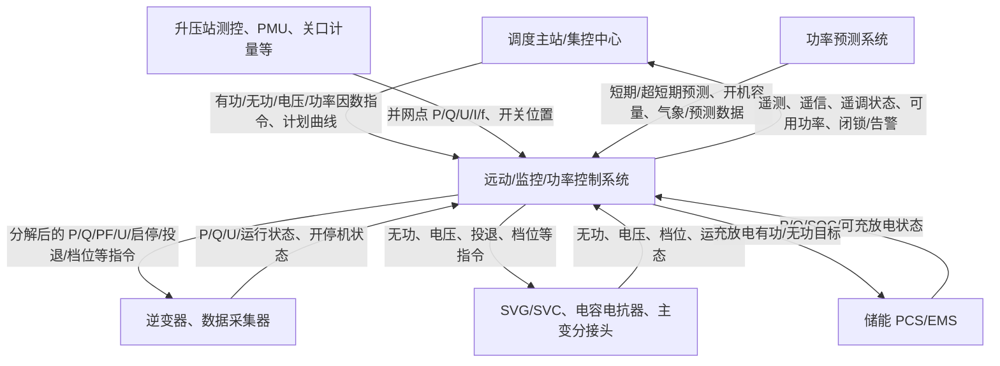

# 光伏功率调节控制通信数据与参数来源

> 研究目标：围绕光伏电站功率调节，梳理“通信链路中需要哪些数据/参数、从哪里来、用于什么计算/控制”。本文只采用 `refs/` 中已有文件作为依据；标准或说明书未明确给出的工程细节，均标注为“需工程点表确认”。

## 1. 引用来源

| 编号 | 文件 | 主要引用位置 | 本文使用目的 |
|---|---|---|---|
| S1 | `./refs/GBT40289-2021-光伏发电站功率控制系统技术要求.md` | 第 5 章、第 6 章、第 8 章、第 9 章、第 10 章、第 11 章、第 12 章、附录 C | 功率控制系统功能、数据采集类型、AGC/AVC 控制模式、理论/可用功率计算、控制记录要求 |
| S2 | `./refs/GBT19964-2024-光伏发电站接入电力系统技术规定.md` | 第 4 章、第 5 章、第 8 章、第 11.2 节、第 11.3 节 | 并网侧对有功、一次调频、无功电压、预测上报、调度自动化和通信通道的总要求 |
| S3 | `./refs/GBT31366-2015-光伏发电站监控系统技术要求.md` | 第 5 章、第 6.1.3 节、第 6.2 节、第 6.3 节、第 6.4 节、第 6.7 节 | 监控系统结构、控制对象、与预测系统的信息交互、站控层/间隔层/远动通信要求 |
| S4 | `./refs/GBT40607-2021-调度侧风电或光伏功率预测系统技术要求.md` | 第 4 章、第 5.3 节、第 5.6 节 | 预测相关输入数据：静态信息、数值天气预报、实测气象、实测功率、设备状态、计划检修信息 |
| S5 | `./refs/big_files/四方/四方CSD-801-CN新能源功率优化控制装置AGCAVC说明书V1.00.pdf` | PDF 第 13、15～23 页；文内第 2.5.6、3、3.1～3.9 节 | 工程装置视角：控制对象、通信接口、AGC/AVC 指令来源、闭锁条件、分配方式、样板逆变器法、储能协同 |

## 2. 总体数据流



依据：S1 第 5.1 节说明功率控制系统可集成于监控系统，也可独立实现；S1 第 5.2 节要求具备数据采集与通信、有功功率控制、无功电压控制、闭锁、控制过程记录，并具备与功率预测系统、变电站综合自动化系统的数据接口。S3 第 5.2～5.3 节说明监控系统分站控层和间隔层，硬件包括服务器、远动通信装置、网络安全设备、逆变器/汇流箱/气象监测/规约转换器/测控/保护等间隔层设备。S2 第 11.2.4～11.2.5 节涉及关口计量点和同步相量测量装置配置。S5 第 3 节说明 CSD-801-CN 可通过以太网或 RS485 接入逆变器、储能、SVC/SVG 等，也可通过通信管理机转发，并与升压站监控系统、功率预测系统通信。

## 3. 有功功率调节需要的参数

### 3.1 全站反馈量与调度目标

| 参数 | 从哪里来 | 用于什么 | 引用依据 |
|---|---|---|---|
| 并网点/全站有功功率 `P_poi` | 升压站测控装置、监控系统、远动直采数据，工程上也可能来自 PMU 或关口测量；具体点号需工程点表确认 | AGC 闭环反馈；判断实际出力是否跟踪目标 | S1 第 6.1 节要求采集“光伏发电站有功功率”；S5 第 3 节说明装置与升压站监控系统通信获取“并网点有功”；S3 第 6.2.4 节要求实时上送全站有功出力、有功变化率、有功功率；S2 第 11.2.4～11.2.5 节涉及关口计量点和同步相量测量装置配置 |
| 调度有功指令 `P_cmd` | 电网调度机构，经远动/调度数据网/调度自动化通道下发 | 有功限值控制、定值控制、计划曲线跟踪的目标输入 | S1 第 8.1.2 节说明控制模式根据调度自动化信号及调度指令投入/退出；S3 第 6.2.2 节要求监控系统接收并执行电网调度远方有功出力控制指令；S5 第 3.1 节说明调度直控模式实时接受调度控制指令 |
| 日前计划曲线、超短期计划曲线 | 调度/集控或功率预测、计划编制系统；具体链路需工程确认 | 按当前时刻生成有功控制目标 | S5 第 1.3 节说明支持日计划曲线、超短期计划曲线和实时控制指令；S5 第 3.1 节说明调度计划曲线模式根据日前计划曲线和超短期计划曲线获取控制指令 |
| 手动有功目标 | 本地后台/操作员站 | 开环调试、人工控制或调试目标 | S5 第 3.1 节说明手动控制模式由运行人员在后台手动输入控制指令 |
| 有功控制模式 | 调度自动化信号、调度指令、本地设置 | 决定采用限值、定值、差值或调频控制 | S1 第 8.1.2 节要求至少包含有功限值、定值、差值和调频响应；S5 第 3.1 节列出正常工作、调度对点、开环调试等工作模式 |
| 光伏电站额定功率 `P_N` | 场站静态参数/设计参数/控制系统配置 | 参与调频计算、限幅、变化率限制、精度判断 | S1 第 3.2、8.5 节在调频公式中使用额定功率；S2 第 4.3.2 节一次调频公式使用 `PN` |
| 功率变化率限制 | 调度机构或控制系统参数配置 | 对目标值变化做斜率限制，避免输出突变 | S2 第 4.1.4 节要求有功变化速率满足电力系统要求，宜为 10% 额定容量/min；S5 第 1.3 节说明目标值变化过大时采用渐近变化处理，确保不超过调度给定变化率 |

### 3.2 频率/一次调频相关参数

| 参数 | 从哪里来 | 用于什么 | 引用依据 |
|---|---|---|---|
| 并网点频率 `f` | 并网点交流采样、测控装置或高精度采集插件 | 一次调频/快速频率响应的反馈量 | S1 第 6.1 节要求采集频率，第 6.2.1 节要求频率测量分辨率不低于 0.005 Hz；S5 第 3.3 节说明通过高精度交流采集插件硬接线实时采集并网点频率 |
| 额定频率 `f_N` | 系统额定参数，通常配置为 50 Hz；具体按并网地区配置 | 调频公式基准 | S1 第 8.5.3 节、S2 第 4.3.2 节的调频公式均使用系统额定频率 |
| 调频系数 `K_f` 或分段调频系数 `K_L1/K_H1/...` | 调度机构确定或控制系统参数整定 | 计算频率偏差对应的有功变化量 | S1 第 8.5.3～8.5.5 节给出基本/分段调频公式和参数范围；S2 第 4.3.3 节说明调频系数、死区由调度机构根据系统特性确定 |
| 调频死区阈值 | 调度机构确定或控制系统参数整定 | 判断频率偏差是否启动调频 | S1 第 8.5.3～8.5.5 节给出 `f_L1/f_H1` 等阈值；S2 第 4.3.3 节说明死区范围由调度机构确定 |
| 功率初值 `P0` | AGC 当前指令或调频启动前稳定出力 | 作为快速调频目标的基准 | S1 第 8.5 图示标注 `P0` 为有功功率稳态初始值；S5 第 3.3 节说明 `P0` 为功率初值（AGC 指令） |
| 一次调频投入/动作状态 | 第三方一次调频设备、调频控制装置或本系统状态量 | 启动调频、闭锁常规 AGC，或向调度上传状态 | S2 第 4.3.7 节要求设置一次调频启用状态、动作状态并上传；S5 第 3.1 节说明可通过通信或开入信号接入第三方一次调频启动信号，启动时闭锁有功优化控制 |

### 3.3 逆变器/储能侧有功分配参数

| 参数 | 从哪里来 | 用于什么 | 引用依据 |
|---|---|---|---|
| 逆变器当前有功 `P_i` | 逆变器、光伏数据采集器、监控系统或规约转换器 | 计算每台/每组设备当前出力和可调空间 | S1 第 6.1 节要求采集各光伏逆变器有功功率；S5 第 3 节说明控制对象包括光伏逆变器或数据采集器，并通过通信接入数据 |
| 逆变器运行状态 | 逆变器、数据采集器、监控系统 | 判断设备是否可参与分配；计算开机运行数量 | S1 第 6.1 节要求采集逆变器运行状态；S4 第 4.2.6 节要求采集设备运行状态；S5 第 3.4 节可用功率计算使用“开机运行总数量” |
| 逆变器电压 | 逆变器或测控系统 | 有功控制的状态监视，也服务于无功/电压控制和闭锁判断 | S1 第 6.1 节要求采集各逆变器电压及运行状态 |
| 样板逆变器实际功率 `P_j,k,m` | 被选为样板机的逆变器 | 计算全站理论功率和可用功率 | S1 附录 C 给出样板逆变器法；S5 第 3.4 节说明理论功率以选定样板逆变器为基础 |
| 逆变器型号数量 `K`、每型号总数量 `N_k`、样板数量 `M_k`、开机运行数量 `N'_k` | 场站静态台账、监控/设备状态、控制系统配置 | 理论发电功率 `P_j`、可用发电功率 `P'_j` 计算 | S1 附录 C 明确公式变量；S5 第 3.4 节给出同类变量含义 |
| 光伏理论发电功率 `P_theory` | 由样板逆变器法计算，或工程上可由预测/监控系统提供；本文采用样板逆变器法作为有来源依据 | 判断资源条件下理论可发能力；计算受阻电力 | S1 第 8.1.3 节要求功率控制系统具备计算理论发电功率能力，附录 C 给出方法；S5 第 3.4 节说明理论功率定义和计算思路 |
| 光伏可用发电功率 `P_available` | 由样板逆变器实际功率、逆变器总数量和开机运行数量计算 | 差值控制目标、限幅、受阻电力、调峰/顶峰策略 | S1 第 8.1.3 节和附录 C；S5 第 3.4 节定义可用功率为扣除故障、缺陷或检修受阻后可发功率 |
| 储能当前有功/无功 | 储能 PCS 或储能 EMS | 风光储协同控制、优先调频、平滑输出 | S1 第 6.1 节要求配置储能时采集储能有功/无功；S5 第 3 节将储能变流器或储能能量管理平台列为控制对象 |
| 储能 SOC、可充放电约束 | 储能 EMS/BMS/PCS | 判断储能是否可吸收/释放功率；风光储联合分配 | S5 第 3.1 节说明储能分配需考虑电池充放电约束；S5 第 3.8 节说明计划编制考虑储能 SOC 及运行约束 |
| 分配方式/优先级 | 控制系统定值或工程配置 | 将全站 `P_target` 分解成逆变器/储能控制目标 | S5 第 3.1 节列出光伏电站在逆变器或数据采集器之间按相似裕度、等比例、优先级分配；S1 第 11.4 节要求记录分解下发的设备控制指令 |

## 4. 无功/电压调节需要的参数

### 4.1 全站反馈量与调度目标

| 参数 | 从哪里来 | 用于什么 | 引用依据 |
|---|---|---|---|
| 并网点/全站无功功率 `Q_poi` | 升压站测控装置、监控系统 | 定无功控制反馈、无功越限/闭锁判断 | S1 第 6.1 节要求采集光伏发电站无功功率；S5 第 3 节说明从升压站监控系统获取并网点无功 |
| 并网点电压 `U_poi` | 升压站测控装置、监控系统、PMU | 定电压控制、下垂控制、低电压闭锁 | S1 第 6.1 节要求采集并网点电压；S1 第 10.3 节要求低电压闭锁；S5 第 3 节说明从升压站监控系统获取相关并网点信息；S2 第 11.2.5 节涉及同步相量测量装置配置 |
| 并网点电流 `I_poi` | 测控装置/交流采样 | 功率计算、状态监视、保护/闭锁辅助 | S1 第 6.1 节要求采集并网点电流；S1 第 6.2.1 节规定电压、电流采集精度 |
| 功率因数 `PF_poi` | 升压站监控系统或由 P/Q 计算；具体点源需点表确认 | 定功率因数控制反馈/显示 | S5 第 3 节说明从升压站监控系统获取功率因数；S1 第 9.3 节给出定功率因数控制目标计算 |
| 调度无功指令 `Q_cmd` | 电网调度机构/集控中心/本地手动 | 定无功控制目标 | S1 第 9.2 节要求定无功控制跟踪指令值；S3 第 6.3.2 节要求接收并执行电网调度电压无功控制指令；S5 第 3.2 节说明无功指令可来自调度直控、集控、计划曲线或手动 |
| 调度电压指令 `U_cmd` | 电网调度机构/集控中心/本地手动 | 定电压控制目标 | S2 第 5.3.4 节要求自动接收调度下发的并网点电压值；S1 第 9.4 节要求定电压控制达到调度下达设定值 |
| 调度功率因数指令 `PF_cmd` | 电网调度机构/集控中心/本地手动 | 定功率因数控制目标 | S2 第 5.3.4 节要求接收调度下发的功率因数值；S1 第 9.3 节使用功率因数设定值计算无功目标 |
| 无功/电压控制模式 | 调度指令或本地设置 | 决定定无功、定功率因数、定电压、下垂控制 | S1 第 9.1.2 节要求至少包含定无功、定功率因数、定电压、无功电压下垂等模式；S2 第 5.3.2 节要求具备相关模式及在线切换 |

### 4.2 逆变器、SVG/SVC、主变等设备侧参数

| 参数 | 从哪里来 | 用于什么 | 引用依据 |
|---|---|---|---|
| 逆变器当前无功 `Q_i` | 逆变器、数据采集器、监控系统 | 计算可调裕度、分配无功目标 | S1 第 6.1 节要求采集各逆变器无功功率；S1 第 9.1.1 节说明无功电压控制对象包括光伏逆变器 |
| 逆变器当前有功 `P_i` | 逆变器、数据采集器、监控系统 | 定功率因数计算、无功能力判断 | S1 第 9.3.1 节按有功测量值和功率因数设定值计算无功目标；S1 第 6.1 节要求采集逆变器有功 |
| 逆变器容量/无功能力 | 设备静态参数、厂家资料、控制系统配置；具体数值需设备资料确认 | 判断可输出/吸收无功范围 | S2 第 5.1.1 节要求逆变器额定有功出力下功率因数在超前 0.95～滞后 0.95 范围动态可调；S2 第 5.1.2 节要求利用逆变器无功容量及调节能力 |
| SVG/SVC 当前无功、电压、运行状态 | SVG/SVC 装置或监控系统 | 无功分配、闭锁、暂态支撑 | S1 第 6.1 节要求采集无功补偿装置无功功率、电压；S5 第 3.2 节将 SVG/SVC 作为稳态/暂态无功调节对象 |
| 电容器/电抗器投退状态 | 无功补偿装置、测控系统 | 无功控制辅助执行 | S5 第 3 节将电容器列为控制对象；S3 第 6.3.4 节说明调节手段包括控制无功补偿装置 |
| 主变分接头位置 | 主变有载调压装置、测控系统 | 电压控制辅助执行 | S2 第 5.3.4 节说明通过协调控制逆变器、无功补偿装置以及主变分接头实现并网点电压控制；S3 第 6.3.4 节说明调节手段包括调节升压变压器变比 |
| 无功分配优先级 | 控制系统定值/工程配置 | 决定优先使用 SVG/SVC、储能、逆变器或其他设备 | S5 第 3.2 节说明可根据调节优先级依次调节 SVG/SVC、储能、风机、光伏逆变器、电容器投退和主变分接头 |
| 无功裕度 | 由逆变器、SVG/SVC、储能等可调能力计算；具体算法需工程策略确认 | 上报调度，保持快速调节能力 | S1 第 9.1.4 节要求具备无功裕度计算并上传调度；S5 第 3.2 节说明可将 SVG/SVC 无功回调，使其保持一定无功裕量 |

## 5. 闭锁、状态与通信质量参数

| 参数/状态 | 从哪里来 | 用于什么 | 引用依据 |
|---|---|---|---|
| 功率控制系统投退状态 | 本地/远方控制命令、后台设置 | 决定 AGC/AVC 是否允许动作 | S1 第 10.5 节要求闭锁功能投入/退出设置；S5 第 3.1、3.2 节说明 AGC/AVC 投入条件 |
| 装置异常状态：CPU、内存、主进程、定值 CRC、逻辑任务、拓扑配置 | 功率控制装置自诊断 | 异常时禁止投入 AGC/AVC | S5 第 3.1、3.2 节列出 AGC/AVC 装置异常判断项 |
| 与升压站监控系统通信状态 | 通信链路/心跳/数据刷新状态 | 通信异常时闭锁调节 | S5 第 3.1 节列出与升压站监控系统通信异常、并网点数据 60s 未刷新等 AGC 闭锁条件 |
| 与受控对象通信状态 | 逆变器、SVG/SVC、储能、数据采集器通信状态 | 避免向失联设备下发错误指令 | S5 第 3.1 节列出与所有受控对象通信中断；S5 第 3.2 节列出电压模式 SVG 通信中断等 AVC 闭锁条件 |
| 并网点电压越限/低电压闭锁 | 并网点电压测量 | 电压异常时停止或闭锁控制 | S1 第 10.3 节要求低电压闭锁并停止发送功率控制指令；S5 第 3.2 节列出母线电压、低压侧电压越上/下限闭锁 |
| 指令越限/越步长 | 调度指令、控制系统定值 | 防止异常目标导致误调 | S5 第 3.2 节列出无功指令越上限/下限/步长、电压指令越步长等 AVC 闭锁条件 |
| 设备闭锁对象、闭锁原因、解锁时间 | 控制系统事件记录 | 追溯控制动作，供调试/审计 | S1 第 11.5 节要求记录闭锁开始时间、闭锁对象、闭锁原因、解锁时间 |
| 遥测/遥信/遥控/遥调点数能力 | 控制系统配置和点表 | 决定工程接入规模 | S1 第 12.2 节要求遥测不少于 5000 点、遥信不少于 10000 点、遥控不少于 500 点、遥调不少于 1000 点 |

## 6. 预测系统给功率调节提供哪些参数

> 注意：功率预测不等于实时 AGC/AVC 闭环，但会影响计划曲线、可用功率判断、顶峰/调峰和调度上报。

| 参数 | 从哪里来 | 用于什么 | 引用依据 |
|---|---|---|---|
| 短期/超短期功率预测结果 | 功率预测系统 | 计划曲线、调峰/顶峰策略、调度上报；是否直接参与实时控制需工程策略确认 | S2 第 8.1 节要求光伏功率预测系统具备中期、短期、超短期预测并上报；S5 第 3 节说明与功率预测系统通信获取短期预测信息 |
| 当前/预计开机容量 | 功率预测系统、监控系统、设备运行状态 | 预测上报、可用能力判断 | S2 第 8.1.4～8.1.5 节要求上报预测同时上报预计开机容量，并每 15 min 上报当前开机总容量 |
| 实测气象数据 | 气象站/气象监测设备，经预测系统或监控系统 | 预测输入，也可辅助判断功率波动来源 | S2 第 8.1.5 节要求每 5 min 上报实测气象数据；S4 第 4.2.4 节列出光伏实测气象至少包括总辐照度、法向直射辐照度、水平面散射辐照度、气温、湿度、气压 |
| 数值天气预报 NWP | 气象服务/预测系统 | 短期/中期预测输入 | S4 第 4.2.3 节要求 NWP 至少包括未来 240 h、15 min 分辨率，以及风速、风向、总辐照度、云量、气温、湿度、气压等参数 |
| 设备运行状态、计划检修信息 | 监控系统、运维系统、人工录入 | 预测修正、可用功率/开机容量判断 | S4 第 4.1 节将设备运行状态、计划检修信息列为预测基础数据；S4 第 4.2.6 节要求实测功率和设备运行状态采集间隔不大于 5 min |

## 7. 控制计算中有明确来源的公式/逻辑

### 7.1 有功定值/限值/差值控制

- 定值控制：控制全站有功与指令值偏差不超过额定功率的 ±1%。依据 S1 第 8.3.1 节。
- 限值控制：控制全站有功不超过指令值，实际值与指令值之差不大于额定功率的 1%。依据 S1 第 8.2.1 节。
- 差值控制：当可用发电功率大于额定功率的 20% 时：

```text
P_obj = P_available - ΔP
```

依据 S1 第 8.4.1 节。`ΔP` 应在额定功率的 5%～15% 范围内连续可调，依据 S1 第 8.4.2 节。

### 7.2 一次调频/快速频率响应

S2 第 4.3.2 节给出一次调频公式：

```text
ΔPt = -Kf × (ft - fN) / fN × PN
```

S1 第 8.5.3～8.5.4 节给出基本/分段调频响应公式，需要 `f`、`fN`、`PN`、调频系数、频率死区阈值等参数。S5 第 3.3 节补充工程实现：通过硬接线实时采集并网点频率，频率越过死区后按有功-频率特性曲线计算有功目标并分配到发电设备。

### 7.3 理论功率与可用功率

S1 附录 C 给出样板逆变器法：

```text
P_theory = Σ_k (N_k / M_k) × Σ_m P_sample(k,m)
P_available = Σ_k (N'_k / M_k) × Σ_m P_sample(k,m)
```

其中 `N_k` 是某型号逆变器总数量，`N'_k` 是开机运行总数量，`M_k` 是样板逆变器数量，`P_sample(k,m)` 是该型号第 m 台样板逆变器实际功率。S5 第 3.4 节也说明理论功率以样板逆变器为基础建立全站映射关系，可用功率扣除站内故障、缺陷或检修等受阻因素。

### 7.4 无功/功率因数/电压控制

- 定无功控制：全站无功跟踪无功指令，偏差不超过额定功率的 ±1%。依据 S1 第 9.2.1 节。
- 定功率因数控制：S1 第 9.3.1 节给出：

```text
Q_obj = ± sqrt(1 - PF_ref^2) / PF_ref × P_meas
```

- 定电压控制：并网点电压达到调度下达设定值，依据 S1 第 9.4.1 节。
- 无功电压下垂控制：S1 第 9.5.1 节给出：

```text
Q_obj = Q0 + Kqv × (U_ref - U_meas)
```

## 8. 输出指令给谁

| 输出指令 | 接收对象 | 引用依据 |
|---|---|---|
| 有功功率控制指令、启停控制指令 | 光伏逆变器或光伏数据采集器 | S1 第 8.1.1 节规定有功控制对象为逆变器和储能；S3 第 6.2.3 节说明调节逆变器包括启停控制或分配有功功率控制指令；S5 第 3.1 节说明光伏电站控制对象为集中式逆变器或数据采集器 |
| 储能有功充放电目标 | 储能 PCS/EMS | S1 第 8.1.1 节将储能列为有功控制对象；S5 第 3.1 节说明风光储联合电站根据总有功指令控制储能充放电 |
| 无功功率、功率因数或电压控制指令 | 光伏逆变器 | S1 第 9.1.1 节规定无功电压控制对象包括光伏逆变器；S3 第 6.3.3 节说明调节逆变器包括分配无功功率或功率因数控制指令 |
| 无功/电压控制指令 | SVG/SVC 等无功补偿装置 | S1 第 9.1.1 节规定无功电压控制对象包括无功补偿装置；S5 第 3.2 节说明可按优先级调节 SVG/SVC |
| 电容器/电抗器投退 | 无功补偿设备 | S3 第 6.3.4 节说明调节手段包括控制无功补偿装置；S5 第 3 节将电容器列为控制对象 |
| 分接头调节指令 | 主变有载调压装置 | S2 第 5.3.4 节说明通过主变分接头位置实现并网点电压控制；S3 第 6.3.4 节说明调节升压变压器变比 |
| 遥测、遥信、遥调状态、预测/可用功率、闭锁告警 | 调度主站/集控中心 | S2 第 11.2.3 节要求提供遥测、遥信、遥调等信号；S1 第 8.1.3、9.1.4、11 章要求上报理论/可用功率、无功裕度并记录调控指令和设备指令 |

## 9. 通信链路与协议依据

| 通信方向 | 可能协议/接口 | 引用依据 |
|---|---|---|
| 调度主站 ↔ 远动/监控/功率控制系统 | 调度数据网；DL/T 634.5104 或调度自动化系统要求协议 | S3 第 6.7.4 节；S2 第 11.2.3 节要求符合调度自动化远动信息接入要求，提供遥测、遥信、遥调等 |
| 监控系统 ↔ 功率预测系统 | 网络通信，宜 DL/T 634.5104，并通过安全隔离设备 | S3 第 6.4.2 节和第 6.7.1 节 |
| 站控层 ↔ 间隔层设备 | 以太网通信，宜 DL/T 860；无网络接口设备可通过规约转换器 | S3 第 6.7.2 节 |
| CSD 装置 ↔ 设备/系统 | 以太网、RS485；DL/T 634.5101、DL/T 634.5104、IEC 61850、DL/T 667、Modbus-TCP、GOOSE、Modbus-RTU | S5 第 2.5.6 节 |
| 功率控制装置 ↔ 升压站监控系统/预测系统 | 通信获取并网点 P/Q/PF/开关位置和短期预测信息 | S5 第 3 节 |

### 9.1 IEC 104 与 IEC 61850/DL/T 860 的工程边界

在光伏电站功率控制通信中，IEC 60870-5-104/DL/T 634.5104 与 IEC 61850/DL/T 860 通常对应不同工程边界。按 S3 第 6.7.4 节，监控系统通过电力调度数据网与调度主站通信时，宜采用 DL/T 634.5104 或调度自动化系统要求的通信协议；按 S3 第 6.7.2 节，站控层和间隔层之间宜采用 DL/T 860。S5 第 2.5.6 节也同时列出 DL/T 634.5104、IEC 61850、GOOSE、Modbus 等接口，说明实际工程中多种协议可能并存。

简化理解如下：

| 边界 | 更关注什么 | 与本文参数的关系 |
|---|---|---|
| 调度主站 ↔ 远动/监控/功率控制系统 | 遥测、遥信、遥控、遥调、调度指令、运行状态、闭锁告警等点表数据 | 承载并网点 P/Q/U/I/f、AGC/AVC 指令、控制状态、理论/可用功率、无功裕度等上送或下发数据 |
| 站控层 ↔ 间隔层/站内设备 | 保护测控、监控系统、规约转换器、逆变器、SVG/SVC、储能等设备的数据接入和控制下发 | 提供功率控制计算所需的设备状态、测量量、可调能力和控制执行反馈 |
| 协议转换/通信网关 | 将站内设备数据整理成调度侧点表，或将调度指令转换为站内设备可执行指令 | 需要明确对象、点号、单位、倍率、刷新周期、时标、控制确认流程等工程细节 |

因此，若站内侧采用 IEC 61850/DL/T 860、Modbus 或厂家协议，而调度侧采用 DL/T 634.5104，则远动通信装置、通信网关、监控系统或功率控制系统需要完成“站内对象/设备数据”到“调度远动点表”的映射。本文第 10 节列出的调度远动点表、逆变器点表、SVG/SVC 点表、储能点表和控制器定值清单，正是完成该映射和闭环控制落地所需的关键工程资料。

## 10. 仍需工程资料确认的关键点

已有标准和说明书能确定“参数类别、来源系统、控制对象、部分公式”，但还不能确定以下落地细节：

1. **调度远动点表**：具体遥测、遥信、遥调、遥控点号，单位，倍率，刷新周期，是否双点遥信，是否带选择/返校/执行。
2. **逆变器点表**：有功限值写入点、无功设定点、功率因数设定点、启停点、远方/就地状态、写入确认、通信心跳、厂家私有寄存器定义。
3. **SVG/SVC 点表**：Q 指令、电压指令、运行模式、自动/手动、闭锁/故障、投退控制。
4. **储能 EMS/PCS 点表**：充放电功率、SOC、SOH、可充/可放功率、运行约束、告警闭锁。
5. **控制器定值清单**：死区、斜率限制、PI 参数、优先级、样板逆变器清单、闭锁阈值、解锁延时。
6. **现场网络图和安全分区**：功率控制系统是独立装置还是集成于监控系统，是否直连逆变器/SVG/储能，是否经过规约转换器或通信管理机。

这些不是本文凭空补充，而是由 S1/S3/S5 已明确存在“遥测/遥信/遥控/遥调接入、控制对象、通信接口、闭锁、分解下发设备指令”等要求后，工程实施必然要提供的配套资料。
