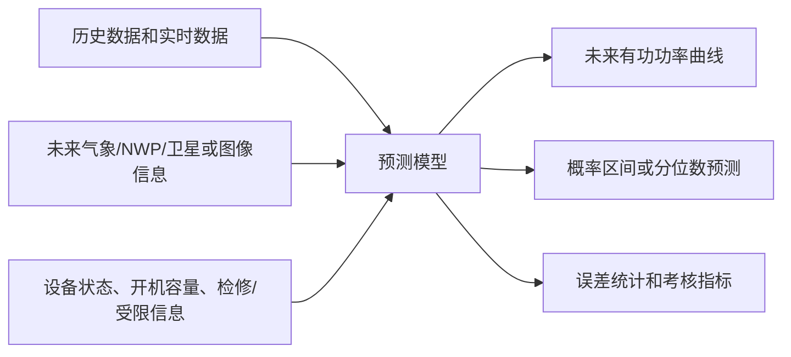
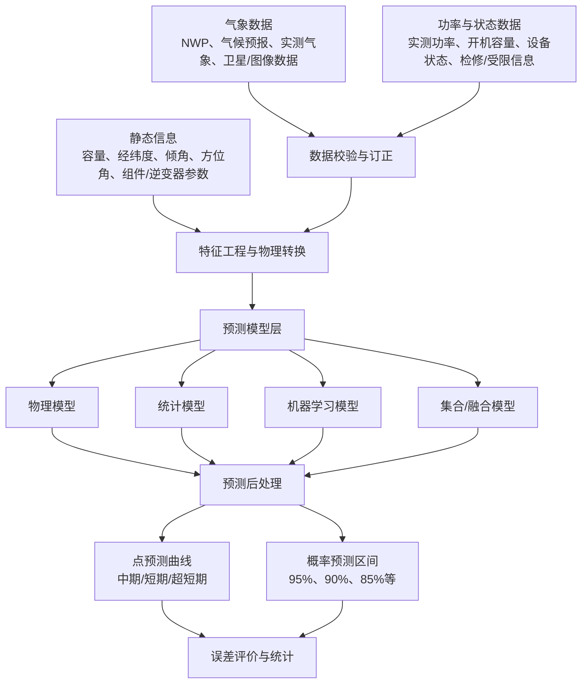

# 光伏发电功率预测调研报告

> 研究目标：围绕光伏发电功率预测，梳理“预测需要哪些参数、这些参数对应什么物理机理、系统技术框架如何组织、可采用哪些算法路线、如何评价预测结果”。本文定位为调研报告和标准需求梳理，不是最终工程算法设计文档；首期模型选型、训练样本口径、回退策略、版本管理和验收数据集等，需要结合项目数据后另行收敛。本文只采用 `refs/` 中指定核心资料作为依据；通信链路、监控系统、站控层架构、AGC/AVC 控制链路不在本文展开，相关工程细节均留给后续整体架构文档。

## 1. 引用来源与使用边界

| 编号 | 文件 | 主要引用位置 | 本文使用目的 |
|---|---|---|---|
| S1 | `./refs/GBT40607-2021-调度侧风电或光伏功率预测系统技术要求.md` | 第 3～7 章、附录 B～D、附录 E | 预测系统的数据要求、时间尺度、执行周期、数据处理、概率预测、评价指标、静态信息模板 |
| S2 | `./refs/GBT19964-2024-光伏发电站接入电力系统技术规定.md` | 第 3.4～3.7 节、第 8 章 | 光伏功率预测定义，中期/短期/超短期范围，上报周期，受限工况下评价口径 |
| S3 | `./refs/IEA_PVPS_T16_regional_forecast-dual.pdf` | 第 2～4 章、第 4.6～4.7 节 | 物理模型、数据驱动模型、区域尺度上推、NWP/卫星辐照度、模型融合、典型机器学习算法 |
| S4 | `./refs/iec-61724-1-2021.zh.md` | 第 3 章、第 7～9 章 | 辐照度、阵列面内辐照度、组件温度、环境气象、传感器测量与预测模型输入的物理依据 |
| S5 | `./refs/Advances in solar forecasting-Computer vision with deep learning.pdf` | 第 1.2、3.3、4、5.1 节 | 前沿算法补充：卫星云图、天空成像、深度学习、云运动、概率预测、物理信息深度学习 |
| S6 | `./refs/big_files/2026新能源科技项目/4.EEE-PDT-3E新能源功率预测系统产品说明书.pdf` | 第 2～4 章、第 6～8 章 | 工程产品参考：多气象源、集合预报、机器学习优化、上报与部署能力；其可信度弱于标准和 IEA/IEC 报告 |

使用边界：

1. **标准优先**：时间尺度、采样周期、上报周期、性能指标等，以 S1、S2 为主；其中 S1 是调度侧预测系统标准，S2 是光伏电站接入电力系统时对场站侧预测功能和上报准确度的要求，二者适用边界需区分。
2. **算法框架参考**：算法路线和区域预测方法，以 S3 为主。
3. **物理量定义参考**：辐照度、POA、温度、风、污损、积雪等输入的物理意义，以 S4 为主。
4. **前沿算法不作为主线**：S5 只用于补充图像和深度学习方向，不把视觉算法作为本文重点。
5. **厂商资料弱引用**：S6 只说明工程产品常见功能点，不用作准确率或算法有效性的强依据。

## 2. 光伏功率预测的目标与时间尺度

S2 第 3.4 节将光伏功率预测定义为：基于历史功率、历史气象、设备运行状态等数据建立模型，以辐照度、功率或数值天气预报等为输入，结合设备状态和运行工况，预测未来一段时间内的有功功率。该定义可以拆成三个层次：



| 预测类型 | 预测范围 | 时间分辨率/执行周期 | 主要用途 | 引用依据 |
|---|---|---|---|---|
| 长期电量预测 | 未来 12 个月逐月电量 | 每月滚动，宜每月上旬发布 | 调度侧/经营分析/可选增强功能；不作为一阶段场站侧并网验收核心功能 | S1 第 3.2、5.3.1 节 |
| 中期功率预测 | 次日零时起到未来 240 h | 15 min 分辨率；每日不少于两次，单次计算小于 5 min | 多日调度计划、检修和交易安排 | S1 第 3.3、5.3.2 节；S2 第 3.5、8.1 节 |
| 短期功率预测 | 次日零时起到未来 72 h | 15 min 分辨率；每日不少于两次，单次计算小于 5 min | 日前计划、日前交易、调度上报 | S1 第 3.4、5.3.3 节；S2 第 3.6、8.1 节 |
| 超短期功率预测 | 未来 15 min 到 4 h | 15 min 分辨率；每 15 min 滚动执行，单次计算小于 5 min | 实时调度、滚动修正、短时波动应对 | S1 第 3.5、5.3.4 节；S2 第 3.7、8.1 节 |
| 概率预测 | 与中期/短期/超短期一致 | 至少给出 95%、90%、85% 置信区间上下限 | 不确定性评估、备用容量和风险分析 | S1 第 3.6、5.3.5 节 |

S2 第 8.1 节还要求：光伏电站应配置功率预测系统；应具备中期、短期、超短期预测功能；应每日上报两次中期和短期预测结果，每 15 min 上报一次超短期预测结果；上报预测结果时，还应上报相同时段预计开机容量，并每 15 min 上报当前开机总容量、每 5 min 上报实测气象数据。

## 3. 预测输入参数

### 3.1 参数总表

| 参数类别 | 关键参数 | 从哪里来 | 主要作用 | 对应算法环节 | 引用依据 |
|---|---|---|---|---|---|
| 场站静态信息 | 电站名称、建设地点、中心经纬度、并网装机容量、测光设备经纬度、电压等级 | 设计资料、并网资料、预测系统配置 | 地理定位、太阳位置计算、空间聚合、容量归一化 | 静态建模、区域上推、误差归一化 | S1 第 4.2.1 节、附录 B.1 |
| 阵列静态信息 | 电池型号、逆变器型号、逆变器效率、阵列倾角、方位角、串并联方式、总功率 | 组件/逆变器台账、设计图纸 | 将 GHI/DNI/DHI 转成 POA，估算阵列输出能力 | 物理模型、POA 转换、容量建模 | S1 附录 B.2；S3 第 2.1、2.2 节 |
| 组件电气参数 | `Vmp`、`Imp`、`Voc`、`Isc`、峰值功率 `Pm` | 组件铭牌、厂家手册、静态信息表 | 建立组件功率上限和温度/辐照度响应关系 | 物理模型、参数化模型 | S1 附录 B.3 |
| 数值天气预报 NWP | 系统侧需形成未来 240 h、15 min 分辨率的预测输入/输出；原始 NWP 可能为 1 h、3 h 或其他分辨率，需按气象源确认并插值/降尺度/后处理 | 气象预报源、预测系统外部数据接口 | 中期/短期预测的主输入 | NWP 后处理、物理模型、机器学习模型 | S1 第 4.2.3 节 |
| 气候预报 | 未来 12 个月月平均风速、总辐照度、温度 | 气象机构或气候预报源 | 长期电量预测 | 月度电量模型 | S1 第 4.2.2、5.3.1 节 |
| 实测气象 | 总辐照度、DNI、DHI、气温、相对湿度、气压 | 场站气象站/测光设备 | 模型训练、实时校正、超短期滚动修正 | 数据校验、在线订正、短时预测 | S1 第 4.2.4 节 |
| 辐照度扩展量 | POA、GHI、DNI、DHI、反照率、后侧 POA、光谱匹配辐照度 | 地面仪器、卫星遥感、分解/转置模型 | 表征太阳能资源和阵列实际入射能量 | 物理模型、双面组件建模、性能评估 | S4 第 3.13、3.21、3.23、3.27、8.3 节 |
| 温度与环境 | 组件温度、环境温度、风速、风向、湿度 | 组件温度传感器、环境传感器、NWP | 温度损失、组件温度估算、光谱变化估计 | 温度修正、损失建模 | S4 第 7 章表格、第 9 章；S3 第 2.2、4.2 节 |
| 污损/降雨/积雪 | 污损比、降雨、积雪 | 运维记录、传感器、气象数据 | 估算污损、清洗、积雪遮挡导致的损失 | 损失修正、异常识别 | S4 第 7 章表格 |
| 实测功率 | 并网点或场站实际有功功率 | 电表/计量系统/预测系统接收数据；具体点源需工程确认 | 模型训练、在线校正、误差统计 | 监督学习标签、后处理、评价 | S1 第 4.1、4.2.6、4.4、5.5 节 |
| 设备运行状态 | 逆变器/阵列运行状态、开停机状态 | 设备台账、运行系统、人工补录；具体点源需工程确认 | 判断可用容量、剔除故障和检修影响 | 可用功率修正、异常工况预测 | S1 第 4.1、4.2.6 节；S2 第 8.1.2 节 |
| 计划检修信息 | 检修设备、检修时间、影响容量 | 检修计划、人工录入；具体格式需工程确认 | 预测非正常停机情况下的功率 | 容量修正、受限工况预测 | S1 第 4.1 节；S2 第 8.1.2 节 |
| 开机容量 | 当前开机总容量、预测时段预计开机容量 | 设备状态、运维计划、预测系统配置 | 误差归一化、上报、非正常工况修正 | 指标计算、容量约束 | S2 第 8.1.4～8.1.5 节；S1 附录 D |
| 受限/可用功率 | 出力受限标志、限电时段可用功率 | 调度/运行记录、理论/可用功率计算；具体口径需工程确认 | 受限时刻评价替代实际功率 | 数据清洗、误差评价 | S1 第 7.1 节；S2 第 8.2.4 节 |

### 3.2 数据质量要求

S1 第 4.3 节要求预测系统具备完整性、合理性校验，并对缺测和异常数据进行插补和修正。落实到算法上，至少需要以下处理：

| 数据问题 | 处理要求 | 对算法的影响 | 引用依据 |
|---|---|---|---|
| 数量不完整、时间不连续 | 校验数据数量、开始/结束时间和时间顺序 | 避免训练样本错位和预测时间戳错位 | S1 第 4.3.2 节 |
| 功率、NWP、气象越限 | 可手动设置限值并进行越限检验 | 剔除传感器故障、异常 NWP 或错误量纲 | S1 第 4.3.3 节 |
| 气象与功率关系异常 | 根据实测气象与实测功率关系做相关性检验 | 识别遮挡、限电、设备故障或错误数据 | S1 第 4.3.3 节 |
| 实际功率缺测/异常 | 用前一时刻功率补全 | 保证评价曲线连续，但需保留特殊标识 | S1 第 4.3.4 节 |
| 功率小于零 | 以零代替 | 避免夜间或计量误差造成负发电 | S1 第 4.3.4 节 |
| 气象缺测/异常 | 采用线性内插或相关性原理订正 | 保证 NWP/实测气象训练输入连续 | S1 第 4.3.4、附录 C |
| 人工补录/修正 | 缺测和异常数据可人工补录或修正 | 需要记录来源和修正标识，避免训练污染 | S1 第 4.3.4 节 |

附录 C 给出两个可直接落地的数据订正思路：

```text
线性内插：x(t+i) = [(x(t+n) - x(t)) / (n - 1)] × i + x(t)
```

```text
相关性订正：y_N = mean(y_n) + r × (e_x / e_y) × (x_N - mean(x_n))
```

其中，S1 将 `x`、`y` 说明为风电场实测功率/实测风速，或光伏电站实测功率/实测辐照度等序列。工程实现时，需明确哪些字段允许自动插补、哪些字段必须人工确认。

## 4. 光伏发电物理原理

### 4.1 从太阳辐照度到阵列面辐照度

光伏功率预测的物理基础是太阳辐照度变化。S3 第 2.1 节说明，GHI 由直接法向辐照度 DNI 和散射水平辐照度 DHI 组成，并受地球自转/公转形成的确定性变化、云和风等随机大气过程共同影响。S4 第 3.21、3.23、3.27 节也给出 GHI、DNI、DHI 的关系：

```text
GHI = DNI × cos(Z) + DHI
```

其中 `Z` 是太阳天顶角。工程实现时还需处理太阳高度角过低、夜间功率置零、辐照度异常和时间戳对齐等边界条件。

对于固定倾角或跟踪式光伏阵列，真正作用于组件正面的不是水平面的 GHI，而是阵列面内辐照度 POA。S4 第 3.13、8.3.2 节说明 POA 是入射到平行于组件平面的倾斜表面上的直接、漫射和地面反射辐照度总和。S4 第 3.28 节给出阵列面内直射分量关系：

```text
G_i,b = cos(θ) × DNI
```

其中 `θ` 是太阳光线与阵列平面法线之间的夹角。工程计算时应采用 `max(0, cosθ)` 处理背向入射，并叠加漫射、地面反射、遮挡、逆变器限幅、AC/DC 容量换算等边界；上述公式不能单独等同于完整功率模型。S3 第 2.1 节进一步说明，平面倾角、方位角、纬度、经度、天顶角、时角、太阳赤纬等角度共同决定入射角和 POA。因此，阵列倾角、方位角和经纬度不是普通台账字段，而是物理预测模型的核心参数。

### 4.2 确定性变化与随机变化

S3 将 GHI 变化拆为两类：

| 变化来源 | 特点 | 预测处理方式 | 引用依据 |
|---|---|---|---|
| 确定性变化 | 由地球自转、公转、季节和日出日落导致，可通过太阳位置和晴空辐照度描述 | 太阳位置算法、晴空模型、按日出日落剔除无发电时段 | S3 第 2.1 节；S1 第 5.5.5 节 |
| 随机变化 | 云、风、气溶胶等大气过程导致，短时波动强 | NWP、卫星云图、天空成像、实时功率/辐照度滚动修正 | S3 第 2.1～2.2 节；S5 第 1.2 节 |

S3 还说明，可用 GHI 除以晴空辐照度得到近似平稳的晴空指数序列，降低确定性日周期/季节周期影响，使模型更聚焦云量和天气扰动。该思想在区域预测和机器学习模型中常用。

### 4.3 温度、风和损失修正

光伏组件效率与温度相关。S3 第 2.2 节指出，物理模型通常会加入温度预测，因为温度与光伏板效率有关。S4 第 7 章表格将组件温度用于确定温度相关损失，将环境温度、风速、风向用于估算 PV 温度并连接预测模型。

S3 第 4.2 节的 RSE 模型使用 GHI、2 m 气温和 NOCT 估算组件温度。该式适合作为基线模型或物理启发特征，不应直接视为所有场景通用的组件温度模型：

```text
T_panel = T_2m - 1 + GHI × (NOCT - 20) / 800
```

其中 `NOCT` 为标称工作电池温度，报告案例中取 45°C。实际项目中，该模型会受组件类型、支架散热、风速、双面组件、沙漠/高寒环境等影响，需要本地校准或替换为更完整的组件温度模型。该公式说明：即使算法最终是数据驱动模型，温度、辐照度和组件热特性仍然可以作为物理启发特征。

此外，S4 将污损比、降雨、积雪、湿度列为有助于估算污损损失、雪损失和光谱变化的监测参数。工程预测中，如果场站存在积灰、积雪、遮挡、组件退化或限电，单纯依赖辐照度会高估输出，因此需要引入损失修正或用历史功率自动学习这些偏差。

### 4.4 可用功率与受限出力

S1 第 7.1 节和 S2 第 8.2.4 节均要求：预测性能统计数据包含功率受限时刻时，应使用该时刻光伏可用功率替代实际功率。这一要求对算法训练和评价有直接影响：

1. **训练时**：若把限电后的实际功率直接作为标签，模型会学习到“天气很好但功率较低”的错误关系。
2. **评价时**：若不使用可用功率替代实际功率，会把调度限电、设备检修等非气象因素错误计入预测误差。
3. **上报时**：S2 要求上报预测结果同时上报预计开机容量，说明预测曲线必须与容量状态保持一致。

因此，功率预测算法至少需要区分三类功率：

| 功率口径 | 含义 | 算法用途 | 是否需工程确认 |
|---|---|---|---|
| 实际功率 `P_actual` | 计量得到的实际并网有功 | 模型标签、实时校正、误差评价 | 需确认计量点和倍率 |
| 可用功率 `P_available` | 当前资源和设备可用条件下可发出的功率 | 受限时刻替代实际功率，修正训练标签 | 需确认计算方法和限电标志 |
| 预测功率 `P_forecast` | 模型输出的未来有功功率 | 调度上报、计划编制、误差统计 | 需确认上报格式和时间戳 |

## 5. 预测技术框架

本文只描述算法系统内部流程，不展开站控、通信和调度链路。依据 S1 的数据、软件和性能要求，可抽象为以下技术框架：



| 模块 | 必要能力 | 关键实现点 | 引用依据 |
|---|---|---|---|
| 数据接入 | 自动采集气候预报、NWP、实测气象、实测功率、设备状态，也允许手动补录 | 自动采集延迟不大于 1 min；实测气象/功率/状态采集周期满足要求 | S1 第 4.2 节 |
| 数据校验 | 完整性、合理性、相关性校验 | 时间连续、越限检查、气象与功率关系检查 | S1 第 4.3 节 |
| 数据订正 | 缺测和异常插补、修正、特殊标识记录 | 功率前值补齐、负功率置零、气象线性内插/相关性订正 | S1 第 4.3、附录 C |
| 特征工程 | 太阳位置、晴空辐照度、晴空指数、POA、温度、容量归一化 | 把物理量转换为模型更容易学习的特征 | S3 第 2.1～2.2、4.1 节；S4 第 8～9 章 |
| 模型计算 | 中期、短期、超短期、长期电量、概率预测 | 每次中期/短期/超短期计算小于 5 min；超短期 15 min 滚动 | S1 第 5.1、5.3 节 |
| 后处理 | 限幅、异常预测剔除、容量约束、性能修正 | 晴空条件下最大/最小输出约束，PRF 等性能修正 | S3 第 4.1.4、4.5.5 节 |
| 存储统计 | 存储实测数据、气象数据、每次预测结果及时标 | 支持误差统计和曲线追溯 | S1 第 4.4、5.5 节 |
| 概率输出 | 置信区间上下限、分位数预测 | 至少 95%、90%、85% 置信度 | S1 第 5.3.5、附录 D |

## 6. 主流算法路线

### 6.1 物理模型

物理模型从太阳位置、辐照度转换、组件和逆变器特性出发，将天气预报映射为功率。S3 第 2.2 节说明，单体电站常用物理模型或数据驱动模型把辐照度预测映射为光伏功率预测；物理模型会通过位置、朝向和厂家规格描述系统，并通常加入温度预测。

S3 第 4.1 节给出一个区域预测案例：UNIROMA2/EURAC 使用直接辐射模拟、各向同性转置模型、Sandia Array Performance Model（SAPM）形成物理半经验链条，并通过预处理得到“虚拟电站”的等效 POA。

| 优点 | 局限 | 适用场景 | 引用依据 |
|---|---|---|---|
| 可解释性强，能利用组件/逆变器/倾角/方位角等工程参数 | 依赖静态参数准确性；难覆盖污损、退化、遮挡、限电等复杂损失 | 新建电站、历史数据较少、电站参数完整 | S3 第 2.2、4.1 节 |
| 能把 GHI/DNI/DHI、POA、温度等物理量串起来 | NWP 偏差会直接传导到功率预测 | 中期/短期预测基线模型 | S3 第 4.1 节；S4 第 8～9 章 |

可采用的工程抽象为：

```text
P_physical = f(太阳位置, GHI/DNI/DHI, POA, 组件参数, 温度, 逆变器效率, 可用容量, 损失因子)
```

其中具体 `f` 可选择 SAPM、PVWatts 类模型或厂家/项目指定模型；本文资料中明确出现的是 SAPM 案例，其他模型需工程方案另行确认。

### 6.2 统计模型

统计模型利用历史天气场景和历史功率之间的相似性或时间序列关系进行预测。S3 第 4.2 节的 RSE 模型采用 Analog Ensemble（类比集合，AE）：当过去天气情景与当前预测情景相似时，使用过去对应的实测发电量估计未来发电量概率分布。

| 方法 | 输入 | 输出 | 特点 | 引用依据 |
|---|---|---|---|---|
| 类比集合 AE | 修正后的 GHI、组件温度、历史功率 | 未来功率分布或点预测 | 适合用历史相似天气构造概率分布 | S3 第 4.2 节 |
| 持久性模型 Persistence | 最近时刻功率或晴空指数 | 短时预测基准 | 简单，常作为超短期/机器学习基准 | S3 第 4.5.4 节 |
| 模型输出统计 MOS | NWP 输出与观测偏差关系 | 修正后的 NWP/GHI | 用于提高气象预报输入质量 | S3 第 3.1.2、4.2 节 |

统计模型适合作为基线或后处理模块，但对于复杂非线性关系和空间聚合问题，通常需要与机器学习或物理特征结合。

### 6.3 机器学习模型

S3 给出多个机器学习案例：

| 算法 | 典型输入 | 典型输出 | 适用点 | 引用依据 |
|---|---|---|---|---|
| 多层感知器 MLPNN | 等效入射角、市场区域晴空指数均值/标准差、晴空功率 | PV 晴空指数或归一化功率 | 把物理模型输出和数据驱动修正结合 | S3 第 4.1.3 节 |
| KNN | NWP、晴空辐照度、历史功率等聚合特征 | 市场区域功率 | 利用相似样本，适合作为集成成员 | S3 第 4.3 节 |
| QRF | 高维 NWP 特征、PCA 降维结果 | 分位数/概率预测，也可取均值做点预测 | 同时支持不确定性量化 | S3 第 4.4 节 |
| SVM | NWP 和季节/昼夜可预测成分 | 区域聚合功率 | 中小规模数据、非线性回归 | S3 第 4.5 节 |
| RF | 同上 | 区域聚合功率 | 鲁棒、调参相对简单 | S3 第 4.5 节 |
| GB | 同上 | 区域聚合功率 | 对非线性和复杂特征组合表现较好 | S3 第 4.5 节 |
| FNN | 同上 | 区域聚合功率 | 可学习非线性映射 | S3 第 4.5 节 |

机器学习路线的关键不是“选一个模型”即可，而是要配套以下流程：

1. **训练样本构建**：历史 NWP/卫星辐照度/实测气象与实测功率按时间戳对齐。
2. **异常样本处理**：S3 第 4.3.2 节强调去除辐照度与功率关系严重不一致的离群点，避免模型学习错误模式。
3. **特征降维**：S3 第 4.4 节用 PCA 处理 1325 个 GHI 网格点，降低过拟合和训练时间。
4. **交叉验证**：S3 第 4.4、4.5 节都使用交叉验证选择主成分数量、树数量、随机变量数、模型参数等。
5. **后处理**：S3 第 4.5.5 节通过晴空条件下可能的最大/最小发电量剔除预测异常值。

### 6.4 集合与融合模型

S3 第 4.7 节说明，多个模型的融合可以通过简单平均、线性加权、智能线性混合或神经网络非线性融合实现。最简单的线性融合为：

```text
P_blend = Σ Wi × Pi
且 Σ Wi = 1
```

S3 进一步指出，融合效果取决于各成员模型自身准确性、模型误差之间的相关性以及权重。工程含义是：如果多个模型犯错方式高度相似，简单堆叠不会显著提高准确率；如果物理模型、统计模型、机器学习模型的误差互补，则融合更有价值。

| 融合方式 | 实现复杂度 | 适用场景 | 风险 |
|---|---:|---|---|
| 简单平均 | 低 | 多模型质量接近，缺少稳定验证集 | 差模型会拖累结果 |
| 固定加权 | 中 | 有历史评估数据，可按整体误差定权重 | 权重不能适应天气场景变化 |
| 分天气/分晴空指数加权 | 中高 | 晴天、阴天、多云误差模式差异明显 | 需要足够样本和场景划分 |
| 神经网络融合 | 高 | 数据量大，模型输出和气象特征丰富 | 可解释性较弱，需防过拟合 |

### 6.5 区域尺度上推

S3 第 2.2 节指出，区域光伏预测与单站预测不同：局部波动会因地理平滑效应降低，但区域性天气过程和光伏容量空间分布变得更重要。常见上推路线包括：

| 上推路线 | 思路 | 输入要求 | 引用依据 |
|---|---|---|---|
| 代表电站法 | 用一组代表性电站预测结果外推到区域总出力 | 代表站位置、容量、技术类型、实测功率 | S3 第 2.2 节 |
| 虚拟电站法 | 把整个区域光伏集群视为单个虚拟电站，直接预测区域总功率 | 区域总装机、区域功率计量、区域 NWP/卫星数据 | S3 第 2.2、4.1 节 |
| 空间聚合机器学习 | 按省、市、市场区或网格聚合 NWP/GHI 特征，直接学习区域功率 | 空间网格数据、区域历史功率、容量分布 | S3 第 4.3～4.5 节 |
| PCA 降维 + QRF | 将大量空间网格 NWP 特征降维，再做概率预测 | 大量 NWP 网格点、足够训练数据 | S3 第 4.4 节 |

对于本文后续工程方案，如果目标是单个光伏电站，优先采用“电站级物理特征 + 数据驱动修正 + 滚动超短期校正”；如果目标是区域调度或多场站集控，则需要考虑区域尺度上推和空间聚合。

## 7. 前沿算法补充：计算机视觉与深度学习

> 本节仅作为前沿方向补充，不作为本文算法主线。当前工程方案仍应优先满足 S1、S2 的标准要求，并以 NWP、实测气象、实测功率、设备状态为核心输入。

S5 综述了计算机视觉和深度学习在太阳能预测中的应用。其核心逻辑是：云层运动是日内辐照度变化的主要来源，卫星图像和天空成像仪都能以图像形式观测云覆盖，计算机视觉可用于提取云的位置、类型、运动和辐射影响。

| 前沿方向 | 输入 | 预测尺度 | 主要思想 | 引用依据 |
|---|---|---|---|---|
| 天空成像仪 ASI | 鱼眼天空图像、实测辐照度/功率 | 单站、分钟级到约 30 min | 云检测、定位、跟踪、阴影投影 | S5 第 1.2、3.3 节 |
| 卫星云图 | 多通道卫星图像、卫星辐照度、NWP | 区域、数小时尺度 | 云指数、云运动、未来图像外推、辐射传输 | S5 第 1.2、3.3 节；S3 第 2.2 节 |
| CNN/ResNet/U-Net | 图像或图像序列 | 短时辐照度/功率估计 | 从图像直接学习辐照度或功率映射 | S5 第 3.3 节 |
| LSTM/ConvLSTM/3D-CNN | 图像时间序列、功率历史 | 分钟级到小时级 | 学习云图时空演化 | S5 第 3.3、4 节 |
| 云运动向量/光流 | 连续云图 | 超短期 | 估计云移动方向和速度，外推云位置 | S5 第 3.3 节 |
| 概率深度学习 | 图像、卫星、历史功率 | 点预测 + 不确定性 | 多云天气下输出更宽不确定区间 | S5 第 4.7、5.1.3 节 |
| 物理信息深度学习 | 图像 + 太阳几何 + 辐射物理 | 研究方向 | 将物理约束引入神经网络 | S5 第 5.1 节 |

工程采用这类算法前，需要额外确认：是否有天空相机或卫星数据源、图像数据授权和存储成本、图像与功率/辐照度的时空对齐方式、现场算力、模型更新和可解释性要求。

## 8. 工程产品参考：3E 新能源功率预测系统

> S6 为厂商产品白皮书，信息颗粒度和可验证性弱于 S1～S4。本文只将其作为工程产品常见功能参考，不把其中准确率提升宣称作为标准依据。

S6 提到的工程功能点可归纳为：

| 产品功能/技术点 | 可借鉴点 | 不作为强依据的原因 | 引用依据 |
|---|---|---|---|
| 短期、超短期、实际功率、预测气象、实测气象统一展示 | 预测系统需要同时管理预测、实测和上报数据 | 未给出数据模型和接口细节 | S6 第 3.2 节 |
| 场站基础信息、集电线、气象站、逆变器设备管理 | 工程实现需要维护静态台账 | 具体字段需按 S1 附录 B 和项目资料确定 | S6 第 3.2 节；S1 附录 B |
| 开机容量、限电、故障、检修维护 | 与 S2 要求的开机容量、受限工况预测一致 | 未给出计算口径和校验方法 | S6 第 3.2 节；S2 第 8.1、8.2 节 |
| 多气象源和集合预报 | 可作为提高 NWP 稳定性的工程路线 | 厂商宣称未提供可复现实验 | S6 第 4 章 |
| 机器学习中心和自动优化 | 可作为模型持续优化方向 | 未说明算法、样本、评价指标 | S6 第 4 章 |
| 数据上报、失败补报、日志告警 | 说明预测系统需要运行监视和追溯 | 通信/上报链路不在本文展开 | S6 第 3.2、6 章 |

因此，工程设计时可以参考 S6 的“功能清单意识”，但算法方案应以 S1/S2 的标准要求、S3 的公开算法框架、S4 的物理量定义为主。

## 9. 评价指标与考核口径

### 9.1 标准指标

S1 第 5.5.4 节要求预测误差统计指标包括：均方根误差、平均绝对误差、平均误差、相关性系数、准确率、95% 分位数偏差率、合格率、平均带宽、可靠度和分位数损失等。附录 D 给出计算方法。

| 指标 | 公式/含义 | 主要用途 | 引用依据 |
|---|---|---|---|
| RMSE | `sqrt(mean(((P_actual - P_forecast) / C)^2))` | 对大误差更敏感，准确率基础 | S1 附录 D.1 |
| MAE | `mean(abs((P_actual - P_forecast) / C))` | 平均绝对偏差，解释直观 | S1 附录 D.2 |
| ME | `mean((P_actual - P_forecast) / C)` | 判断系统性高估/低估 | S1 附录 D.3 |
| 相关系数 `r` | 预测功率与实际功率相关性 | 判断曲线形态跟随能力 | S1 附录 D.4 |
| 准确率 `C_R` | `1 - RMSE` | 月平均准确率考核 | S1 附录 D.5 |
| 合格率 `Q_R` | 偏差小于 25% 开机容量的点占比 | 合格点比例考核 | S1 附录 D.6 |
| 95% 分位数偏差率 | 正/负偏差按 95% 位置取值 | 极端偏差评价 | S1 附录 D.7 |
| 可靠度 | 实际功率落入预测区间的比例 | 概率预测校准度 | S1 附录 D.8 |
| 平均带宽 | 预测区间上下限平均宽度 | 概率预测区间锐度 | S1 附录 D.9 |
| Pinball loss | 分位数预测损失 | 分位数预测评价 | S1 附录 D.10 |

其中，`C_i` 是 i 时刻开机容量。该归一化方式说明：预测误差评价不能只看 MW 绝对误差，还要结合当时可运行容量。

### 9.2 光伏电站性能要求

S1 表 2 与 S2 第 8.2 节对光伏电站预测性能要求一致：

| 预测类型 | 指标要求 | 引用依据 |
|---|---|---|
| 中期功率预测 | 第 10 日（第 217～240 h）月平均准确率不低于 75% | S1 第 7 章表 2；S2 第 8.2.1 节 |
| 短期功率预测 | 日前预测月平均准确率不低于 85%，月平均合格率不低于 85% | S1 第 7 章表 2；S2 第 8.2.2 节 |
| 超短期功率预测 | 第 4 h 预测月平均准确率不低于 90%，月平均合格率不低于 90% | S1 第 7 章表 2；S2 第 8.2.3 节 |
| 月可用率 | 预测系统月可用率大于 99% | S1 第 7.4 节 |
| 受限工况 | 出力受限时刻使用可用功率替代实际功率 | S1 第 7.1 节；S2 第 8.2.4 节 |

### 9.3 评价口径注意事项

1. **日出日落处理**：S1 第 5.5.5 节允许光伏电站根据地理位置自动剔除凌晨和夜间不发电时段。工程评价应明确日出日落算法和剔除规则。
2. **开机容量归一化**：附录 D 使用 `C_i` 开机容量归一化误差，工程上需保证开机容量与预测/实际功率时间戳一致。
3. **受限替代口径**：受限时刻用可用功率替代实际功率，需要可靠的限电标志和可用功率计算方法。
4. **概率预测双目标**：可靠度高但平均带宽过宽并不一定好；需要同时看可靠度、平均带宽和 pinball loss。
5. **模型对比基准**：S3 多个案例均使用训练集/测试集划分、交叉验证、持久性模型或多模型基准。工程验收也应固定训练周期、测试周期和基准模型，避免只报单次最好结果。

## 10. 仍需工程资料确认的关键点

已有资料可以确定预测系统的参数类别、时间尺度、算法路线、评价指标，但不能直接确定以下落地细节。以下内容只记录真实存在的工程不确定性，不在缺少项目数据时编造结论：

1. **场站静态台账**：组件型号、逆变器型号、容量、倾角、方位角、串并联、经纬度、测光设备位置是否齐全，是否与 S1 附录 B 对齐。
2. **数据粒度与时标**：实测功率、实测气象、设备状态、开机容量、限电记录的时间戳、采样周期、存储周期、时区和对齐规则。
3. **NWP 数据源**：是否有单源或多源 NWP，是否包含总辐照度、云量、气温、湿度、气压、风速风向；原始 NWP 分辨率是多少，如何插值、降尺度或后处理为系统需要的 15 min 输入/输出。
4. **辐照度口径**：现场采集的是 GHI、DNI、DHI、POA 还是部分字段；若缺 POA，采用哪种分解/转置模型。
5. **实测气象质量**：辐照度传感器等级、安装位置、倾角/方位角对准、遮挡、清洁、露水/霜冻影响是否可控。
6. **可用功率口径**：限电、故障、检修、停机时的可用功率如何计算，是否有可追溯的替代实际功率记录。
7. **训练标签规则**：受限时段、夜间、异常功率、负功率、缺测气象是否剔除、插补或打标参与训练；需区分原始数据正本、考核统计数据、训练样本数据三套口径，避免把限电、通信中断、传感器漂移、检修停机当成正常天气-功率关系学习进去。
8. **模型更新策略**：模型离线训练还是在线增量更新；更新频率、回滚机制、版本记录和效果评估周期。
9. **MVP 算法方案**：首期采用物理模型、机器学习模型、集合模型中的哪几种；是否包含超短期滚动修正、异常回退、基准模型和概率预测。
10. **验收数据集与模型管理**：用于验收的历史数据范围、训练/验证/测试划分、测试月份、天气场景覆盖、基准模型、指标阈值、模型版本记录和回滚机制。
11. **上报格式**：中期、短期、超短期曲线文件格式、点数、单位、命名、补报规则不在本文展开，需由后续整体架构或接口文档确认。
12. **安全与部署边界**：预测系统运行区、隔离装置、数据库、服务器冗余等在 S1/S6 中有要求或示例，但本文不展开，需在整体架构文档中确定。
